# 👍 Java性能调优面试题突击课


## 你能解释一下什么是JVM吗？它是如何工作的？
我们都知道在Windows系统里面一个软件安装包是exe文件对吧。但是在MacOS里面exe文件是不能够安装的，只能安装dmg后缀的安装包。同样的Mac系统里的安装包在Windows里面是无法安装的。
那为什么不同的操作系统之间，软件不能互用呢？这是因为他们之间操作系统的底层实现是不一样的，它们之间形成的机器码不能互用。但是我们学过Java的同学应该都知道，我只要打成了Jar之后，不论是在Windows、MacOS还是在Windows下都可以执行对吧。
那Java是怎么做到的呢？这个大功臣就是我们的JVM了。与其他语言不同，Java代码编译之后并不是直接编译成机器码，而是编译成只有JVM才能识别的一种字节码。不论Java程序在那个环境运行。只要JVM能装，Java程序就可以直接运行。
JVM承担的就是一个翻译工作，动态的将Java代码编译成操作系统可以识别的机器码。这样一来，Java就实现了「Write Once，Run Anywhere」的伟大愿景了。
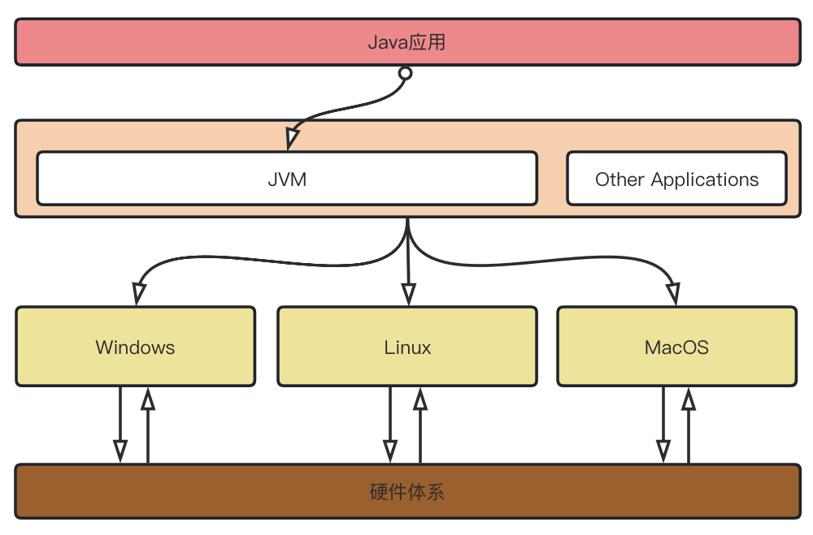
一次编译、处处运行「Write Once，Run Anywhere」
很多同学会有一个疑惑，就像当年的C语言或者说如今的Go语言，打包成各个平台的软件包也不是一件很麻烦的事情。我总不至于为了这一个特性就直接切换到Java语言吧。这句话实际上也只是一句口号，直到如今Java程序跑在不同的平台上也会遇到不同的一些问题。Java能火起来实际上包含了很多的因素，比如语法简单容易入门、生态开放性、语言本身的扩展性、稳定性还有一些运气的成分等等，跨平台只是其中的一个小点而已。
很多初学者对于JVM也会存在一个误区，觉得只有Java语言才能运行在JVM上。但实际上Java虚拟机运行的是字节码文件。换句话说你如果写一段JavaScript代码，只要能通过编译器编译成字节码文件，那Java虚拟机也能够运行。这也不是开玩笑，现在Java虚拟机确实可以运行JS代码了。虽然名字是Java虚拟机但是和Java语言并没有什么强关联。它只是按照Java虚拟机规范去读取Class文件解析执行，仅此而已了～
如果你对JVM足够了解足够深入，你完全可以自己写一门语言，只要能编译成规范的字节码就运行在JVM虚拟机之上了。这种语言也有很多比如Scala、Kotlin等等都是同一个思路。
关于JVM的介绍我们就聊到这，下一集讲带领大家走进JVM的世界～

## 你能谈一下JVM的主要组成部分吗？
JDK的JRE的区别作为一个Java开发，我相信每个人都知道。但是很多人却不知道JRE是Java虚拟机的实现。它可以分析字节码、解释代码然后执行它。我们作为开发人员，了解JVM的体系结构非常重要。它可以指导我们去写出性能良好的代码。能够很好的去分析性能问题。接下来带领大家来学习JVM的体系结构和它的组成部分。
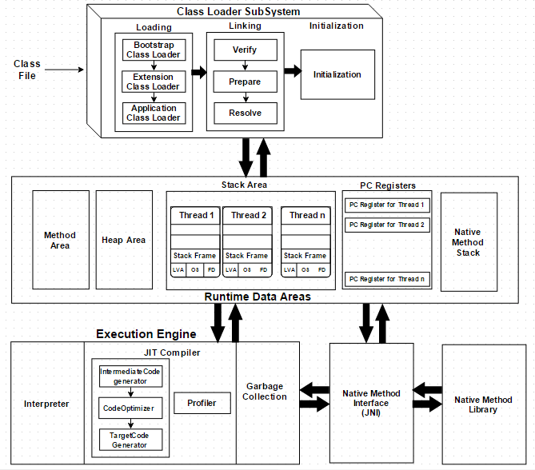
我们看上面的体系图，里面的东西虽然有点多看起来很累，我们先别去看细节，我们就先关注三个最外围的部分：

- ClassLoader子系统
- 运行时数据区
- 执行引擎

### 类加载器
当 Java 虚拟机将 Java 源码编译为字节码之后，虚拟机便可以将字节码读取进内存，从而进行解析、运行等整个过程，这个过程我们叫：Java 虚拟机的类加载机制。JVM 虚拟机执行 class 字节码的过程可以分为七个阶段：**加载、验证、准备、解析、初始化、使用、卸载。**
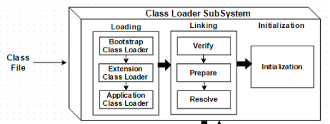

### 运行时数据区
「运行时数据区」也可以叫做是「虚拟机内存结构」我们通常叫的比较多的还是JVM虚拟机内存结构。它指 JVM 运行时会把它管理的内存划分成若干个不同的数据区域 ，简单的说就是不同的数据放在不同的地方。共分为五个部分：**方法区、堆、虚拟机栈、程序计数器、本地方法栈。**
`**虚拟机栈**`和`**程序计数器**`是线程私有的，而`**堆**`和`**方法区**`是线程共享的区域。
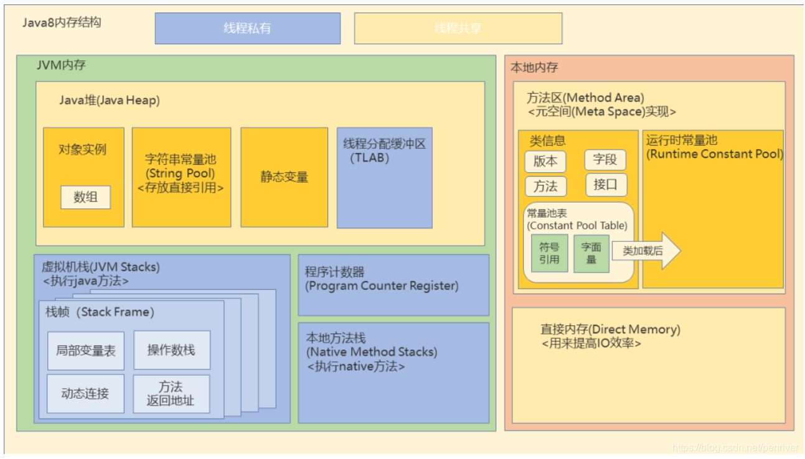

### 执行引擎
我们最终代码是要运行的，这部分工作就是由执行引擎来完成。它会把分配给运行时数据区的字节码交给执行引擎来执行。执行引擎则会读取字节码并一段一段的执行它。
Java是一门半解释半编译型语言，所以执行引擎又分为了`**解释器**`和`**JIT编译器**`，解释器就是当Java虚拟机启动时根据预定义的规范把字节码翻译成对应的机器码逐行去解释执行。而JIT编译器是虚拟机将源代码直接编译成机器码。
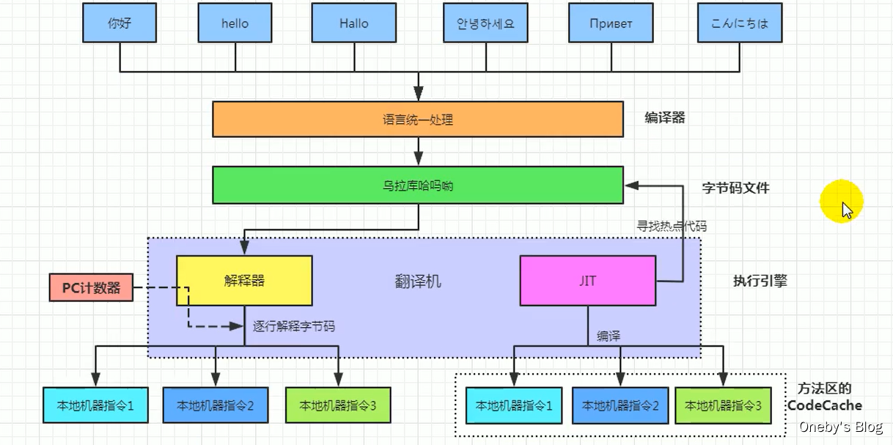

## 你能解释一下JVM类加载器的作用吗？
在前面我们简单聊过类加载器。它就是读取字节码转换成java.lang.Class类的一个实例。通过newInstance()方法就可以创建类的实例。说起来一句话非常简单，实际的情况可能更加复杂，比如Java字节代码可能是通过工具动态生成的，也可能是通过网络下载的。这一讲，我们详细的来聊聊类加载器～

**在Java语言里，类型的加载、连接、初始化都是在程序运行期间完成的**，这种策略让类加载时稍微增加一些性能开销，但也为Java应用提供了高度的灵活性，Java天生可以动态扩展的语言特性就是基于运行期动态加载和动态连接这个特点实现的。
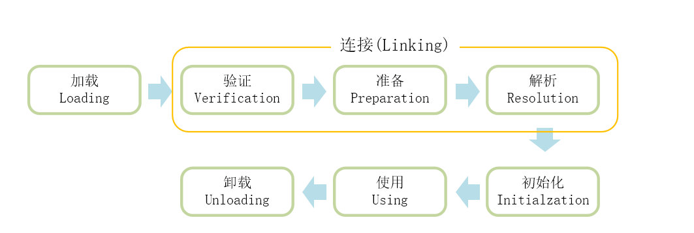
上图就是类的生命周期，从图中可以看出，类从加载到虚拟机内存中开始，到卸载为止，整个生命周期包括：**加载（Loading）、验证（Verification）、准备（Preparation）、解析（Resolution）、初始化（Initialization）、使用（Using）、卸载（Unloading）7个阶段**。其中验证、准备和解析三个部分统称为连接。加载、验证、准备、初始化和卸载这五个阶段的顺序是确定的，类型的加载过程必须按照这种顺序按部就班地开始，而解析阶段则不一定：它在某些情况下可以在初始化阶段之后再开始，这是为了支持Java语言的运行时绑定特性（也称为动态绑定或晚期绑定）。

### 加载
“加载”（Loading）阶段是整个“类加载”（Class Loading）过程中的一个阶段，在加载阶段，Java虚拟机需要完成以下三件事情：

- 通过一个类的全限定名来获取定义此类的二进制字节流
- 将这个字节流所代表的静态存储结构转化为方法区的运行时数据结构。
- 在内存中生成一个代表这个类的java.lang.Class对象，作为方法区这个类的各种数据的访问入口  

《Java虚拟机规范》对这三点要求其实并不是特别具体，留给虚拟机实现与`**Java**`应用的灵活度都是 
相当大的。例如“通过一个类的全限定名来获取定义此类的二进制字节流”这条规则，它并没有指明二 
进制字节流必须得从某个`**Class**`文件中获取，确切地说是根本没有指明要从哪里获取、如何获取。
仅仅这一点空隙，Java虚拟机的使用者们就可以在加载阶段搭构建出一个相当开放广阔的舞台，Java发展历程中，充满创造力的开发人员则在这个舞台上玩出了各种花样，许多举足轻重的Java技术都建立在这 
一基础之上，例如：

- 从ZIP压缩包中读取，这很常见，最终成为日后JAR、EAR、WAR格式的基础。 
- 从网络中获取，这种场景最典型的应用就是Web Applet。 
- 运行时计算生成，这种场景使用得最多的就是动态代理技术，在`**java.lang.reflect.Proxy**`中，就是用了ProxyGenerator.generateProxyClass()来为特定接口生成形式为“*$Proxy”的代理类的二进制字节流。 
- 可以从加密文件中获取，这是典型的防Class文件被反编译的保护措施，通过加载时解密Class文件来保障程序运行逻辑不被窥探。 
- ....

相对于类加载过程的其他阶段，加载阶段是可控性最强的阶段（准确地说，是加载阶段中获取类的二进制字节流的动作）。加载阶段既可以使用Java虚拟机里内置的引导类加载器来完成，也可以由用户自定义的类加载器去完成，开发人员通过定义自己的类加载器去控制字节流的获取方式（重写一个类加载器的`**findClass()**`或`**loadClass()**`方法），实现根据自己的想法来赋予应用程序获取运行代码的动态性。
加载阶段完成后，虚拟机外部的二进制字节流就按照虚拟机所需的格式存储在方法区之中，而且在Java堆中也创建一个java.lang.Class类的对象，这样便可以通过该对象访问方法区中的这些数据。

### 验证
验证是连接阶段的第一步，这一阶段的目的是为了确保Class文件的字节流中包含的信息符合当前虚拟机的要求，并且不会危害虚拟机自身的安全。验证阶段大致会完成4个阶段的检验动作：

- 文件格式验证：验证字节流是否符合Class文件格式的规范；例如：是否以0xCAFEBABE开头、主次版本号是否在当前虚拟机的处理范围之内、常量池中的常量是否有不被支持的类型。
- 元数据验证：对字节码描述的信息进行语义分析（注意：对比javac编译阶段的语义分析），以保证其描述的信息符合Java语言规范的要求；例如：这个类是否有父类，除了java.lang.Object之外。
- 字节码验证：通过数据流和控制流分析，确定程序语义是合法的、符合逻辑的。
- 符号引用验证：确保解析动作能正确执行。

验证阶段是非常重要的，但不是必须的，它对程序运行期没有影响，如果所引用的类经过反复验证，那么可以考虑采用-Xverifynone参数来关闭大部分的类验证措施，以缩短虚拟机类加载的时间。

### 准备
为类的静态变量分配内存，并将其初始化为默认值
准备阶段是正式为类变量分配内存并设置类变量初始值的阶段，这些内存都将在方法区中分配。对于该阶段有以下几点需要注意：

1. 这时候进行内存分配的仅包括类变量（static），而不包括实例变量，实例变量会在对象实例化时随着对象一块分配在Java堆中。
2. 这里所设置的初始值通常情况下是数据类型默认的零值（如0、0L、null、false等），而不是被在Java代码中被显式地赋予的值。

假设一个类变量的定义为：public static int value = 3；
那么变量value在准备阶段过后的初始值为0，而不是3，因为这时候尚未开始执行任何Java方法，而把value赋值为3的public static指令是在程序编译后，存放于类构造器<clinit>（）方法之中的，所以把value赋值为3的动作将在初始化阶段才会执行。
这里还需要注意如下几点：

- 对基本数据类型来说，对于类变量（static）和全局变量，如果不显式地对其赋值而直接使用，则系统会为其赋予默认的零值，而对于局部变量来说，在使用前必须显式地为其赋值，否则编译时不通过。
- 对于同时被static和final修饰的常量，必须在声明的时候就为其显式地赋值，否则编译时不通过；而只被final修饰的常量则既可以在声明时显式地为其赋值，也可以在类初始化时显式地为其赋值，总之，在使用前必须为其显式地赋值，系统不会为其赋予默认零值。
- 对于引用数据类型reference来说，如数组引用、对象引用等，如果没有对其进行显式地赋值而直接使用，系统都会为其赋予默认的零值，即null。
- 如果在数组初始化时没有对数组中的各元素赋值，那么其中的元素将根据对应的数据类型而被赋予默认的零值。
1. 如果类字段的字段属性表中存在ConstantValue属性，即同时被final和static修饰，那么在准备阶段变量value就会被初始化为ConstValue属性所指定的值。

假设上面的类变量value被定义为： public static final int value = 3；
编译时Javac将会为value生成ConstantValue属性，在准备阶段虚拟机就会根据ConstantValue的设置将value赋值为3。我们可以理解为static final常量在编译期就将其结果放入了调用它的类的常量池中。

### 解析
把类中的符号引用转换为直接引用。
解析阶段是虚拟机将常量池内的符号引用替换为直接引用的过程，解析动作主要针对类或接口、字段、类方法、接口方法、方法类型、方法句柄和调用点限定符7类符号引用进行。符号引用就是一组符号来描述目标，可以是任何字面量。
直接引用就是直接指向目标的指针、相对偏移量或一个间接定位到目标的句柄。

### 初始化
初始化，为类的静态变量赋予正确的初始值，JVM负责对类进行初始化，主要对类变量进行初始化。在Java中对类变量进行初始值设定有两种方式：

1. 声明类变量是指定初始值
2. 使用静态代码块为类变量指定初始值

JVM初始化步骤：

1. 假如这个类还没有被加载和连接，则程序先加载并连接该类
2. 假如该类的直接父类还没有被初始化，则先初始化其直接父类
3. 假如类中有初始化语句，则系统依次执行这些初始化语句

类初始化时机：只有当对类的主动使用的时候才会导致类的初始化，类的主动使用包括以下六种：

1. 创建类的实例，也就是new的方式
2. 访问某个类或接口的静态变量，或者对该静态变量赋值
3. 调用类的静态方法
4. 反射（如Class.forName(“com.shengsiyuan.Test”)）
5. 初始化某个类的子类，则其父类也会被初始化
6. Java虚拟机启动时被标明为启动类的类（Java Test），直接使用java.exe命令来运行某个主类

### 使用
当 JVM 完成初始化阶段之后，JVM 便开始从入口方法开始执行用户的程序代码。这个阶段也只是了解一下就可以

### 卸载
当用户程序代码执行完毕后，JVM 便开始销毁创建的 Class 对象，最后负责运行的 JVM 也退出内存。这个阶段也只是了解一下就可以

## 你知道JVM的类加载器有哪些？双亲委派机制是什么？
JVM设计者把类加载阶段中的“通过'类全名'来获取定义此类的二进制字节流”这个动作放到Java虚拟机外部去实现，以便让应用程序自己决定如何去获取所需要的类。实现这个动作的代码模块称为“类加载器”。

### 类与类加载器
对于任何一个类，都需要由加载它的类加载器和这个类来确立其在JVM中的唯一性。也就是说，两个类来源于同一个Class文件，并且被同一个类加载器加载，这两个类才相等。

### 双亲委派模型
从虚拟机的角度来说，只存在两种不同的类加载器：一种是启动类加载器（Bootstrap ClassLoader），该类加载器使用C++语言实现，属于虚拟机自身的一部分。另外一种就是所有其它的类加载器，这些类加载器是由Java语言实现，独立于JVM外部，并且全部继承自抽象类java.lang.ClassLoader。
从Java开发人员的角度来看，大部分Java程序一般会使用到以下三种系统提供的类加载器：

- 启动类加载器（Bootstrap ClassLoader）：负责加载JAVA_HOME\lib目录中并且能被虚拟机识别的类库到JVM内存中，如果名称不符合的类库即使放在lib目录中也不会被加载。该类加载器无法被Java程序直接引用。
- 扩展类加载器（Extension ClassLoader）：该加载器主要是负责加载JAVA_HOME\lib\，该加载器可以被开发者直接使用。
- 应用程序类加载器（Application ClassLoader）：该类加载器也称为系统类加载器，它负责加载用户类路径（Classpath）上所指定的类库，开发者可以直接使用该类加载器，如果应用程序中没有自定义过自己的类加载器，一般情况下这个就是程序中默认的类加载器。

我们的应用程序都是由这三类加载器互相配合进行加载的，我们也可以加入自己定义的类加载器。这些类加载器之间的关系如下图所示：
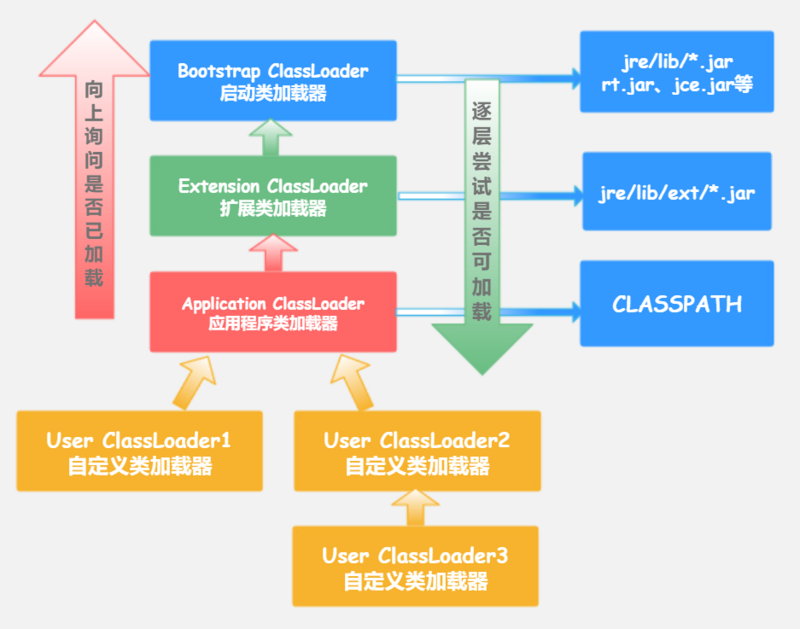
如上图所示的类加载器之间的这种层次关系，就称为类加载器的双亲委派模型（Parent Delegation Model）。该模型要求除了顶层的启动类加载器外，其余的类加载器都应当有自己的父类加载器。子类加载器和父类加载器不是以继承（Inheritance）的关系来实现，而是通过组合（Composition）关系来复用父加载器的代码。
双亲委派模型的工作过程为：如果一个类加载器收到了类加载的请求，它首先不会自己去尝试加载这个类，而是把这个请求委派给父类加载器去完成，每一个层次的加载器都是如此，因此所有的类加载请求都会传给顶层的启动类加载器，只有当父加载器反馈自己无法完成该加载请求（该加载器的搜索范围中没有找到对应的类）时，子加载器才会尝试自己去加载。
使用这种模型来组织类加载器之间的关系的好处是Java类随着它的类加载器一起具备了一种带有优先级的层次关系。例如java.lang.Object类，无论哪个类加载器去加载该类，最终都是由启动类加载器进行加载，因此Object类在程序的各种类加载器环境中都是同一个类。
否则的话，如果不使用该模型的话，如果用户自定义一个java.lang.Object类且存放在classpath中，那么系统中将会出现多个Object类，应用程序也会变得很混乱。如果我们自定义一个rt.jar中已有类的同名Java类，会发现JVM可以正常编译，但该类永远无法被加载运行。 在rt.jar包中的java.lang.ClassLoader类中，我们可以查看类加载实现过程的代码，具体源码如下：
```java
protected synchronized Class loadClass(String name, boolean resolve)  
        throws ClassNotFoundException {  
    // 首先检查该name指定的class是否有被加载  
    Class c = findLoadedClass(name);  
    if (c == null) {  
        try {  
            if (parent != null) {  
                // 如果parent不为null，则调用parent的loadClass进行加载  
                c = parent.loadClass(name, false);  
            } else {  
                // parent为null，则调用BootstrapClassLoader进行加载  
                c = findBootstrapClass0(name);  
            }  
        } catch (ClassNotFoundException e) {  
            // 如果仍然无法加载成功，则调用自身的findClass进行加载  
            c = findClass(name);  
        }  
    }  
    if (resolve) {  
        resolveClass(c);  
    }  
    return c;  
}  
```
通过上面代码可以看出，双亲委派模型是通过`loadClass()`方法来实现的，根据代码以及代码中的注释可以很清楚地了解整个过程其实非常简单：
先检查是否已经被加载过，如果没有则调用父加载器的`loadClass()`方法，如果父加载器为空则默认使用启动类加载器作为父加载器。
如果父类加载器加载失败，则先抛出`ClassNotFoundException`然后再调用自己的`findClass()`方法进行加载。

类加载器双亲委派模型是从JDK1.2以后引入的，并且只是一种推荐的模型，不是强制要求的，因此有一些没有遵循双亲委派模型的特例：(了解)

- 在JDK1.2之前，自定义类加载器都要覆盖loadClass方法去实现加载类的功能，JDK1.2引入双亲委派模型之后，loadClass方法用于委派父类加载器进行类加载，只有父类加载器无法完成类加载请求时才调用自己的findClass方法进行类加载，因此在JDK1.2之前的类加载的loadClass方法没有遵循双亲委派模型，因此在JDK1.2之后，自定义类加载器不推荐覆盖loadClass方法，而只需要覆盖findClass方法即可。
- 双亲委派模式很好地解决了各个类加载器的基础类统一问题，越基础的类由越上层的类加载器进行加载，但是这个基础类统一有一个不足，当基础类想要调用回下层的用户代码时无法委派子类加载器进行类加载。为了解决这个问题JDK引入了ThreadContext线程上下文，通过线程上下文setContextClassLoader方法可以设置线程上下文类加载器。JavaEE只是一个规范，sun公司只给出了接口规范，具体的实现由各个厂商进行实现，因此JNDI，JDBC,JAXB等这些第三方的实现库就可以被JDK的类库所调用。线程上下文类加载器也没有遵循双亲委派模型。
- 近年来的热码替换，模块热部署等应用要求不用重启java虚拟机就可以实现代码模块的即插即用，催生了OSGi技术，在OSGi中类加载器体系被发展为网状结构。OSGi也没有完全遵循双亲委派模型。


### 自定义类加载器
扩展阅读，不展开太多

## 关于JVM内存结构你了解哪些？
我相信大家对于一个 Java 源文件是如何变成字节码文件，以及字节码文件的含义已经非常清楚了。那么接下来就是让 Java 虚拟机运行字节码文件，从而得出我们最终想要的结果了。在这个过程中，Java 虚拟机会加载字节码文件，将其存入 Java 虚拟机的内存空间中，之后进行一系列的初始化动作，最后运行程序得出结果。
那么字节码数据在 Java 虚拟机内存中是如何存放的 ？Java 虚拟机在为类实例或成员变量分配内存是如何分配的 ？要解答上面这些问题，我们首先需要了解一下 Java 虚拟机的内存结构。
其实 Java 虚拟机的内存结构并不是官方的说法，在《Java 虚拟机规范》中用的是「运行时数据区」这个术语。但很多时候这个名词并不是很形象，再加上日积月累的习惯，我们都习惯用虚拟机内存结构这个说法了。
根据《Java 虚拟机规范》中的说法，Java 虚拟机的内存结构可以分为公有和私有两部分。公有指的是所有线程都共享的部分，指的是 Java 堆、方法区、常量池。私有指的是每个线程的私有数据，包括：PC寄存器、Java 虚拟机栈、本地方法栈。


### 线程共享：Java堆、方法区、常量池
在 Java 虚拟机中，线程共享部分包括 Java 堆、方法区及常量池。
Java 堆指的是从 JVM 划分出来的一块区域，这块区域专门用于 Java 实例对象的内存分配，几乎所有实例对象都在会这里进行内存的分配。之所以说几乎是因为有特殊情况，有些时候小对象会直接在栈上进行分配，这种现象我们称之为「栈上分配」。这里并不深入介绍，后续会介绍到。
方法区指的是存储 Java 类字节码数据的一块区域，它存储了每一个类的结构信息，例如运行时常量池、字段和方法数据、构造方法等。可以看到常量池其实是存放在方法区中的，但《Java 虚拟机规范》将常量池和方法区放在同一个等级上，这点我们知晓即可。
方法区在不同版本的虚拟机有不同的表现形式，例如在 1.7 版本的 HotSpot 虚拟机中，方法区被称为永久代（Permanent Space），而在 JDK 1.8 中则被称之为 MetaSpace。
说完这几个部分的大致作用之后，我们来深入说说 Java 堆。
Java 堆根据对象存活时间的不同，Java 堆还被分为年轻代、老年代两个区域，年轻代还被进一步划分为 Eden 区、From Survivor 0、To Survivor 1 区。
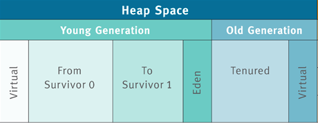
当有对象需要分配时，一个对象永远优先被分配在年轻代的 Eden 区，等到 Eden 区域内存不够时，Java 虚拟机会启动垃圾回收。
此时 Eden 区中没有被引用的对象的内存就会被回收，而一些存活时间较长的对象则会进入到老年代。
在 JVM 中有一个名为 -XX:MaxTenuringThreshold 的参数专门用来设置晋升到老年代所需要经历的 GC 次数，即在年轻代的对象经过了指定次数的 GC 后，将在下次 GC 时进入老年代。
这里让我们思考一个问题：为什么 Java 堆要进行这样一个区域划分呢？
根据我们的经验，虚拟机中的对象必然有存活时间长的对象，也有存活时间短的对象，这是一个普遍存在的正态分布规律。如果我们将其混在一起，那么因为存活时间短的对象有很多，那么势必导致较为频繁的垃圾回收。而垃圾回收时不得不对所有内存都进行扫描，但其实有一部分对象，它们存活时间很长，对他们进行扫描完全是浪费时间。因此为了提高垃圾回收效率，分区就理所当然了。
另外一个值得我们思考的问题是：为什么默认的虚拟机配置`Eden：from ：to = 8:1:1` 呢？
其实这是 IBM 公司根据大量统计得出的结果。根据 IBM 公司对对象存活时间的统计，他们发现 80% 的对象存活时间都很短。于是他们将 `Eden` 区设置为年轻代的 `80%`，这样可以减少内存空间的浪费，提高内存空间利用率。

### 线程私有：PC寄存器、Java 虚拟机栈、本地方法栈
Java 堆以及方法区的数据是共享的，但是有一些部分则是线程私有的。线程私有部分可以分为：PC 寄存器、Java 虚拟机栈、本地方法栈三大部分。

- PC 寄存器：顾名思义 Program Counter 寄存器，指的是保存线程当前正在执行的方法。

如果这个方法不是 native 方法，那么 PC 寄存器就保存 Java 虚拟机正在执行的字节码指令地址。如果是 native 方法，那么 PC 寄存器保存的值是 undefined。
任意时刻，一条 Java 虚拟机线程只会执行一个方法的代码，而这个被线程执行的方法称为该线程的当前方法，其地址被存在 PC 寄存器中。

- Java 虚拟机栈：这个栈与线程同时创建，用来存储栈帧，即存储局部变量与一些过程结果的地方。栈帧存储的数据包括：局部变量表、操作数栈。
- 本地方法栈：当 Java 虚拟机使用其他语言（例如 C 语言）来实现指令集解释器时，也会使用到本地方法栈。如果 Java 虚拟机不支持 natvie 方法，并且自己也不依赖传统栈的话，可以无需支持本地方法栈。

Java 虚拟机的内存结构是学习虚拟机所必须掌握的地方，其中以 Java 堆的内存模型最为重要，因为线上问题很多时候都是 Java 堆出现问题。因此掌握 Java 堆的划分以及常用参数的调整最为关键。
除了上述所说的六大部分之外，其实在 Java 中还有直接内存、栈帧等数据结构。但因为直接内存、栈帧的使用场景还比较少，所以这里并不做介绍，以免让初学者一时间混淆。
学到这里，一个 Java 文件就加载到内存中了，并且 Java 类信息就会存储在我们的方法区中。如果创建对象，那么对象数据就会存放在 Java 堆中。如果调用方法，就会用到 PC 寄存器、Java 虚拟机栈、本地方法栈等结构。

## 说说你知道的JVM的垃圾回收算法？
我们说到 Java 虚拟机的内存结构，提到了这部分的规范其实是由《Java 虚拟机规范》指定的，每个 Java 虚拟机可能都有不同的实现。其实涉及到 Java 虚拟机的内存，就不得不谈到 Java 虚拟机的垃圾回收机制。因为内存总是有限的，我们需要一个机制来不断地回收废弃的内存，从而实现内存的循环利用，这样程序才能正常地运转下去。
比起 Java 虚拟机的内存结构有《Java 虚拟机规范》规定，垃圾回收机制并没有具体的规范约束。所以很多时候不同的虚拟机有不同的实现方式，下面所说的垃圾回收都是以 HotSpot 虚拟机为例。

### 到底谁是垃圾？
要进行垃圾回收，最为重要的一个问题是：判断谁是垃圾？
联想其日常生活中，如果一个东西经常没被使用，那么这个对象可以说就是垃圾。在 Java 中也是如此，如果一个对象不可能再被引用，那么这个对象就是垃圾，应该被回收。
根据这个思想，我们很容易想到使用引用计数的方法来判断垃圾。在一个对象被引用时加一，被去除引用时减一，这样我们就可以通过判断引用计数是否为零来判断一个对象是否为垃圾。这种方法我们一般称之为「引用计数法」。
上面的这种方法虽然简单，但是其存在一个致命的问题，那就是循环引用。A 引用了 B，B 引用了 C，C 引用了 A，它们各自的引用计数都为 1。但是它们三个对象却从未被其他对象引用，只有它们自身互相引用。从垃圾的判断思想来看，它们三个确实是不被其他对象引用的，但是此时它们的引用计数却不为零。这就是引用计数法存在的循环引用问题。
而现今的 Java 虚拟机判断垃圾对象使用的是：GC Root Tracing 算法。其大概的过程是这样：从 GC Root 出发，所有可达的对象都是存活的对象，而所有不可达的对象都是垃圾。
可以看到这里最重要的就是 GC Root 这个集合了，其实 GC Root 就是一组活跃引用的集合。但是这个集合又与一般的对象集合不太一样，这些集合是经过特意筛选出来的，通常包括：

- 所有当前被加载的 Java 类
- Java 类的引用类型静态变量
- Java类的运行时常量池里的引用类型常量
- VM的一些静态数据结构里指向GC堆里的对象的引用
- ....

简单地说，GC Root 就是经过精心挑选的一组活跃引用，这些引用是肯定存活的。那么通过这些引用延伸到的对象，自然也是存活的。

### 如何进行垃圾回收？
到这里，我们了解了什么是垃圾以及 JVM 是如何判断垃圾对象的。那么识别出垃圾对象之后，JVM 是如何进行垃圾回收的呢？这就是我们下面要讲的内容：如何进行垃圾回收？
垃圾回收算法简单地说有三种算法：标记清除算法、复制算法、标记压缩算法。

- 标记清除算法:从名字可以看到其分为两个阶段：标记阶段和清除阶段。一种可行的实现方式是，在标记阶段，标记所有由 GC Root 触发的可达对象。此时，所有未被标记的对象就是垃圾对象。之后在清除阶段，清除所有未被标记的对象。标记清除算法最大的问题就是空间碎片问题。如果空间碎片过多，则会导致内存空间的不连续。虽说大对象也可以分配在不连续的空间中，但是效率要低于连续的内存空间。
- 复制算法：复制算法的核心思想是将原有的内存空间分为两块，每次只使用一块，在垃圾回收时，将正在使用的内存中的存活对象复制到未使用的内存块中。之后清除正在使用的内存块中的所有对象，之后交换两个内存块的角色，完成垃圾回收。该算法的缺点是要将内存空间折半，极大地浪费了内存空间。
- 标记压缩算法：标记压缩算法可以说是标记清除算法的优化版，其同样需要经历两个阶段，分别是：标记结算、压缩阶段。在标记阶段，从 GC Root 引用集合触发去标记所有对象。在压缩阶段，其则是将所有存活的对象压缩在内存的一边，之后清理边界外的所有空间。

对比一下这三种算法，可以发现他们都有各自的优点和缺点。标记清除算法虽然会产生内存碎片，但是不需要移动太多对象，比较适合在存活对象比较多的情况。而复制算法虽然需要将内存空间折半，并且需要移动存活对象，但是其清理后不会有空间碎片，比较适合存活对象比较少的情况。而标记压缩算法，则是标记清除算法的优化版，减少了空间碎片。

### 分代思想
试想一下，如果我们单独采用任何一种算法，那么最终的垃圾回收效率都不会很好。其实 JVM 虚拟机的建造者们也是这么想的，因此在实际的垃圾回收算法中采用了分代算法。
所谓分代算法，就是根据 JVM 内存的不同内存区域，采用不同的垃圾回收算法。例如对于存活对象少的新生代区域，比较适合采用复制算法。这样只需要复制少量对象，便可完成垃圾回收，并且还不会有内存碎片。而对于老年代这种存活对象多的区域，比较适合采用标记压缩算法或标记清除算法，这样不需要移动太多的内存对象。
试想一下，如果没有采用分代算法，而在老年代中使用复制算法。在极端情况下，老年代对象的存活率可以达到100%，那么我们就需要复制这么多个对象到另外一个内存区域，这个工作量是非常庞大的。
在这里我们再深入地聊一聊新生代里采取的垃圾回收算法。如我们上面所说，新生代的特点是存活对象少，适合采用复制算法。而复制算法的一种最简单实现便是折半内存使用，另一半备用。但实际上我们知道，在实际的 JVM 新生代划分中，却不是采用等分为两块内存的形式。而是分为：Eden 区域、from 区域、to 区域 这三个区域。那么为什么 JVM 最终要采用这种形式，而不用 50% 等分为两个内存块的方式？
要解答这个问题，我们就需要先深入了解新生代对象的特点。根据IBM公司的研究表明，在新生代中的对象 98% 是朝生夕死的，所以并不需要按照1:1的比例来划分内存空间。所以在HotSpot虚拟机中，JVM 将内存划分为一块较大的Eden空间和两块较小的Survivor空间，其大小占比是8:1:1。当回收时，将Eden和Survivor中还存活的对象一次性复制到另外一块Survivor空间上，最后清理掉Eden和刚才用过的Eden空间。
通过这种方式，内存的空间利用率达到了90%，只有10%的空间是浪费掉了。而如果通过均分为两块内存，则其内存利用率只有 50%，两者利用率相差了将近一倍。

### 分区思想
分代思想按照对象的生命周期长短将其分为了两个部分（新生代、老年代），但 JVM 中其实还有一个分区思想，即将整个堆空间划分成连续的不同小区间。
每一个小区间都独立使用，独立回收，这种算法的好处是可以控制一次回收多少个区间，可以较好地控制 GC 时间。
到这里我们基本上把 JVM 的垃圾回收都将清除了，从一开始什么是垃圾，到之后如何判断垃圾，到如何回收垃圾，到垃圾回收的两个重要思想：分代思想、分区思想。通过这么一个脉络，我们了解了垃圾回收的整体概括。

## 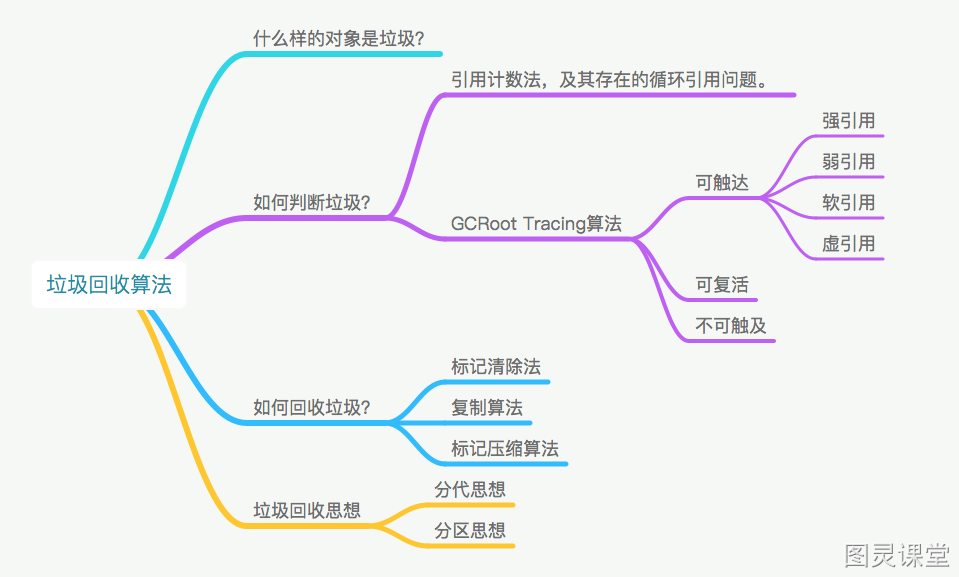


## 你知道在JVM有哪些垃圾回收器吗？
我们介绍了 Java 虚拟机的内存结构，Java 虚拟机的垃圾回收机制，那么这篇文章我们说说具体执行垃圾回收的垃圾回收器。
总的来说，Java 虚拟机的垃圾回收器可以分为四大类别：**串行回收器、并行回收器、CMS 回收器、G1 回收器。**

### 串行回收器
串行回收器是指使用单线程进行垃圾回收的回收器。因为每次回收时只有一个线程，因此串行回收器在并发能力较弱的计算机上，其专注性和独占性的特点往往能让其有更好的性能表现。
串行回收器可以在新生代和老年代使用，根据作用于不同的堆空间，分为新生代串行回收器和老年代串行回收器。

#### 新生代串行回收器
串行收集器是所有垃圾回收器中最古老的一种，也是 JDK 中最基本的垃圾回收器之一。
在新生代串行回收器中使用的是`**复制算法**`。在串行回收器进行垃圾回收时，会触发 Stop-The-World 现象，即其他线程都需要暂停，等待垃圾回收完成。因此在某些情况下，其会造成较为糟糕的用户体验。
使用 -XX:+UseSerialGC 参数可以指定使用新生代串行收集器和老年代串行收集器。当虚拟机在 Client 模式下运行时，其默认使用该垃圾收集器。

#### 老年代串行回收器
在老年代串行回收器中使用的是标记压缩算法。其与新生代串行收集器一样，只能串行、独占式地进行垃圾回收，因此也经常会有较长时间的 Stop-The-World 发生。
但老年代串行回收器的好处之一，就是其可以与多种新生代回收器配合使用。若要启用老年代串行回收器，可以尝试以下参数：

- -XX:UseSerialGC：新生代、老年代都使用串行回收器。
- -XX:UseParNewGC：新生代使用 ParNew 回收器，老年代使用串行回收器。
- -XX:UseParallelGC：新生代使用 ParallelGC 回收器，老年代使用串行回收器。

### 并行回收器
并行回收器在串行回收器的基础上做了改进，其使用多线程进行垃圾回收。对于并行能力强的机器，可以有效缩短垃圾回收所使用的时间。
根据作用内存区域的不同，并行回收器也有三个不同的回收器：新生代 ParNew 回收器、新生代 ParallelGC 回收器、老年代 ParallelGC 回收器。

#### **新生代 ParNew 回收器**
新生代 ParNew 回收器工作在新生代，其只是简单地将串行回收器多线程化，其回收策略、算法以及参数和新生代串行回收器一样。
新生代 ParNew 回收器同样使用复制的垃圾回收算法，其垃圾收集过程中同样会触发 Stop-The-World 现象。但因为其使用多线程进行垃圾回收，因此在并发能力强的 CPU 上，其产生的停顿时间要短于串行回收器。
但在单 CPU 或并能能力弱的系统中，并行回收器效果会因为线程切换的原因，其实际表现反而不如串行回收器。要开启新生代 ParNew 回收器，可以使用以下参数：

- -XX:+UseParNewGC：新生代使用 ParNew 回收器，老年代使用串行回收器。
- -XX:UseConcMarkSweepGC：新生代使用 ParNew 回收器，老年代使用 CMS。
- -XX:ParallelGCThreads：指定 ParNew 回收器的工作线程数量。

#### 新生代 Parallel GC 回收器
新生代 Parallel GC 回收器与新生代 ParNew 回收器非常类似，其也是使用复制算法，都是多线程、独占式的收集器，也会导致 Stop-The-World。但其余 ParNew 回收器的一个重大不同是：其非常注重系统的吞吐量。
之所以说新生代 Parallel GC 回收器非常注重系统吞吐量，是因为其有一个自适应 GC 调节策略。我们可以使用 -XX:+UseAdaptiveSizePolicy 参数打开这个策略，在这个模式下，新生代的大小、Eden 和 Survivor 的比例、晋升老年代的对象年龄等参数都会被自动调节，已达到堆大小、吞吐量、停顿时间的平衡点。
Parallel GC 回收器提供了两个重要参数用于控制系统的吞吐量。

- -XX:MaxGCPauseMillis：设置最大垃圾收集停顿时间。在 ParallelGC 工作时，其会自动调整响应参数，将停顿时间控制在设置范围内。为了达到目的，其可能会使用较小的堆，但这会导致 GC 较为频繁。
- -XX:GCTimeRatio：设置吞吐量大小，其实一个 0 - 100 的整数。假设 GCTimeRatio 的值为 n，那么系统将不花费超过 1/(1+n) 的时间用于垃圾手机。比如 GCTimeRatio 值为 19，那么系统用于垃圾收集的时间不超过 1 /(1+19) = 5%。默认情况下，它的取值是 99，即不超过 1% 的时间用于垃圾收集。

新生代 Parallel GC 回收器可以使用以下参数启用：

- -XX:+UseParallelGC：新生代使用 Parallel 回收器，老年代使用串行回收器。
- -XX:+UseParallelOldGC：新生代使用 ParallelGC 回收器，老年代使用 ParallelOldGC 回收器。

#### 老年代 ParallelOldGC 回收器
老年代 ParallelOldGC 回收器也是一种多线程并发的回收器，与新生代 ParallelGC 收集器一样，其也是注重吞吐量的收集器，只不过其是作用于老年代。
ParallelOldGC 回收器使用的是标记压缩算法，只有在 JDK 1.6 中才可以使用。我们可以使用
-XX:UseParallelOldGC参数在新生代中使用 ParallelGC 收集器，在老年代中使用 ParallelOldGC 收集器。
参数 -XX:ParallelGCThreads也可以用于设置垃圾回收时的线程数量。

### CMS 回收器
与 ParallelGC 和 ParallelOldGC 不同，CMS 回收器主要关注系统停顿时间。CMS 回收器全称为 Concurrent Mark Sweep，意为标记清除算法，其是一个使用多线程并行回收的垃圾回收器。

#### 工作步骤
CMS 的主要工作步骤有：初始标记、并发标记、预清理、重新标记、并发清除和并发充值。其中初始标记和重新标记是独占系统资源的，而其他阶段则可以和用户线程一起执行。
在整个 CMS 回收过程中，默认情况下会有预清理的操作，我们可以关闭开关 -XX:-CMSPrecleaningEnabled 不进行预清理。因为重新标记是独占 CPU 的，因此如果新生代 GC 发生之后，立刻出发一次新生代 GC，那么停顿时间就会很长。为了避免这种情况，预处理时会刻意等待一次新生代 GC 的发生，之后在进行预处理。

#### 主要参数
启动 CMS 回收器刻意使用参数：-XX:+UseConcMarkSweepGC，线程并发数量刻意通过 -XX:ConcGCThreads 或 -XX:ParallelCMSThreads 参数设定。
此外，我们还可以设置 -XX:CMSInitiatingOccupancyFraction 来指定老年代空间使用阈值。当老年代空间使用率达到这个阈值时，会执行一次 CMS 回收，而不像其他回收器一样等到内存不够用的时候才进行 GC。
我们之前说过标记清除算法的缺点是会产生内存碎片，因此 CMS 回收器会产生较多内存碎片。我们可以使用 XX:+UseCMSCompactAtFullCollection 参数让 CMS 在完成垃圾回收后，进行一次内存碎片整理。使用 -XX:CMSFullGCsBeforeCompaction 参数设置进行多少次 CMS 回收后，进行一次内存压缩。
此外，如果希望使用 CMS 回收 Perm 区，那么则可以打开 -XX:+CMSClassUnloadingEnabled 开关。打开该开关后，如果条件允许，那么系统会使用 CMS 的机制回收 Perm 区 Class 数据。

### G1 回收器
G1 回收器是 JDK 1.7 中使用的全新垃圾回收器，从长期目标来看，其是为了取代 CMS 回收器。
G1 回收器拥有独特的垃圾回收策略，和之前所有垃圾回收器采用的垃圾回收策略不同。从分代看，G1 依然属于分代垃圾回收器。但它最大的改变是使用了分区算法，从而使得 Eden 区、From 区、Survivor 区和老年代等各块内存不必连续。
在 G1 回收器之前，所有的垃圾回收器其内存分配都是连续的一块内存，如下图所示。

而在 G1 回收器中，其将一大块的内存分为许多细小的区块，从而不要求内存是连续的。
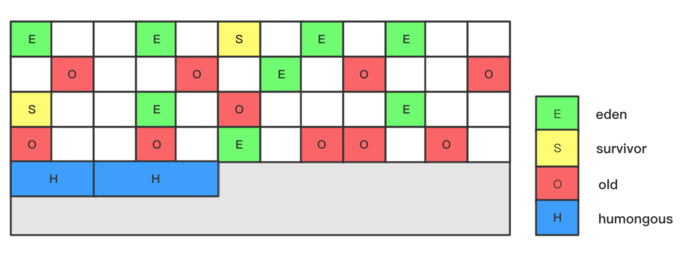
从上图可以看到，每个Region被标记了 E、S、O 和 H，说明每个 Region 在运行时都充当了一种角色。所有标记为 E 的都是 Eden 区的内存，它们散落在内存的各个角落，并不要求内存连续。同理，Survivor 区、老年代（Old）也是如此。
从上图我们还可以看到 H 是以往算法中没有的，它代表 Humongous。这表示这些 Region 存储的是巨型对象（humongous object，H-obj），当新建对象大小超过 Region 大小一半时，直接在新的一个或多个连续 Region 中分配，并标记为 H。
堆内存中一个 Region 的大小可以通过 -XX:G1HeapRegionSize 参数指定，大小区间只能是1M、2M、4M、8M、16M 和 32M，总之是2的幂次方。如果G1HeapRegionSize 为默认值，即把设置的最小堆内存按照2048份均分，最后得到一个合理的大小。

#### 工作步骤
G1 收集器的收集过程主要有四个阶段：

- 新生代 GC
- 并发标记周期
- 混合收集
- 如果需要，可能进行 FullGC

新生代 GC 与其他垃圾收集器的类似，就是清空 Eden 区，将存活对象移动到 Survivor 区，部分年龄到了就移动到老年代。
并发标记周期则分为：初始标记、根区域扫描、并发标记、重新标记、独占清理、并发清理阶段。其中初始标记、重新标记、独占清理是独占式的，会引起停顿。并且初始标记会引发一次新生代 GC。在这个阶段，所有将要被回收的区域会被 G1 记录在一个称之为 Collection Set 的集合中。
混合回收阶段会首先针对 Collection Set 中的内存进行回收，因为这些垃圾比例较高。G1 回收器的名字 Garbage First 就是这个意思，垃圾优先处理的意思。在混合回收的时候，也会执行多次新生代 GC 和 混合 GC，从而来进行内存的回收。
必要时进行 Full GC。当在回收阶段遇到内存不足时，G1 会停止垃圾回收并进行一次 Full GC，从而腾出更多空间进行垃圾回收。

#### 相关参数
打开 G1 收集器，我们可以使用参数：`-XX:+UseG1GC。
设置目标最大停顿时间，可以使用参数：-XX:MaxGCPauseMillis。
设置 GC 工作线程数量，可以使用参数：-XX:ParallelGCThreads。
设置堆使用率触发并发标记周期的执行，可以使用参数：-XX:InitiatingHeapOccupancyPercent。

从一开始的串行回收器，到后来的并行回收器、CMS回收器，到最后的 G1 回收器，垃圾回收器不断改进，使得垃圾回收效率不断提升。特别是分区思想诞生后，对于垃圾回收停顿时间的控制更加细腻，可以让应用有更完美的延时控制，从而呈现更好的用户体验。


### 垃圾回收的几种类型
我们经常会听到许多垃圾回收的术语，例如：**Minor GC、Major GC、Young GC、Old GC、Full GC、Stop-The-World** 等。但这些 GC 术语到底指的是什么，它们之间的区别到底是什么？今天我们就来详细说说。

#### Minor GC
从年轻代空间回收内存被称为 Minor GC，有时候也称之为 Young GC。对于 Minor GC，你需要知道的一些点：

- 当 JVM 无法为一个新的对象分配空间时会触发 Minor GC，比如当 Eden 区满了。所以 Eden 区越小，越频繁执行 Minor GC。
- 当年轻代中的 Eden 区分配满的时候，年轻代中的部分对象会晋升到老年代，所以 Minor GC 后老年代的占用量通常会有所升高。
- 质疑常规的认知，所有的 Minor GC 都会触发 Stop-The-World，停止应用程序的线程。对于大部分应用程序，停顿导致的延迟都是可以忽略不计的，因为大部分 Eden 区中的对象都能被认为是垃圾，永远也不会被复制到 Survivor 区或者老年代空间。如果情况相反，即 Eden 区大部分新生对象不符合 GC 条件（即他们不被垃圾回收器收集），那么 Minor GC 执行时暂停的时间将会长很多（因为他们要JVM要将他们复制到 Survivor 区或老年代）。

#### Major GC
从老年代空间回收内存被称为 Major GC，有时候也称之为 Old GC。
许多 Major GC 是由 Minor GC 触发的，所以很多情况下将这两种 GC 分离是不太可能的。
Minor GC 作用于年轻代，Major GC 作用于老年代。 分配对象内存时发现内存不够，触发 Minor GC。Minor GC 会将对象移到老年代中，如果此时老年代空间不够，那么触发 Major GC。因此才会说，许多 Major GC 是由 Minor GC 引起的。

#### Full GC
Full GC 是清理整个堆空间 —— 包括年轻代、老年代和永久代（如果有的话）。因此 Full GC 可以说是 Minor GC 和 Major GC 的结合。
当准备要触发一次 Minor GC 时，如果发现年轻代的剩余空间比以往晋升的空间小，则不会触发 Minor GC 而是转为触发 Full GC。因为JVM此时认为：之前这么大空间的时候已经发生对象晋升了，那现在剩余空间更小了，那么很大概率上也会发生对象晋升。既然如此，那么我就直接帮你把事情给做了吧，直接来一次 Full GC，整理一下老年代和年轻代的空间。
另外，即在永久代分配空间但已经没有足够空间时，也会触发 Full GC。

#### Stop-The-World
Stop-The-World，中文一般翻译为全世界暂停，是指在进行垃圾回收时因为标记或清理的需要，必须让所有执行任务的线程停止执行任务，从而让垃圾回收线程回收垃圾的时间间隔。
在 Stop-The-World 这段时间里，所有非垃圾回收线程都无法工作，都暂停下来。只有等到垃圾回收线程工作完成才可以继续工作。可以看出，Stop-The-World 时间的长短将关系到应用程序的响应时间，因此在 GC 过程中，Stop-The-World 的时间是一个非常重要的指标。

## 有没有进行过JVM调优，说说你的调优思路？
**为什么要调优**

- 防止出现OOM
- 解决OOM
- 减少Full GC出现的频率

前面铺垫了很多JVM的基础知识，这一讲我们终于来到了JVM调优课题。JVM调优是一个手段，但并不一定所有问题都可以通过JVM进行调优解决，因此，在进行JVM调优时，我们要遵循一些原则：

- 大多数的Java应用不需要进行JVM优化； 
- 大多数导致GC问题的原因是代码层面的问题导致的（代码层面）； 
- ~~上线之前，应先考虑将机器的JVM参数设置到最优；~~ 
- 减少创建对象的数量（代码层面）； 
- 减少使用全局变量和大对象（代码层面）； 
- 优先架构调优和代码调优，JVM优化是不得已的手段（代码、架构层面）； 
- 分析GC情况优化代码比优化JVM参数更好（代码层面）； 

通过以上原则，我们发现，其实最有效的优化手段是架构和代码层面的优化，而JVM优化则是最后不得已的手段，也可以说是对服务器配置的最后一次“压榨”。接下来我们再看看如何进行JVM调优，调优不是盲目的，我们每修改一个JVM都有它背后的考究和数据支撑。在这里分享给大家一个比较通用的JVM调优的步骤 ⬇️

### JVM调优的一般步骤为：

- 第1步：分析GC日志及dump文件，判断是否需要优化，确定瓶颈问题点；
- 第2步：确定JVM调优量化目标；
- 第3步：确定JVM调优参数（根据历史JVM参数来调整）；
- 第4步：调优一台服务器，对比观察调优前后的差异；
- 第5步：不断的分析和调整，直到找到合适的JVM参数配置；
- 第6步：找到最合适的参数，将这些参数应用到所有服务器，并进行后续跟踪。

### 分析GC日志及dump文件，判断是否需要优化，确定瓶颈问题点
前面提到每一个参数的修改都有它背后的数据做支撑。那数据是怎么来的呢？就是从我们`GC`日志和`dump`文件中分析出来的。这一讲我们就来仔细聊一聊我们通过什么工具去查看GC日志和dump文件，如何去分析GC日志和dump文件去找出症节所在。

#### GC日志分析
首先我们来看看GC日志分析，可能很多同学都没看到过GC日志，GC日志记录了垃圾收集器的运行情况，包括垃圾回收的原因、时间、执行的线程、回收的内存空间等信息。它主要用于分析垃圾收集器的性能和调优，在这里我们先来铺垫一下我们的工程是如何获取到GC日志的，然后我们在去讲工具讲分析。这里我们以Java程序、Tomcat项目、SpringBoot项目来讲解。
**Java程序**
Java程序可以通过在启动参数中添加相应的参数来开启GC日志的记录。具体而言，可以使用以下参数：

- -XX:+PrintGC：开启GC日志输出；
- -XX:+PrintGCDetails：在GC日志中输出详细的信息；
- -XX:+PrintGCDateStamps：在GC日志中输出时间戳；
- -Xlog:gc+heap=trace：在GC前后输出堆的详细信息；
- -Xlog:gc:<filename>：将GC日志输出到指定的文件中。

基于Java17版本：
例如，可以使用如下命令启动Java程序，并输出GC日志到文件gc.log中：
```bash
-Xms5M -Xmx5M -Xlog:gc:/Users/a123/IdeaProjects/java-example/logs/gc.log -XX:+PrintGC -Xlog:gc+heap=trace
```
在程序运行过程中，GC日志会被输出到指定的文件中，可以通过分析日志来了解垃圾收集的情况，进而进行优化和调优。
**Tomcat**
对于Tomcat项目，可以在Tomcat启动脚本中的JAVA_OPTS变量中添加相应的参数来开启GC日志的记录。具体而言，可以修改catalina.sh或catalina.bat（Windows下）文件，加入如下参数：
```bash
JAVA_OPTS="-Xloggc:/path/to/gc.log -XX:+PrintGC -XX:+PrintGCDetails -XX:+PrintGCDateStamps -XX:+PrintHeapAtGC"
```
其中，/path/to/gc.log为指定的日志输出文件路径。
**SpringBoot**
对于Spring Boot项目，可以在application.properties或application.yml配置文件中添加以下参数：
```properties
logging.file=gc.log
logging.level.gc=info
```
其中，logging.file指定日志文件名，logging.level.gc指定日志输出级别，这里设置为info以输出GC日志。
需要注意的是，不同版本的Tomcat和Spring Boot可能会有所差异，具体添加参数的方式可能会有所不同。在实际使用中，应该查阅对应版本的文档或手册，了解如何正确地开启GC日志记录。
我们简单的来看一下GC日志：
```bash
[2023-02-14T22:13:12.554+0800] -XX:+PrintGC is deprecated. Will use -Xlog:gc instead.
[2023-02-14T22:13:12.557+0800] Using G1
[2023-02-14T22:13:12.593+0800] GC(0) Pause Young (Normal) (G1 Evacuation Pause) 3M->3M(8M) 1.720ms
[2023-02-14T22:13:12.596+0800] GC(1) Pause Young (Concurrent Start) (G1 Preventive Collection) 4M->3M(8M) 1.533ms
[2023-02-14T22:13:12.596+0800] GC(2) Concurrent Mark Cycle
[2023-02-14T22:13:12.598+0800] GC(3) Pause Young (Normal) (G1 Preventive Collection) 4M->4M(8M) 1.069ms
[2023-02-14T22:13:12.601+0800] GC(4) To-space exhausted
[2023-02-14T22:13:12.601+0800] GC(4) Pause Young (Normal) (G1 Preventive Collection) 5M->5M(8M) 2.454ms
[2023-02-14T22:13:12.606+0800] GC(5) To-space exhausted
[2023-02-14T22:13:12.606+0800] GC(5) Pause Young (Normal) (G1 Evacuation Pause) 6M->6M(8M) 4.494ms
[2023-02-14T22:13:12.617+0800] GC(6) Pause Full (G1 Compaction Pause) 6M->6M(8M) 10.797ms
[2023-02-14T22:13:12.627+0800] GC(7) Pause Full (G1 Compaction Pause) 6M->6M(8M) 10.258ms
[2023-02-14T22:13:12.627+0800] GC(2) Concurrent Mark Cycle 31.610ms
[2023-02-14T22:13:12.628+0800] GC(8) Pause Young (Normal) (G1 Evacuation Pause) 6M->6M(8M) 0.243ms
[2023-02-14T22:13:12.636+0800] GC(9) Pause Full (G1 Compaction Pause) 6M->6M(8M) 8.079ms
[2023-02-14T22:13:12.646+0800] GC(10) Pause Full (G1 Compaction Pause) 6M->6M(8M) 10.570ms
[2023-02-14T22:13:12.647+0800] GC(11) Pause Young (Concurrent Start) (G1 Evacuation Pause) 6M->6M(8M) 0.307ms
[2023-02-14T22:13:12.647+0800] GC(13) Concurrent Mark Cycle
[2023-02-14T22:13:12.648+0800] GC(12) Pause Full (G1 Compaction Pause) 6M->1M(8M) 1.330ms
[2023-02-14T22:13:12.648+0800] GC(13) Concurrent Mark Cycle 1.388ms

```
日志文件直接看起来不是不是很直观看起来比较费劲。事实上分析GC日志可视化的工具很多很多，这里整理了一份：

- GCViewer：功能简单、易于使用，适合初学者。
- GCEasy：自动检测GC日志，并提供了一系列的报告和建议，适合快速定位和解决GC问题。
- HPROF：Java自带的堆内存分析工具，可以与GCViewer等工具结合使用，提供更全面的分析。
- Java Mission Control：JDK自带的性能监控工具，提供了包括GC在内的多种监控指标，并能与VisualVM等工具集成使用。
- VisualVM：功能全面、插件丰富，支持多种监控指标和分析方式，适合高级用户和专业人士。
- GClogAnalyzer：提供了多种图表和分析工具，能够深入分析GC日志的各个方面。
- YourKit Java Profiler：功能丰富、易于使用，提供了GC分析、CPU分析、内存分析等多种功能，适合专业人士使用。
- JProfiler：提供了多种性能分析和调试工具，包括GC分析、CPU分析、内存分析等，适合专业人士使用。

大家可以按照自己的喜好、习惯进行选择。同时JDK也我们提供了很多关于JVM调优的工具合集，在安装包的bin目录下面可以找到，我以我电脑举例：
```bash
/Library/Java/JavaVirtualMachines/jdk-17.0.5.jdk/Contents/Home/bin
```

上面是基于JDK17截图的Java工具集，已经删除了VisualVM了，在此我们基于GCEasy来进行GC日志分析。
官网地址为：[https://gceasy.io/](https://gceasy.io/) 它有在线分析版和离线分析版都可以使用～


查看当前日志，分析当前JVM参数设置，并且分析当前堆内存快照和gc日志，根据实际的各区域内存划分和GC执行时间，觉得是否进行优化。
**举一个例子： 系统崩溃前的一些现象：**

-  每次垃圾回收的时间越来越长，由之前的10ms延长到50ms左右，FullGC的时间也有之前的0.5s延长到4、5s
-  FullGC的次数越来越多，最频繁时隔不到1分钟就进行一次FullGC
-  年老代的内存越来越大并且每次FullGC后年老代没有内存被释放

之后系统会无法响应新的请求，逐渐到达OutOfMemoryError的临界值，这个时候就需要分析JVM内存快照dump。

#### dump文件分析
讲完了我们的GC日志分析，我们再来看看我们的dump文件分析，dump文件记录了Java虚拟机在某个时间点的状态信息，包括Java虚拟机进程的堆栈信息、Java对象的详细信息、线程信息、类信息等。它主要用于分析Java虚拟机的状态、诊断内存泄漏等问题。GC日志适合用于调优垃圾收集器，而dump文件适合用于分析Java虚拟机的状态信息。
老样子我们先来看看如何获取到我们的dump文件信息，先将工具再讲分析。
**Java程序**

- 使用命令行工具：如果您的Java应用程序在命令行上运行，则可以使用jmap和jstack命令行工具来生成dump文件。例如，要获取一个堆转储文件，您可以使用以下命令：
```bash
jmap -dump:format=b,file=<filename> <pid>
```
其中，<filename>是您想要为dump文件指定的名称，<pid>是您的Java应用程序的进程ID。
要获取一个线程转储文件，您可以使用以下命令：
```bash
jstack -F <pid> > <filename>
```
其中，<filename>是您想要为dump文件指定的名称，<pid>是您的Java应用程序的进程ID。

- 使用JMX API：如果您的Java应用程序正在运行，您可以使用Java Management Extensions（JMX）API获取dump文件。使用JMX API，您可以远程连接到应用程序并生成转储文件。有关如何使用JMX API获取dump文件的更多信息，请参阅Oracle的官方文档。
- 使用调试器：如果您在调试模式下运行您的Java应用程序，您可以使用调试器（如Eclipse、IntelliJ IDEA等）来获取dump文件。这些调试器通常提供了内存转储和线程转储的选项。
- 使用Java Flight Recorder（JFR）：Java Flight Recorder是JDK自带的一个工具，用于记录应用程序在运行时的各种指标。您可以使用JFR来记录内存使用、线程、锁定信息等，并生成相应的dump文件。有关如何使用JFR的更多信息，请参阅Oracle的官方文档。
- 使用HeapDumpOnOutOfMemoryError参数：您可以通过在Java虚拟机参数中设置HeapDumpOnOutOfMemoryError参数来自动生成堆转储文件。当Java应用程序出现内存溢出错误时，JVM将自动生成一个转储文件，以便进行故障排除。例如：
```bash
java -XX:+HeapDumpOnOutOfMemoryError -XX:HeapDumpPath=<filename> <your-class>
```
其中，<filename>是您想要为转储文件指定的路径和名称，<your-class>是您的Java应用程序的类名

- 使用第三方工具：还有许多第三方工具可用于生成Java程序的dump文件，例如VisualVM、MA（Memory Analyzer Tool）、JProfiler等。这些工具通常提供了丰富的功能，可以帮助您更好地分析和解决Java应用程序中的问题。

请注意，无论您使用哪种方法，生成dump文件都可能会对应用程序的性能产生一定的影响，因此请在必要时使用，并确保仅在测试或非生产环境中使用。
**分析结果，判断是否需要优化**
如果各项参数设置合理，系统没有超时日志出现，GC频率不高，GC耗时不高，那么没有必要进行GC优化，如果GC时间超过1-3秒，或者频繁GC，则必须优化。
**如果满足下面的指标，则一般不需要进行GC：**

-  Minor GC执行时间不到50ms；
-  Minor GC执行不频繁，约10秒一次；
-  Full GC执行时间不到1s；
-  Full GC执行频率不算频繁，不低于10分钟1次；

**调整GC类型和内存分配**
如果内存分配过大或过小，或者采用的GC收集器比较慢，则应该优先调整这些参数，并且先找1台或几台机器进行beta，然后比较优化过的机器和没有优化的机器的性能对比，并有针对性的做出最后选择。
**不断的分析和调整**
通过不断的试验和试错，分析并找到最合适的参数，如果找到了最合适的参数，则将这些**参数应用到所有服务器。**

### 有用过哪些JVM调优参数吗？
1.针对JVM堆的设置，一般可以通过-Xms -Xmx限定其最小、最大值，**为了防止垃圾收集器在最小、最大之间收缩堆而产生额外的时间，通常把最大、最小设置为相同的值;**
**2.年轻代和年老代将根据默认的比例（1：2）分配堆内存**， 可以通过调整二者之间的比率NewRadio来调整二者之间的大小，也可以针对回收代。
比如年轻代，通过 -XX:newSize -XX:MaxNewSize来设置其绝对大小。同样，为了防止年轻代的堆收缩，我们通常会把-XX:newSize -XX:MaxNewSize设置为同样大小。
3.年轻代和年老代设置多大才算合理
**1）更大的年轻代必然导致更小的年老代，大的年轻代会延长普通GC的周期，但会增加每次GC的时间；小的年老代会导致更频繁的Full GC**
**2）更小的年轻代必然导致更大年老代，小的年轻代会导致普通GC很频繁，但每次的GC时间会更短；大的年老代会减少Full GC的频率**
如何选择应该依赖应用程序**对象生命周期的分布情况**： 如果应用存在大量的临时对象，应该选择更大的年轻代；如果存在相对较多的持久对象，年老代应该适当增大。但很多应用都没有这样明显的特性。
**在抉择时应该根 据以下两点：**
（1）本着Full GC尽量少的原则，让年老代尽量缓存常用对象，JVM的默认比例1：2也是这个道理 。
（2）通过观察应用一段时间，看其他在峰值时年老代会占多少内存，在不影响Full GC的前提下，根据实际情况加大年轻代，比如可以把比例控制在1：1。但应该给年老代至少预留1/3的增长空间。
**4.在配置较好的机器上（比如多核、大内存），可以为年老代选择并行收集算法**： **-XX:+UseParallelOldGC** **。**
**5.线程堆栈的设置**：每个线程默认会开启1M的堆栈，用于存放栈帧、调用参数、局部变量等，对大多数应用而言这个默认值太了，一般256K就足用。
理论上，在内存不变的情况下，减少每个线程的堆栈，可以产生更多的线程，但这实际上还受限于操作系统。

## 如果生产环境出现了OOM问题如何定位解决呢？
对于排查 OOM 问题、分析程序堆内存使用情况，最好的方式就是分析堆转储，堆转储，包含了堆现场全貌和线程栈信息。这节就来看看如何使用MAT分析OOM问题。

### MAT 分析OOM问题的思路
对于线上运行的程序，如果我们不能通过日志快速定位出OOM的根源，一般就可以使用MAT来分析OOM的问题。
使用 MAT 分析 OOM 问题，一般可以按照以下思路进行：

- 通过支配树功能或直方图功能查看消耗内存最大的类型，来分析内存泄露的大概原因；
- 查看那些消耗内存最大的类型、详细的对象明细列表，以及它们的引用链，来定位内存泄露的具体点；
- 配合查看对象属性的功能，可以脱离源码看到对象的各种属性的值和依赖关系，帮助我们理清程序逻辑和参数；
- 辅助使用查看线程栈来看 OOM 问题是否和过多线程有关，甚至可以在线程栈看到 OOM 最后一刻出现异常的线程。

如果dump出来的内存快照很大，比如有几个G，务必在启动MAT之前，先在配置文件（MemoryAnalyzer.ini）里给MAT本身设置—下堆内存大小（默认为1024m），比如设置为4个G，或者8个G。

### 总览图 — 快速分析OOM问题
使用MAT打开堆转储文件 dump.hprof，打开后先进入的是概览信息界面：
从饼图可以看出，明显有对象占用了大量内存，然后再看 **Problem Suspect1**，已经说明了 main 线程通过局部变量占据了 99.42% 内存的对象，而且是 java.lang.Object[] 数组占据了大量内存。

点击 **Details** 进去查看详细的说明，从 “Accumulated Objects in Dominator Tree” 支配树可以看出，main 线程引用了 OomService 对象，OomService 引用了一个 ArrayList 对象，然后 ArrayList 存储了大量 String 对象。这里基本上就能分析出OOM的根源了。

再点击 **See stacktrace** 看看线程栈基本就能定位到问题代码了。


### 直方图 — 定位根源
工具栏的第二个按钮可以打开直方图，直方图按照类型进行分组，列出了每个类有多少个实例，以及占用的内存。
可以看到，char[] 字节数组占用内存最多，对象数量也很多，第二位的 String 对象数量也非常多，有 9791 个，从这大概可以猜出应该是创建了大量的 String 对象。

在 char[] 上点击右键，选择 List objects -> with incoming references，就可以列出所有的 char[] 实例，以及每个 char[] 的整个引用关系链：

随机展开一个 char[]，如下图所示：
右侧框中可以看到整个引用链，左侧的框可以查看每一个实例的内部属性。
通过这个引用链可以发现是 String 对象引用了 byte[] 数组（String 的内部结构就是一个 byte[] 数组），说明创建了大量的 String 对象；然后 String 对象又被 ArrayList 的 Object[] 数组引用着，说明是大量 String 对象放入了 ArrayList 中。到这里就定位出了引发OOM的类了。
**Retained Heap（深堆）** 代表对象本身和对象关联的对象占用的内存，**Shallow Heap（浅堆）** 代表对象本身占用的内存。比如，OOMTest 中的这个 ArrayList 对象本身只有 24 字节，但是其所有关联的对象占用了大概5MB 内存。

如果希望看到完整内容的话，可以右键选择 Copy->Value，把值复制到剪贴板或保存到文件中：


### 线程栈 — 分析代码
可以点击工具栏的第五个按钮，打开线程视图来分析 OOMTest 执行什么逻辑。


## 如果生产环境出现了CPU飙高问题如何定位解决？
**Arthas** 是阿里开源的 Java 诊断工具，相比 JDK 内置的诊断工具，要更人性化，并且功能强大，可以实现许多问题的一键定位，而且可以一键反编译类查看源码，甚至是直接进行生产代码热修复，实现在一个工具内快速定位和修复问题的一站式服务。
Arthas 官方文档： [alibaba.github.io/arthas/](https://link.juejin.cn?target=https%3A%2F%2Falibaba.github.io%2Farthas%2F)

### 启动 Arthas
首先，下载 Arthas： [arthas.aliyun.com/arthas-boot…](https://link.juejin.cn?target=https%3A%2F%2Farthas.aliyun.com%2Farthas-boot.jar)
然后把程序先运行起来，再运行 arthas：java -jar arthas-boot.jar
启动后，直接找到我们要排查的 JVM 进程，然后可以看到 Arthas 附加进程成功：

输入 help 命令，可以看到所有支持的命令列表。这里主要会用到 dashboard、thread、jad、watch 等命令，来定位高CPU的问题。


### dashboard — 展示整体情况
`dashboard` 命令整体展示了进程所有线程、内存、GC 等情况，可以明显看到两个CPU占用很高的线程，从线程名字来看应该是线程池的线程。

### 
thread — 查看高CPU的线程
接下来，查看最繁忙的线程在执行的线程栈，可以使用 thread -n 命令。这里，我们查看下最忙的 2 个线程：从线程栈可以看出，应该就是 CpuService 的 randomEncode 方法调用 BCryptPasswordEncoder 的 encode 方法导致CPU负载高的。

### 
watch — 监控参数
如果想要观察方法的入参和出参，可以用 watch 命令来观察：


### jad — 反编译
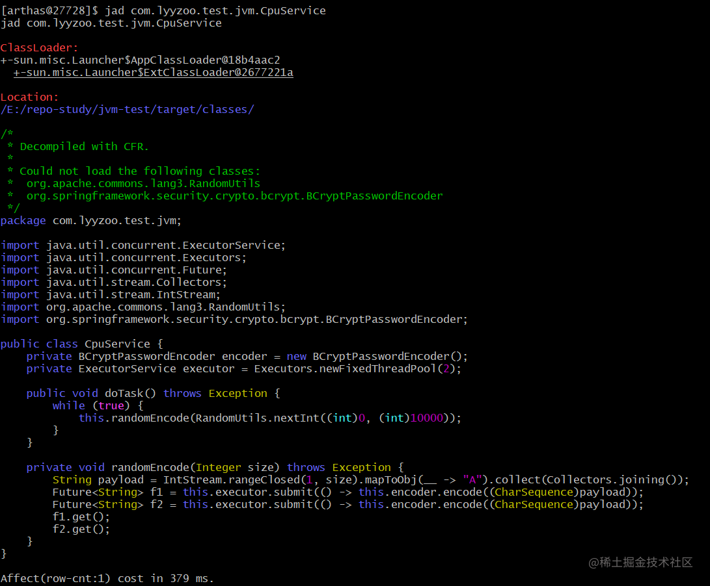

### redefine — 重载类
如果我们想做线上调试，又不想在本地改代码，打印日志，再提交到服务器，再重启服务测试，那我们可以结合 arthas 的 jad、mc、redefine 来动态重定义类。
1、首先用 jad 把源文件下载下来

然后修改下源码：添加了一行输出日志

2、使用 mc 命令反编译源文件
反编译后会生成对应的 class 文件：

3、使用 redefine 重载类

就可以看到控制台已经在输出我们打印的日志了：
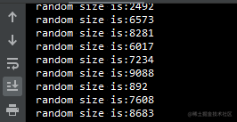
需要额外说明的是，由于 monitor、trace、watch 等命令是通过字节码增强技术来实现的，会在指定类的方法中插入一些切面来实现数据统计和观测，因此诊断结束要执行 shutdown 来还原类或方法字节码，然后退出 Arthas。


> 原文: <https://www.yuque.com/tulingzhouyu/db22bv/qyo9kwtwyo4zvxkf>