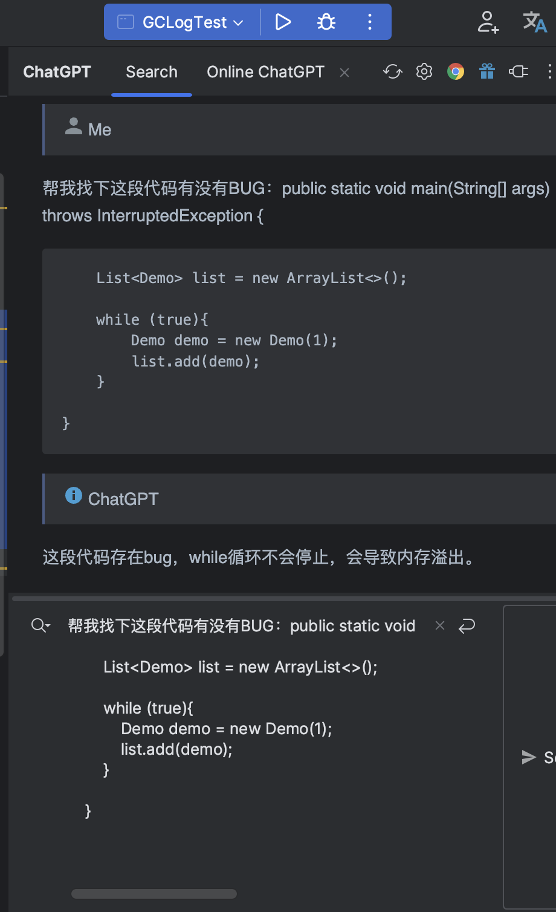

# 如何利用ChatGPT称为生产力工具！！！

大家好，我是一锅炖不下的北冥
这段时间ChatGPT非常火，在知乎上看到了也很多关于ChatGPT会不会替代程序员的焦虑，我个人觉得大家大可不必担心，我相信客户要的五彩斑斓的黑，ChatGPT也无能为力。
我们应该思考的方向是如何利用ChatGPT成为我们生产力的工具，帮我我们去提升效率，释放我们的时间去做一个更有价值的视频。
这里我整理了几个点，大家可以做个参考，也欢迎各位把你们的想法写在评论区我们一起讨论。

#### 源码
我们可以利用ChatGPT帮我们快速理解源码，举个例子，比如我们要研究JVM底层的源代码，那势必会涉及到阅读C、C++的代码。我们可能对C不是很熟悉，阅读会存在不少阻碍，我们就可以将我们看不懂的地方直接交给ChatGPT帮我们翻译出来。

#### 搜索引擎
对搜索引擎的降维打击，具个例子：不知道大家有没有过这么一段经历，假如我们要通过docker-compose去部署一个mysql实例。我们会发现，我们在网上找到的各种配置或多或少都存在一些问题，要么是配置缺失、要么是版本有问题等等。这时我们就可以通过ChatGPT来帮我去生成一份配置，里面可以包含全部的参数文件，还给我们全部解释了一遍～

#### 代码找BUG
这里我用一段死循环代码来做个测试，我们可以直接通过IDEA里面的一个插件，对代码进行分析，检测出我们代码里面的BUG。甚至我们还可以要求他给我们提供修复意见～
关于ChatGPT更多的一些玩法，大家可以在评论区一起聊聊，我是一锅炖不下的北冥，咱们下期再会～

> 原文: <https://www.yuque.com/tulingzhouyu/sfx8p0/sh04i9z654idlmdn>