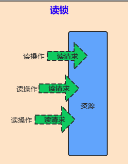
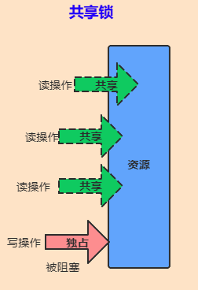

# 金三银四Java面试宝典


> 哈喽，各位小伙伴大家好，我是一锅炖不下的 "北冥"


## 什么是线程安全，造成线程安全的本质是什么？

难度：🌟🌟🌟
薪资：15-20K


### 什么是线程安全呢？

> 咱们初步去理解话记住一句话就行：
**如果一个对象可以安全地被多个线程同时使用，那它就是线程安全的。**


### 为什么并发编程会导致线程不安全？


### 可见性问题

我们先看一个例子来和大家分析一下：

```java
public class Test {
    private  static  int count;
    private static class Thread1 extends Thread {
        public void run() {
            for (int i = 0; i < 1000; i++) {
                count ++;
            }
        }
    }
    public static void main(String[] args) throws InterruptedException {
        Thread1  t1 = new Thread1();
        Thread1  t2 = new Thread1();
        t1.start();
        t2.start();
        t1.join();
        t2.join();
        System.out.println(count);
    }
}
```

代码非常简单，我定义了一个`count`静态全局变量，线程里面有一个方法，`for`循环进行自增 `1000` 次。在`main`方法中我们开启了两个线程执行，大家思考一下最后输出的结果是多少呢？

按照正常的情况，我们是需要它输出 `2000` 对吧，但是实际的情况可能和我们大家想的有点不同，最终输出的值大概率是小于 `2000` 的，而且每次输出的结果可能和我们大家想的也有点不同。

这个就是我们的线程安全的问题。线程安全是指在多线程环境下，程序可以始终执行正确的行为，符合预期的逻辑。比如我们刚刚的程序，共两个线程，每个线程对`count`变量累加`1000`次，预期的逻辑是`count`被累加了`2000`次，而代码执行的结果却不是`2000`，所以它是线程不安全的。

为什么是不安全的呢？这个是一个非常典型的因为可见性引发的线程安全问题，其核心的本质是因为 CPU 缓存可见性的问题导致的。要理解这个问题，我们得去了解一下 CPU 的运行原理：


- 在我们以往的单核时代，所有线程都在同一个 CPU 上执行， CPU 缓存与 内存数据的一致性容易解决。 因为所有线程都操作的是同一个 CPU 的缓存，一个线程对缓存的写，对另外一个线程来说一定是可见的。
线程 A 和 线程 B 都操作同一个 CPU 里面的缓存，所以线程 A 更新了 变量 V 的值，那么线程 B 之后访问变量 V 得到的一定是 V 的最新值。(线程 A 写入的值)。一个线程对共享变量的修改，另一个线程能立刻看到，称为「可见性」。
- 多核时代，每颗 CPU 都有自己的缓存，这时 CPU 缓存与内存的数据一致性就没那么容易解决了。当多个线程在不同 CPU 上执行时，这些线程操作的是不同的 CPU 缓存。 比如下图中，线程 A 操作的是 CPU-1 上的缓存，而线程 B 操作的是 CPU-2 上的缓存，很明显，这个 「线程 A」 对 「变量 V」 的操作对于 「线程 B」 来说就**不具备可见性**了。


### 原子性问题

由于 I/O 速度太慢，早期的**操作系统就发明了「多进程」，即便在单核 CPU** 上我们也可以一边听歌一边做别的，给人一种这几件事并行的错觉，其实是 CPU 在以极小的时间分片进行切换，每个进程执行一个**「时间片」**的时间 例如 50ms ， 这就是 多进程的功劳。


在一个时间片内，如果一个进程进行一个 I/O 操作，例如**「读取一个文件」，这个时候进程可以把自己标记为 「休眠状态」 并 出让 CPU 的使用权，当文件读取进内存这个 I/O 操作结束后**， 「操作系统」会把这个休眠的进程唤醒，唤醒后的进程就有机会重新获得 CPU 的使用权了。

这里的 「进程」 在等待 I/O 时之所以会释放 CPU 使用权，是为了让 CPU 在这段等待的时间里可以做别的事情，这样一来，CPU 的使用率就增加了。

如果这时**另一个进程也在读取文件**，读取文件的操作就会排队，磁盘驱动在完成一个进程的读操作后，发现有排队的任务，就会立即启动下一个读操作，这样 I/O 的使用率也增加了。

虽然这个逻辑看上去很简单，但是支持 「进程分时复用」 在操作系统的发展史上有着 「里程碑」 的意义，Unix 因为解决了这个问题而名噪天下。

「早期的操作系统」基于「进程」 来调度 CPU，不同的进程之间不共享「内存空间」，所以切换任务就需要切换进程，从而切换「内存映射地址」，而一个进程创建的所有线程，则共享同一个内存空间，所以线程之间的切换成本比进程间切换要低很多。 现代的操作系统都是基于更轻量的线程来调度，所以我们现在提到的「任务切换」 指的都是 「线程切换」。

Java 并发程序都是基于 多线程的，自然也会涉及到 「任务切换」。而同时任务切换也是 Java 并发中 Bug 的源头之一。

「任务切换」 的时机大多数是在 时间片结束的时候，我们现在使用的基本都是高级编程语言，而高级编程语言中的一行代码往往对应着多个 CPU 指令操作。

比如上面代码中的 count += 1 就对应着 3 个操作。

- 指令 1 读取：将 count 内存加载到 **CPU 寄存器**中
- 指令 2 修改：将 count 在寄存器中进行 +1 操作
- 指令 3 写入：将寄存器中的结果写入内存。（缓存机机制导致可能写入的是 CPU 缓存而不是 内存）

操作系统做任务切换，可以发生在任何一条 「CPU 指令」 执行完成的时候，而不是 高级编程语言中的一条语句。 ↑---【这里对原子性的解释要比 jcip 中更具体一些，我理解的原子性指的是一组高级语句中对应的所有 CPU 指令一起执行完成 才发生切换】

对于上面的三条指令来说，假设 count = 0，如果 线程 A 在 指令 1 执行完成后进行了线程切换，线程 A 和 线程 B 按照下图的顺序执行，那么我们会发现两个线程都执行了 count += 1 的操作，且 count 的值都是以 0 为起点，最终得到的结果是 1 而不是期望的 2。


> 我们将一个或者多个操作在 CPU 执行的过程中不被中断的特性称为 「原子性」


CPU 能保证的原子操作需要是 CPU 指令级别的，而不是高级语言的操作符。这是违背我们直觉的地方，因此很多时候我们需要在**「高级语言层面」**保证操作的原子性。


### 有序性问题

【也就是**重排序**问题】

并发编程中还有一个容易导致违背直觉性的诡异 BUG 的原因就是**有序性**。

> 有序性指的是 程序按照代码的先后顺序执行。


但是**编译器为了优化性能**，有时候会改变程序中语句的先后顺序，例如 a=6,b=7 编译后可能变成了 b=7,a=6 这个顺序。 **编译器调整了语句的顺序，但是不影响程序的最终结果。**但是有时候编译器和解释器的优化可能导致意想不到的 BUG。

Java 中的一个经典的关于有序性问题的按理就是利用 「双重检查」 创建单例对象，例如下面的代码：

在获取实例 getInstnace() 方法中，首先判断 intance 是否为空，如果为空则锁定 Singleton.class 并再次检查 instance 是否为空，如果还未空则创建 Singleton 的一个实例。

```java
// 一个双重检查的单例代码示例
public class Singleton {
    static Singleton instance;

    static Singleton getInstance() {
        if (instance == null) {
            synchronized (Singleton.class) {
                if (instance == null) {
                    instance = new Singleton();
                }
            }
        }
        return instance;
    }
}
```

假设有两个线程 A、B 同时调用 getInstance() 方法，则同时发现 instance == null ， 于是同时对 Singleton.class 加锁，此时 JVM 保证只有一个线程能够加锁成功（假设是 线程 A），此时另外一个线程会处于等待状态，线程 A 创建一个 Singleton 实例，然后释放锁，锁被释放后 线程 B 被唤醒，线程 B 尝试加锁 ，本次加锁可以成功，然后线程 B 检查 instance == null 发现已经有实例被创建，所以线程 B 不会再创建一个 SIngleton 实例。

看上去很完美，但是实际上 getInstance() 方法存在漏洞， 问题出在 new 这个操作符上。

我们以为的使用 new 操作符构造对象的流程：

1. 分配一块内存 M
2. 在内存上初始化 Singleton 对象
3. 将 M 的地址 赋值给 instance 变量

但是实际上被优化后的执行路径却是这样的：

1. 分配一块内存 M
2. 将 M 的地址赋值给 instance 变量
3. 在 内存 M 上初始化 Singleton 对象。

两者区别就在于，优化后的情况当对象尚未初始化完成的时候就已经被赋值给栈中的引用，此时就已经可以获得该对象了。

这样将会导致：

线程 A 先执行 `getInstance()`方法，当执行完指令 2 时发生了线程切换，此时线程 B 也执行了`getInstance()` 方法，进入判断 `instance != null`是 true，所以直接返回了 instance，而此时的 instance 因为**指令重排序的原因，先将堆内存中的地址值赋值给栈中的引用，下面才对堆中对象真正进行初始化，所以此时的 instance 是一个尚未初始化完成的对象**，如果这个时候直接使用的话，就可能触发 「空指针异常」。

所以这里的 B 存在的是可见性的问题，此时它看到的是一个未构建成功的 instance 实例


> 想写好并发程序，首先要知道并发程序的问题可能出现在哪里，是因为什么导致的。只要我们可以深刻的理解 可见性、原子性、有序性 在并发场景下的原理，就可以对 Bug 进行比较准确的诊断。缓存导致的可见性问题，线程切换带来的原子性问题，编译优化导致的有序性问题。这些手段的目的都是为了提高性能，但是**技术在解决一个问题的同事必然会带来新的问题**。


## Java 创建线程有哪些方式？
难度：🌟🌟
薪资：`10-15K`

#### 继承 Thread 类
通过继承 Thread 类，并重写它的 run 方法，我们就可以创建一个线程。

- 首先定义一个类来继承 Thread 类，重写 run 方法。
- 然后创建这个子类对象，并调用 start 方法启动线程。
```java
public class BeimingThread extends Thread {
      @Overrite
      public void run(){
          System.out.println("hello i'am new thread...")
      }

      public static void main(String[] args){
          new BeimingThread().start();
      }
}
```

#### 实现 Runnable 接口
通过实现 Runnable ，并实现 run 方法，也可以创建一个线程。

- 首先定义一个类实现 Runnable 接口，并实现 run 方法。
- 然后创建 Runnable 实现类对象，并把它作为 target 传入 Thread 的构造函数中
- 最后调用 start 方法启动线程
```java
public class BeimingThread implements Runnable {
      @Overrite
      public void run(){
          System.out.println("hello i'am new thread...")
      }

      public static void main(String[] args){
          new Thread(new BeimingThread()).start();
      }
}
```

#### 实现 Callable 接口，并结合 Future 实现

- 首先定义一个 Callable 的实现类，并实现 call 方法。call 方法是带返回值的。
- 然后通过 FutureTask 的构造方法，把这个 Callable 实现类传进去。
- 把 FutureTask 作为 Thread 类的 target ，创建 Thread 线程对象。
- 通过 FutureTask 的 get 方法获取线程的执行结果。
```java
public class BeimingFuture {
      public static void main(String[] args){
          FutureTask<Boolean> task = new FutureTask<>(new BeimingThread());
          new Thread(task).start();
          String message = task.get();
          System.out.println(message);
      }
}

public class BeimingThread implements Callable<String> {
       @Overrite
       public String call() throw Exception {
            return "hello callable";
       }
}
```

#### 使用 JDK 自带的 Executors 来创建线程池对象

- 首先，定一个 Runnable 的实现类，重写 run 方法
- 然后创建一个拥有固定线程数的线程池
- 最后通过 ExecutorService 对象的 execute 方法传入线程对象
```java
public class BeimingThread implements Runnable {
    @Override
    public void run(){
        System.out.println(Thread.currentThread().getName() + " thread run...");
    }

    public static void main(String[] args){
        ExectorService executor = Executors.newFixedThreadPool(10);
        for (int i = 0;i< 10;i++){
            executor.execute(new BeimingThread());
        }
        executor.shutdown();
    }
}
```

上面是和大家介绍了`4`种创建线程的方式，那真的就只有四种吗？我在网上看到一些说有`5`种的，有`8`种的。我用 Spring 的方式也可以创建线程、用 Timer 创建定时任务也可以创建线程。其实这都不算错，我们在回答这道面试题时，说出几种其实不算出彩，说明我们还没有抓出创建线程的根本原理。
这里教大家一个回答的方式，就直接回答只有一种方式，本质上不论是那种方式，最终都是调用了`Thread.start()`方法或是我们的`run()`方法。而 start()方法最终调用的还是我们的`run()`方法。

```java
/**
 * If this thread was constructed using a separate
 * {@code Runnable} run object, then that
 * {@code Runnable} object's {@code run} method is called;
 * otherwise, this method does nothing and returns.
 * <p>
 * Subclasses of {@code Thread} should override this method.
 *
 * @see     #start()
 * @see     #stop()
 * @see     #Thread(ThreadGroup, Runnable, String)
 */
@Override
public void run() {
    if (target != null) {
        target.run();
    }
}
```

所以在这个地方不论你说几种其实都是可以的，重要的是你要说出你的依据，讲出他们的共同点和区别。让面试官对你频频点头。

## 说说线程的生命周期和状态?

难度：🌟🌟
薪资：`10-15K`

> 线程在生命周期中并不是固定处于某一个状态而是随着代码的执行在不同状态之间切换。


Java 线程在运行的生命周期中的指定时刻只可能处于下面 6 种不同状态的其中一个状态：

- NEW: 初始状态，线程被创建出来但没有被调用 start() 。
- RUNNABLE: 运行状态，线程被调用了 start()等待运行的状态。
- BLOCKED ：阻塞状态，需要等待锁释放。
- WAITING：等待状态，表示该线程需要等待其他线程做出一些特定动作（通知或中断）。
- TIME_WAITING：超时等待状态，可以在指定的时间后自行返回而不是像 WAITING 那样一直等待。
- TERMINATED：终止状态，表示该线程已经运行完毕。


由上图可以看出：线程创建之后它将处于 NEW（新建） 状态，调用 start() 方法后开始运行，线程这时候处于 READY（可运行） 状态。可运行状态的线程获得了 CPU 时间片（timeslice）后就处于 RUNNING（运行） 状态。

> 在操作系统层面，线程有 READY 和 RUNNING 状态；而在 JVM 层面，只能看到 RUNNABLE 状态（图源：HowToDoInJavaopen in new window：Java Thread Life Cycle and Thread Statesopen in new window），所以 Java 系统一般将这两个状态统称为 RUNNABLE（运行中） 状态 。
为什么 JVM 没有区分这两种状态呢？ （摘自：Java 线程运行怎么有第六种状态？ - Dawell 的回答 open in new window ） 现在的时分（time-sharing）多任务（multi-task）操作系统架构通常都是用所谓的“时间分片（time quantum or time slice）”方式进行抢占式（preemptive）轮转调度（round-robin 式）。这个时间分片通常是很小的，一个线程一次最多只能在 CPU 上运行比如 10-20ms 的时间（此时处于 running 状态），也即大概只有 0.01 秒这一量级，时间片用后就要被切换下来放入调度队列的末尾等待再次调度。（也即回到 ready 状态）。线程切换的如此之快，区分这两种状态就没什么意义了。


当线程执行 `wait()`方法之后，线程进入 WAITING（等待） 状态。进入等待状态的线程需要依靠其他线程的通知才能够返回到运行状态。TIMED_WAITING(超时等待) 状态相当于在等待状态的基础上增加了超时限制，比如通过 sleep（long millis）方法或 wait（long millis）方法可以将线程置于 TIMED_WAITING 状态。当超时时间结束后，线程将会返回到 RUNNABLE 状态。当线程进入 synchronized 方法/块或者调用 wait 后（被 notify）重新进入 synchronized 方法/块，但是锁被其它线程占有，这个时候线程就会进入 BLOCKED（阻塞） 状态。线程在执行完了 run()方法之后将会进入到 TERMINATED（终止） 状态。


## 为什么阿里禁止使用 Executors 来创建线程？

难度：🌟🌟🌟
薪资：12-17K

> 阿里开发手册关于线程池有这样一条规定：线程池不允许使用 Executors 去创建，而是通过 ThreadPoolExecutor 的方式，这样的处理方式让写的同学更加明确线程池的运行规则，**规避资源耗尽的风险**。


我们直接抓重点，咱们把这句话精简一下：

> Executors 会导致资源耗尽


非常清晰了对吧，那我们就来研究一下，为什么 Executors 会导致资源耗尽呢？
我们代码来看一下:

```java
ExecutorService beimingExecutor = Executors.newSingleThreadExecutor();
```


我们直接看这张图是不是就可以看到 Executors 实例化的几种线程池的方案了对吧。手册里面直接规定不让用，那说明这几种是不是都存在导致资源耗尽的风险呢？我们一个一个来分析一下：


### CachedThreadPool

> Java 中 Executor 框架中的一种线程池类型，它在需要时会创建新线程来执行任务，并在任务完成后将其闲置的线程保留在池中，以备下次使用。该线程池可以根据需要动态地调整线程数量，因此适合于执行大量短期异步任务的应用程序。


CachedThreadPool 线程池的主要特点是：

- 当需要执行新任务时，如果当前可用线程数量小于 corePoolSize，则创建新线程来执行任务。
- 如果当前可用线程数量等于或大于 corePoolSize，则将任务放入工作队列中等待可用线程执行。
- 如果工作队列已满，将创建一个新线程来执行任务，即使当前已有许多线程处于空闲状态。
- 当线程空闲时间超过指定的 keepAliveTime 时，线程将被终止并从线程池中移除，以便释放系统资源。

总之，CachedThreadPool 线程池的特点是根据需要动态地创建线程，适合于执行大量短期异步任务，但如果任务执行时间过长，则可能会创建过多的线程，从而导致系统资源的浪费。

源码解读：

```java
  public static ExecutorService newCachedThreadPool() {
        return new ThreadPoolExecutor(0, Integer.MAX_VALUE,
                                      60L, TimeUnit.SECONDS,
                                      new SynchronousQueue<Runnable>());
    }
```

里面调用的是**ThreadPoolExecutor**这个类来创建的实例，我们发现这个类是不是很熟悉，阿里规范里面提到的建议就是用 ThreadPoolExecutor 来创建线程池对吧，那为什么不建议我们用封装好的呢？我们仔细的来看看里面的几个入参：

```java
 public ThreadPoolExecutor(int corePoolSize,
                              int maximumPoolSize,
                              long keepAliveTime,
                              TimeUnit unit,
                              BlockingQueue<Runnable> workQueue) {
        this(corePoolSize, maximumPoolSize, keepAliveTime, unit, workQueue,
             Executors.defaultThreadFactory(), defaultHandler);
    }
```
| 字段名称 | 含义 |
| --- | --- |
| corePoolSize | 线程池的基本大小。在没有任务执行时，线程池的大小为 corePoolSize。如果有任务提交，就会创建线程来处理任务，直到线程池的数量达到 corePoolSize |
| maximumPoolSize | 线程池允许的最大线程数。当线程池中的线程数目达到 corePoolSize 时，新任务将被放入队列中，如果队列满了，那么就会创建新的线程来处理任务，直到线程数量达到 maximumPoolSize。 |
| keepAliveTime | 线程池中超过 corePoolSize 线程的空闲时间的存活时间。也就是说，如果线程池中的线程数量大于 corePoolSize，那么这些多出来的线程在空闲了 keepAliveTime 后会被销毁，直到线程池中的线程数目不超过 corePoolSize。 |
| unit | keepAliveTime 的时间单位。 |
| workQueue | 任务队列。用于保存等待执行的任务的阻塞队列。常用的有 ArrayBlockingQueue、LinkedBlockingQueue、SynchronousQueue。 |
| threadFactory | 线程工厂，用于创建新线程。 |
| handler | 拒绝策略，用于当线程池中的资源已经全部使用，且队列已满的情况下，如何拒绝新的任务。常用的有 AbortPolicy、CallerRunsPolicy、DiscardOldestPolicy、DiscardPolicy。 |


### FixedThreadPool

> FixedThreadPool 是一种固定大小的线程池，它的特点是创建一个固定大小的线程池，当有新任务到来时，线程池中有空闲线程则立即使用空闲线程执行任务，如果没有空闲线程，则新任务会被暂时放入任务队列中等待有空闲线程时执行。


```java
    public static ExecutorService newFixedThreadPool(int nThreads) {
        return new ThreadPoolExecutor(nThreads, nThreads,
                                      0L, TimeUnit.MILLISECONDS,
                                      new LinkedBlockingQueue<Runnable>());
    }
```

与 CachedThreadPool 相比，FixedThreadPool 的线程数量是固定的，不会根据任务数量的变化而动态调整。这意味着，当任务数量超过线程池大小时，多出的任务会被放入队列中等待有空闲线程时执行，因此 FixedThreadPool 可能会在任务数量较多时出现队列溢出的问题，也可能因为线程数较少而导致处理任务的速度较慢。但是，当任务数量较少时， FixedThreadPool 由于不需要频繁创建和销毁线程，相比 CachedThreadPool 可以提供更好的性能和稳定性。因此，FixedThreadPool 适用于任务数量比较稳定且需要限制线程数的情况，例如并发请求量不高的网络服务器或者后台任务处理等场景。


### SingleThreadExecutor

> SingleThreadExecutor 是 Java 中的一种线程池实现。它的特点是只创建一个单独的工作线程来处理任务。当任务被提交到线程池时，如果当前没有运行的线程，则会创建一个新的线程来处理该任务。如果当前有一个线程在处理任务，新提交的任务会被加入到队列中等待被执行。该线程池可以保证任务被顺序执行，而且任意时刻只有一个线程在工作，因此也避免了线程安全的问题。


```java
    public static ExecutorService newSingleThreadExecutor() {
        return new FinalizableDelegatedExecutorService
            (new ThreadPoolExecutor(1, 1,
                                    0L, TimeUnit.MILLISECONDS,
                                    new LinkedBlockingQueue<Runnable>()));
    }
```

SingleThreadExecutor 可以看做是一种特殊的 FixedThreadPool，它的线程数量为 1。由于它只创建一个线程，因此它可以避免多线程带来的竞争问题和死锁问题。但是，因为它只有一个线程在工作，因此处理速度较慢，不适合处理大量的任务。它适用于需要顺序执行任务的场景，例如顺序执行文件下载任务、顺序处理消息等场景。同时，由于只有一个线程在工作，也适合用于需要保证数据一致性或避免竞态条件的场景。


## 谈谈你对 ThreadLocal 的理解

难度：🌟🌟🌟
薪资：12-17K

### 使用场景

使用场景一：代替参数的显式传递

使用场景二：全局存储用户信息（项目中用到）

使用场景三：解决线程安全问题


### 原理

首先看下 ThreadLocal 都有哪些重要属性：

```java
// 当前 ThreadLocal 的 hashCode，由 nextHashCode() 计算而来，用于计算当前 ThreadLocal 在 ThreadLocalMap 中的索引位置
private final int threadLocalHashCode = nextHashCode();
// 哈希魔数，主要与斐波那契散列法以及黄金分割有关
private static final int HASH_INCREMENT = 0x61c88647;
// 返回计算出的下一个哈希值，其值为 i * HASH_INCREMENT，其中 i 代表调用次数
private static int nextHashCode() {
    return nextHashCode.getAndAdd(HASH_INCREMENT);
}
// 保证了在一台机器中每个 ThreadLocal 的 threadLocalHashCode 是唯一的
private static AtomicInteger nextHashCode = new AtomicInteger();
```

其中的 HASH_INCREMENT 也不是随便取的，它转化为十进制是 1640531527，2654435769 转换成 int 类型就是 -1640531527，2654435769 等于 (√5-1)/2 乘以 2 的 32 次方。(√5-1)/2 就是黄金分割数，近似为 0.618，也就是说 0x61c88647 理解为一个黄金分割数乘以 2 的 32 次方，它可以保证 nextHashCode 生成的哈希值，均匀的分布在 2 的幂次方上，且小于 2 的 32 次方。

下面是 javaspecialists 中一篇文章对它的介绍：

> This number represents the golden ratio (sqrt(5)-1) times two to the power of 31 ((sqrt(5)-1) * (2^31)). The result is then a golden number, either 2654435769 or -1640531527.


下面用例子来证明下：

```java
private static final int HASH_INCREMENT = 0x61c88647;

public static void main(String[] args) throws Exception {
    int n = 5;
    int max = 2 << (n - 1);
    for (int i = 0; i < max; i++) {
        System.out.print(i * HASH_INCREMENT & (max - 1));
        System.out.print(" ");

    }
}
```

运行结果为：`0 7 14 21 28 3 10 17 24 31 6 13 20 27 2 9 16 23 30 5 12 19 26 1 8 15 22 29 4 11 18 25`
可以发现元素索引值完美的散列在数组当中，并没有出现冲突。


#### ThreadLocalMap

除了上述属性外，还有一个重要的属性 ThreadLocalMap，ThreadLocalMap 是 ThreadLocal 的静态内部类，当一个线程有多个 ThreadLocal 时，需要一个容器来管理多个 ThreadLocal，ThreadLocalMap 的作用就是管理线程中多个 ThreadLocal，源码如下：

```java
static class ThreadLocalMap {
	/**
	 * 键值对实体的存储结构
	 */
	static class Entry extends WeakReference<ThreadLocal<?>> {
		// 当前线程关联的 value，这个 value 并没有用弱引用追踪
		Object value;

		/**
		 * 构造键值对
		 *
		 * @param k k 作 key,作为 key 的 ThreadLocal 会被包装为一个弱引用
		 * @param v v 作 value
		 */
		Entry(ThreadLocal<?> k, Object v) {
			super(k);
			value = v;
		}
	}

	// 初始容量，必须为 2 的幂
	private static final int INITIAL_CAPACITY = 16;

	// 存储 ThreadLocal 的键值对实体数组，长度必须为 2 的幂
	private Entry[] table;

	// ThreadLocalMap 元素数量
	private int size = 0;

	// 扩容的阈值，默认是数组大小的三分之二
	private int threshold;
}
```

从源码中看到 ThreadLocalMap 其实就是一个简单的 Map 结构，底层是数组，有初始化大小，也有扩容阈值大小，数组的元素是 Entry，Entry 的 key 就是 ThreadLocal 的引用，value 是 ThreadLocal 的值。ThreadLocalMap 解决 hash 冲突的方式采用的是线性探测法，如果发生冲突会继续寻找下一个空的位置。

这样的就有可能会发生内存泄漏的问题，下面让我们进行分析：


### ThreadLocal 内存泄漏

难度：🌟🌟🌟
薪资：15-20K

ThreadLocal 在没有外部强引用时，发生 GC 时会被回收，那么 ThreadLocalMap 中保存的 key 值就变成了 null，而 Entry 又被 threadLocalMap 对象引用，threadLocalMap 对象又被 Thread 对象所引用，那么当 Thread 一直不终结的话，value 对象就会一直存在于内存中，也就导致了内存泄漏，直至 Thread 被销毁后，才会被回收。


那么如何避免内存泄漏呢？

在使用完 ThreadLocal 变量后，需要我们手动 remove 掉，防止 ThreadLocalMap 中 Entry 一直保持对 value 的强引用，导致 value 不能被回收，其中 remove 源码如下所示：

```java
/**
 * 清理当前 ThreadLocal 对象关联的键值对
 */
public void remove() {
	// 返回当前线程持有的 map
	ThreadLocalMap m = getMap(Thread.currentThread());
	if (m != null) {
		// 从 map 中清理当前 ThreadLocal 对象关联的键值对
		m.remove(this);
	}
}
```

remove 方法的时序图如下所示：

remove 方法是先获取到当前线程的 ThreadLocalMap，并且调用了它的 remove 方法，从 map 中清理当前 ThreadLocal 对象关联的键值对，这样 value 就可以被 GC 回收了。

那么 ThreadLocal 是如何实现线程隔离的呢？


#### ThreadLocal 的 set 方法

我们先去看下 ThreadLocal 的 set 方法，源码如下：

```java
/**
 * 为当前 ThreadLocal 对象关联 value 值
 *
 * @param value 要存储在此线程的线程副本的值
 */
public void set(T value) {
	// 返回当前ThreadLocal所在的线程
	Thread t = Thread.currentThread();
	// 返回当前线程持有的map
	ThreadLocalMap map = getMap(t);
	if (map != null) {
		// 如果 ThreadLocalMap 不为空，则直接存储<ThreadLocal, T>键值对
		map.set(this, value);
	} else {
		// 否则，需要为当前线程初始化 ThreadLocalMap，并存储键值对 <this, firstValue>
		createMap(t, value);
	}
}
```

set 方法的作用是把我们想要存储的 value 给保存进去。set 方法的流程主要是：

先获取到当前线程的引用

- 利用这个引用来获取到 ThreadLocalMap
- 如果 map 为空，则去创建一个 ThreadLocalMap
- 如果 map 不为空，就利用 ThreadLocalMap 的 set 方法将 value 添加到 map 中
set 方法的时序图如下所示：

其中 map 就是我们上面讲到的 ThreadLocalMap，可以看到它是通过当前线程对象获取到的 ThreadLocalMap，接下来我们看 getMap 方法的源代码：

```java
/**
 * 返回当前线程 thread 持有的 ThreadLocalMap
 *
 * @param t 当前线程
 * @return ThreadLocalMap
 */
ThreadLocalMap getMap(Thread t) {
	return t.threadLocals;
}
```

getMap 方法的作用主要是获取当前线程内的 ThreadLocalMap 对象，原来这个 ThreadLocalMap 是线程的一个属性，下面让我们看看 Thread 中的相关代码：

```java
/**
 * ThreadLocal 的 ThreadLocalMap 是线程的一个属性，所以在多线程环境下 threadLocals 是线程安全的
 */
ThreadLocal.ThreadLocalMap threadLocals = null;
```

可以看出每个线程都有 ThreadLocalMap 对象，被命名为 threadLocals，默认为 null，所以每个线程的 ThreadLocals 都是隔离独享的。

调用 ThreadLocalMap.set() 时，会把当前 threadLocal 对象作为 key，想要保存的对象作为 value，存入 map。

其中 ThreadLocalMap.set() 的源码如下：

```java
/**
 * 在 map 中存储键值对<key, value>
 *
 * @param key   threadLocal
 * @param value 要设置的 value 值
 */
private void set(ThreadLocal<?> key, Object value) {
	Entry[] tab = table;
	int len = tab.length;
	// 计算 key 在数组中的下标
	int i = key.threadLocalHashCode & (len - 1);
	// 遍历一段连续的元素，以查找匹配的 ThreadLocal 对象
	for (Entry e = tab[i]; e != null; e = tab[i = nextIndex(i, len)]) {
		// 获取该哈希值处的ThreadLocal对象
		ThreadLocal<?> k = e.get();

		// 键值ThreadLocal匹配，直接更改map中的value
		if (k == key) {
			e.value = value;
			return;
		}

		// 若 key 是 null，说明 ThreadLocal 被清理了，直接替换掉
		if (k == null) {
			replaceStaleEntry(key, value, i);
			return;
		}
	}

	// 直到遇见了空槽也没找到匹配的ThreadLocal对象，那么在此空槽处安排ThreadLocal对象和缓存的value
	tab[i] = new Entry(key, value);
	int sz = ++size;
	// 如果没有元素被清理，那么就要检查当前元素数量是否超过了容量阙值(数组大小的三分之二)，以便决定是否扩容
	if (!cleanSomeSlots(i, sz) && sz >= threshold) {
		// 扩容的过程也是对所有的 key 重新哈希的过程
		rehash();
	}
}
```

相信到这里，大家应该对 Thread、ThreadLocal 以及 ThreadLocalMap 的关系有了进一步的理解，下图为三者之间的关系：


#### ThreadLocal 的 get 方法

了解完 set 方法后，让我们看下 get 方法，源码如下：

```java
/**
 * 返回当前 ThreadLocal 对象关联的值
 *
 * @return
 */
public T get() {
	// 返回当前 ThreadLocal 所在的线程
	Thread t = Thread.currentThread();
	// 从线程中拿到 ThreadLocalMap
	ThreadLocalMap map = getMap(t);
	if (map != null) {
		// 从 map 中拿到 entry
		ThreadLocalMap.Entry e = map.getEntry(this);
		// 如果不为空，读取当前 ThreadLocal 中保存的值
		if (e != null) {
			@SuppressWarnings("unchecked")
			T result = (T) e.value;
			return result;
		}
	}
	// 若 map 为空，则对当前线程的 ThreadLocal 进行初始化，最后返回当前的 ThreadLocal 对象关联的初值，即 value
	return setInitialValue();
}
```

get 方法的主要流程为：

- 先获取到当前线程的引用
- 获取当前线程内部的 ThreadLocalMap
- 如果 map 存在，则获取当前 ThreadLocal 对应的 value 值
- 如果 map 不存在或者找不到 value 值，则调用 setInitialValue() 进行初始化

get 方法的时序图如下所示:

其中每个 Thread 的 ThreadLocalMap 以 threadLocal 作为 key，保存自己线程的 value 副本，也就是保存在每个线程中，并没有保存在 ThreadLocal 对象中。

其中 ThreadLocalMap.getEntry() 方法的源码如下：

```java
/**
 * 返回 key 关联的键值对实体
 *
 * @param key threadLocal
 * @return
 */
private Entry getEntry(ThreadLocal<?> key) {
	int i = key.threadLocalHashCode & (table.length - 1);
	Entry e = table[i];
	// 若 e 不为空，并且 e 的 ThreadLocal 的内存地址和 key 相同，直接返回
	if (e != null && e.get() == key) {
		return e;
	} else {
		// 从 i 开始向后遍历找到键值对实体
		return getEntryAfterMiss(key, i, e);
	}
}
```


#### ThreadLocalMap 的 resize 方法

当 ThreadLocalMap 中的 ThreadLocal 的个数超过容量阈值时，ThreadLocalMap 就要开始扩容了，我们一起来看下 resize 的源代码：

```java
/**
 * 扩容，重新计算索引，标记垃圾值，方便 GC 回收
 */
private void resize() {
	Entry[] oldTab = table;
	int oldLen = oldTab.length;
	int newLen = oldLen * 2;
	// 新建一个数组，按照2倍长度扩容
	Entry[] newTab = new Entry[newLen];
	int count = 0;

	// 将旧数组的值拷贝到新数组上
	for (int j = 0; j < oldLen; ++j) {
		Entry e = oldTab[j];
		if (e != null) {
			ThreadLocal<?> k = e.get();
			// 若有垃圾值，则标记清理该元素的引用，以便GC回收
			if (k == null) {
				e.value = null;
			} else {
				// 计算 ThreadLocal 在新数组中的位置
				int h = k.threadLocalHashCode & (newLen - 1);
				// 如果发生冲突，使用线性探测往后寻找合适的位置
				while (newTab[h] != null) {
					h = nextIndex(h, newLen);
				}
				newTab[h] = e;
				count++;
			}
		}
	}
	// 设置新的扩容阈值，为数组长度的三分之二
	setThreshold(newLen);
	size = count;
	table = newTab;
}
```

resize 方法主要是进行扩容，同时会将垃圾值标记方便 GC 回收，扩容后数组大小是原来数组的两倍


## Java 中的 21 种锁知多少？

难度：🌟🌟🌟🌟
薪资：15-20K


### 乐观锁

乐观锁是一种乐观思想，假定当前环境是读多写少，遇到并发写的概率比较低，读数据时认为别的线程不会正在进行修改（所以没有上锁）。写数据时，判断当前 与期望值是否相同，如果相同则进行更新（更新期间加锁，保证是原子性的）。

Java 中的乐观锁： CAS，比较并替换，比较当前值（主内存中的值），与预期值（当前线程中的值，主内存中值的一份拷贝）是否一样，一样则更新，否则继续进行 CAS 操作。


如上图所示，可以同时进行读操作，读的时候其他线程不能进行写操作。


### 悲观锁

悲观锁是一种悲观思想，即认为写多读少，遇到并发写的可能性高，每次去拿数据的时候都认为其他线程会修改，所以每次读写数据都会认为其他线程会修改，所以每次读写数据时都会上锁。其他线程想要读写这个数据时，会被这个线程 block，直到这个线程释放锁然后其他线程获取到锁。

Java 中的悲观锁： synchronized 修饰的方法和方法块、ReentrantLock。


如上图所示，只能有一个线程进行读操作或者写操作，其他线程的读写操作均不能进行。


### 自旋锁

自旋锁是一种技术： 为了让线程等待，我们只须让线程执行一个忙循环（自旋）。

现在绝大多数的个人电脑和服务器都是多路（核）处理器系统，如果物理机器有一个以上的处理器或者处理器核心，能让两个或以上的线程同时并行执行，就可以让后面请求锁的那个线程“稍等一会”，但不放弃处理器的执行时间，看看持有锁的线程是否很快就会释放锁。

自旋锁的优点： 避免了线程切换的开销。挂起线程和恢复线程的操作都需要转入内核态中完成，这些操作给 Java 虚拟机的并发性能带来了很大的压力。

自旋锁的缺点： 占用处理器的时间，如果占用的时间很长，会白白消耗处理器资源，而不会做任何有价值的工作，带来性能的浪费。因此自旋等待的时间必须有一定的限度，如果自旋超过了限定的次数仍然没有成功获得锁，就应当使用传统的方式去挂起线程。

自旋次数默认值：10 次，可以使用参数-XX:PreBlockSpin 来自行更改。

自适应自旋： 自适应意味着自旋的时间不再是固定的，而是由前一次在同一个锁上的自旋时间及锁的拥有者的状态来决定的。有了自适应自旋，随着程序运行时间的增长及性能监控信息的不断完善，虚拟机对程序锁的状态预测就会越来越精准。

Java 中的自旋锁： CAS 操作中的比较操作失败后的自旋等待。


### 可重入锁（递归锁）

可重入锁是一种技术： 任意线程在获取到锁之后能够再次获取该锁而不会被锁所阻塞。

可重入锁的原理： 通过组合自定义同步器来实现锁的获取与释放。

-  再次获取锁：识别获取锁的线程是否为当前占据锁的线程，如果是，则再次成功获取。获取锁后，进行计数自增， 
-  释放锁：释放锁时，进行计数自减。 

Java 中的可重入锁： ReentrantLock、synchronized 修饰的方法或代码段。

可重入锁的作用： 避免死锁。

面试题 1： 可重入锁如果加了两把，但是只释放了一把会出现什么问题？

答：程序卡死，线程不能出来，也就是说我们申请了几把锁，就需要释放几把锁。

面试题 2： 如果只加了一把锁，释放两次会出现什么问题？

答：会报错，java.lang.IllegalMonitorStateException。


### 读写锁

读写锁是一种技术： 通过 ReentrantReadWriteLock 类来实现。为了提高性能， Java 提供了读写锁，在读的地方使用读锁，在写的地方使用写锁，灵活控制，如果没有写锁的情况下，读是无阻塞的，在一定程度上提高了程序的执行效率。读写锁分为读锁和写锁，多个读锁不互斥，读锁与写锁互斥，这是由 jvm 自己控制的。

读锁： 允许多个线程获取读锁，同时访问同一个资源。



写锁： 只允许一个线程获取写锁，不允许同时访问同一个资源。


如何使用：

```java
/**
* 创建一个读写锁
* 它是一个读写融为一体的锁，在使用的时候，需要转换
*/
private ReentrantReadWriteLock rwLock = new ReentrantReadWriteLock();
```

获取读锁和释放读锁

```java
// 获取读锁
rwLock.readLock().lock();

// 释放读锁
rwLock.readLock().unlock();
```

获取写锁和释放写锁

```java
// 创建一个写锁
rwLock.writeLock().lock();

// 写锁 释放
rwLock.writeLock().unlock();
```

Java 中的读写锁：ReentrantReadWriteLock


### 公平锁


公平锁是一种思想： 多个线程按照申请锁的顺序来获取锁。在并发环境中，每个线程会先查看此锁维护的等待队列，如果当前等待队列为空，则占有锁，如果等待队列不为空，则加入到等待队列的末尾，按照 FIFO 的原则从队列中拿到线程，然后占有锁。


### 非公平锁


非公平锁

非公平锁是一种思想： 线程尝试获取锁，如果获取不到，则再采用公平锁的方式。多个线程获取锁的顺序，不是按照先到先得的顺序，有可能后申请锁的线程比先申请的线程优先获取锁。

优点： 非公平锁的性能高于公平锁。

缺点： 有可能造成线程饥饿（某个线程很长一段时间获取不到锁）

Java 中的非公平锁：synchronized 是非公平锁，ReentrantLock 通过构造函数指定该锁是公平的还是非公平的，默认是非公平的。


### 共享锁


共享锁是一种思想： 可以有多个线程获取读锁，以共享的方式持有锁。和乐观锁、读写锁同义。

Java 中用到的共享锁： ReentrantReadWriteLock。


### 独占锁


独占锁是一种思想： 只能有一个线程获取锁，以独占的方式持有锁。和悲观锁、互斥锁同义。

Java 中用到的独占锁： synchronized，ReentrantLock


### 重量级锁


重量级锁是一种称谓： synchronized 是通过对象内部的一个叫做监视器锁（monitor）来实现的，监视器锁本身依赖底层的操作系统的 Mutex Lock 来实现。操作系统实现线程的切换需要从用户态切换到核心态，成本非常高。这种依赖于操作系统 Mutex Lock 来实现的锁称为重量级锁。为了优化 synchonized，引入了轻量级锁，偏向锁。

Java 中的重量级锁： `synchronized`


### 轻量级锁


轻量级锁是 JDK6 时加入的一种锁优化机制： 轻量级锁是在无竞争的情况下使用 CAS 操作去消除同步使用的互斥量。轻量级是相对于使用操作系统互斥量来实现的重量级锁而言的。轻量级锁在没有多线程竞争的前提下，减少传统的重量级锁使用操作系统互斥量产生的性能消耗。如果出现两条以上的线程争用同一个锁的情况，那轻量级锁将不会有效，必须膨胀为重量级锁。

优点： 如果没有竞争，通过 CAS 操作成功避免了使用互斥量的开销。

缺点： 如果存在竞争，除了互斥量本身的开销外，还额外产生了 CAS 操作的开销，因此在有竞争的情况下，轻量级锁比传统的重量级锁更慢。


### 偏向锁


偏向锁是 JDK6 时加入的一种锁优化机制： 在无竞争的情况下把整个同步都消除掉，连 CAS 操作都不去做了。偏是指偏心，它的意思是这个锁会偏向于第一个获得它的线程，如果在接下来的执行过程中，该锁一直没有被其他的线程获取，则持有偏向锁的线程将永远不需要再进行同步。持有偏向锁的线程以后每次进入这个锁相关的同步块时，虚拟机都可以不再进行任何同步操作（例如加锁、解锁及对 Mark Word 的更新操作等）。

优点： 把整个同步都消除掉，连 CAS 操作都不去做了，优于轻量级锁。

缺点： 如果程序中大多数的锁都总是被多个不同的线程访问，那偏向锁就是多余的。


### 分段锁


分段锁是一种机制： 最好的例子来说明分段锁是 ConcurrentHashMap。**ConcurrentHashMap 原理：**它内部细分了若干个小的 HashMap，称之为段(Segment)。默认情况下一个 ConcurrentHashMap 被进一步细分为 16 个段，既就是锁的并发度。如果需要在 ConcurrentHashMap 添加一项 key-value，并不是将整个 HashMap 加锁，而是首先根据 hashcode 得到该 key-value 应该存放在哪个段中，然后对该段加锁，并完成 put 操作。在多线程环境中，如果多个线程同时进行 put 操作，只要被加入的 key-value 不存放在同一个段中，则线程间可以做到真正的并行。

线程安全：ConcurrentHashMap 是一个 Segment 数组， Segment 通过继承 ReentrantLock 来进行加锁，所以每次需要加锁的操作锁住的是一个 segment，这样只要保证每个 Segment 是线程安全的，也就实现了全局的线程安全


### 互斥锁


互斥锁与悲观锁、独占锁同义，表示某个资源只能被一个线程访问，其他线程不能访问。

-  读-读互斥 
-  读-写互斥 
-  写-读互斥 
-  写-写互斥 

Java 中的同步锁： `synchronized`


### 同步锁


同步锁与互斥锁同义，表示并发执行的多个线程，在同一时间内只允许一个线程访问共享数据。

Java 中的同步锁： synchronized


### 死锁


死锁是一种现象：如线程 A 持有资源 x，线程 B 持有资源 y，线程 A 等待线程 B 释放资源 y，线程 B 等待线程 A 释放资源 x，两个线程都不释放自己持有的资源，则两个线程都获取不到对方的资源，就会造成死锁。

Java 中的死锁不能自行打破，所以线程死锁后，线程不能进行响应。所以一定要注意程序的并发场景，避免造成死锁。


### 锁粗化


锁粗化是一种优化技术： 如果一系列的连续操作都对同一个对象反复加锁和解锁，甚至加锁操作都是出现在循环体体之中，就算真的没有线程竞争，频繁地进行互斥同步操作将会导致不必要的性能损耗，所以就采取了一种方案：把加锁的范围扩展（粗化）到整个操作序列的外部，这样加锁解锁的频率就会大大降低，从而减少了性能损耗。


### 锁消除


锁消除是一种优化技术： 就是把锁干掉。当 Java 虚拟机运行时发现有些共享数据不会被线程竞争时就可以进行锁消除。

那如何判断共享数据不会被线程竞争？

利用逃逸分析技术：分析对象的作用域，如果对象在 A 方法中定义后，被作为参数传递到 B 方法中，则称为方法逃逸；如果被其他线程访问，则称为线程逃逸。

在堆上的某个数据不会逃逸出去被其他线程访问到，就可以把它当作栈上数据对待，认为它是线程私有的，同步加锁就不需要了。


### synchronized


synchronized是 Java 中的关键字：用来修饰方法、对象实例。属于独占锁、悲观锁、可重入锁、非公平锁。

1.  作用于实例方法时，锁住的是对象的实例(this)； 
2.  当作用于静态方法时，锁住的是 Class 类，相当于类的一个全局锁， 会锁所有调用该方法的线程； 
3.  synchronized 作用于一个非 NULL 的对象实例时，锁住的是所有以该对象为锁的代码块。它有多个队列，当多个线程一起访问某个对象监视器的时候，对象监视器会将这些线程存储在不同的容器中。 

每个对象都有个 monitor 对象， 加锁就是在竞争 monitor 对象，代码块加锁是在代码块前后分别加上 monitorenter 和 monitorexit 指令来实现的，方法加锁是通过一个标记位来判断的。


### Lock 和 synchronized 的区别

自动挡和手动挡的区别

Lock： 是 Java 中的接口，可重入锁、悲观锁、独占锁、互斥锁、同步锁。

1.  Lock 需要手动获取锁和释放锁。就好比自动挡和手动挡的区别 
2.  Lock 是一个接口，而 synchronized 是 Java 中的关键字， synchronized 是内置的语言实现。 
3.  synchronized 在发生异常时，会自动释放线程占有的锁，因此不会导致死锁现象发生；而 Lock 在发生异常时，如果没有主动通过 unLock()去释放锁，则很可能造成死锁现象，因此使用 Lock 时需要在 finally 块中释放锁。 
4.  Lock 可以让等待锁的线程响应中断，而 synchronized 却不行，使用 synchronized 时，等待的线程会一直等待下去，不能够响应中断。 
5.  通过 Lock 可以知道有没有成功获取锁，而 synchronized 却无法办到。 
6.  Lock 可以通过实现读写锁提高多个线程进行读操作的效率。 

synchronized 的优势：

足够清晰简单，只需要基础的同步功能时，用 synchronized。

Lock 应该确保在 finally 块中释放锁。如果使用 synchronized，JVM 确保即使出现异常，锁也能被自动释放。

使用 Lock 时，Java 虚拟机很难得知哪些锁对象是由特定线程锁持有的。


### ReentrantLock 和 synchronized 的区别


ReentrantLock是 Java 中的类 ： 继承了 Lock 类，可重入锁、悲观锁、独占锁、互斥锁、同步锁。

划重点

相同点：

1.主要解决共享变量如何安全访问的问题

2.都是可重入锁，也叫做递归锁，同一线程可以多次获得同一个锁，

3.保证了线程安全的两大特性：可见性、原子性。

不同点：

1.  ReentrantLock 就像手动汽车，需要显示的调用 lock 和 unlock 方法， synchronized 隐式获得释放锁。 
2.  ReentrantLock 可响应中断， synchronized 是不可以响应中断的，ReentrantLock 为处理锁的不可用性提供了更高的灵活性 
3.  ReentrantLock 是 API 级别的， synchronized 是 JVM 级别的 
4.  ReentrantLock 可以实现公平锁、非公平锁，默认非公平锁，synchronized 是非公平锁，且不可更改。 
5.  ReentrantLock 通过 Condition 可以绑定多个条件 


## 什么是分布式锁？为什么需要分布式锁？

岗位：中高级工程师
难度：🌟🌟🌟
频率：高频 🔥
作者：北冥
备注：笔记资料在评论区🔝置顶，🆓 免费领取 🆓

> 在日常开发工作中，我们为了保证资源操作的最终一致性，同样需要用到锁来进行操作控制。本文结合自己工作中的经验沉淀，来跟大家一起聊聊 分布式锁的那些事，分享一些实用内容给大家。


在真实业务中，我们用到锁的场景实际上非常多。比如打车业务中的抢单。以往我们在单机环境中，比如说`Java`我们可以使用`Synchronized`或者`ReentrantLock`来保证共享资源并发的安全性。相信大家都已经比较熟悉了，如下图所示，在同一个 JVM 进程中，Thread1 获得锁之后，对共享资源进行操作，其他线程未获得锁的线程只能等待 Thread1 释放后才能进行对应的操作。


随着业务的不断发展，单机系统已经扛不住流量压力了。这时我们就需要考虑升级服务器，提升机器配置或者扩展机器节点。提升机器配置性能提升有限，我们采用的方案一般都是加机器！！！

加机器看似很完美，性能也提升上来了，流量瓶颈也解决了。但是我们的系统从单机系统演化成分布式系统了。又会产生一些新的问题，事物问题、ID问题、锁问题等等。比如说锁，我们在单机环境中一个`Java关键字`就搞定了对吧。`JVM`帮我们去解决了并发竞争问题，但是分布式系统，我们的服务可能是在不同的进程，不同的机器。此时，`JVM`就无能为力了，这时我们就需要自身去解决跨进程共享资源安全性的问题。

> 分布式与单机情况下最大的不同在于其不是多线程而是多进程。多线程由于可以共享堆内存，因此可以简单的采取内存作为标记存储位置。而进程之间甚至可能都不在同一台物理机上，因此需要将标记存储在一个所有进程都能看到的地方。


## 分布式锁在高并发场景中的应用有哪些？请举例说明。

- 分布式任务调度 （最好的例子）


## 分布式锁的实现需要考虑哪些因素？

岗位：中高级工程师
难度：🌟🌟🌟🌟
频率：中频
作者：北冥
备注：笔记资料在评论区🔝置顶，🆓 免费领取 🆓

我们首先回顾一下，锁的几个基本条件：

- 锁必须是**互斥**的，即在任何时候只能有一个线程持有锁。
- 锁必须是**可重入**的，即如果一个线程已经持有了锁，那么它可以多次获取该锁而不会发生死锁。
- 锁必须是**安全**的，即如果一个线程获得了锁，那么即使崩溃或失去连接，锁也必须被释放。

> 那我们接着来思考一下，如果让我们去实现一个分布式锁，我们应该要满足那些条件呢？


- **高性能**：我们这个分布式锁可能会有很多的服务器来获取，所以我们一定要能够高性能的获取和释放；
- **高可用**：不能因为某一个分布式锁获取的服务不可用，导致所有服务都拿不到或释放锁，所以要满足高可用要求；
- **锁失效机制**：假设某个应用获取到锁之后，一直没有来释放锁，可能服务本身已经挂掉了，不能一直不释放，导致其他服务一直获取不到锁；
- **非阻塞特性**：在某个服务来获取锁时，假设该锁已经被另一个服务获取，我们要能直接返回失败，不能一直等待。


## 请描述一下常见的分布式锁实现方式，如何进行选型？

岗位：高级工程师
难度：🌟🌟🌟🌟
频率：中频
作者：北冥
备注：笔记资料在评论区🔝置顶，🆓 免费领取 🆓

当多个进程或者线程需要对共享资源进行访问时，为了保证资源访问的互斥性，需要使用锁来进行控制。在分布式系统中，由于数据存储和处理在多个节点上进行，因此需要使用分布式锁来保证对共享资源的访问互斥性和一致性。

常见的分布式锁实现方式包括基于数据库、基于缓存和基于 `ZooKeeper` 等方式。


### MySQL实现分布式锁

> 基于数据库的分布式锁实现方式，通常使用数据库的事务特性来保证锁的正确性，将锁状态存储在数据库中。实现方式可以是：


- 通过使用数据库的行级锁来保证对同一资源的访问互斥，例如使用 `MySQL` 的 `SELECT ... FOR UPDATE`或者 `UPDATE ... WHERE`语句来实现分布式锁。
- 通过使用数据库的唯一索引来实现分布式锁，例如在 `MySQL` 中可以使用 `INSERT ... ON DUPLICATE KEY UPDATE` 语句来实现分布式锁。在此方式下，需要将资源的唯一标识作为唯一索引，每次需要获取锁时，尝试向数据库中插入一条记录，如果已存在，则更新记录，否则插入一条新记录，插入成功即可获得锁。
- 优点： 
   - 实现简单：相对于基于 `ZooKeeper` 的实现方式，基于 `MySQL` 的实现方式较为简单，只需要使用 `MySQL` 的事务和唯一索引即可实现分布式锁。
   - 不需要引入额外的依赖：`MySQL` 作为一种常见的数据库，不需要引入额外的依赖库即可使用，因此对于没有使用 `ZooKeeper` 的系统来说，可以较为方便地引入基于 `MySQL` 的分布式锁。
- 缺点： 
   - 对 `MySQL` 的可用性和性能要求较高：和基于 `ZooKeeper` 的实现方式一样，基于 `MySQL` 的实现方式也需要保证 `MySQL` 集群的可用性和性能，否则将会影响到整个系统的正常运行。
   - 不适合高频率的加锁和解锁操作：基于 `MySQL` 的实现方式使用数据库的事务机制实现锁的管理，因此在高频率的加锁和解锁操作场景下，会产生大量的数据库连接和事务操作，导致性能瓶颈。
   - 不适合长时间占用锁资源：由于 `MySQL` 的锁实现方式是使用行锁或表锁，因此不适合长时间占用锁资源，否则会导致锁冲突，进而影响到整个系统的性能和可用性。


### Zookeeper实现分布式锁

> 基于 `ZooKeeper` 的分布式锁实现方式，通常使用 `ZooKeeper` 的节点特性来实现，例如使用 `ZooKeeper` 的临时节点来实现分布式锁。实现方式可以是：


- 在 `ZooKeeper` 上创建临时节点，每个节点对应一把锁，锁的持有者在创建节点时添加自己的标识。当锁的持有者释放锁时，删除对应的节点即可。
- 利用 `ZooKeeper` 提供的 `watch` 机制，当节点被删除时，可以通过 `watch` 机制进行通知，从而实现锁的等待机制。
- 优点： 
   - 实现简单：`ZooKeeper` 已经实现了分布式协调服务的机制，提供了临时节点、`watch` 机制等原语，可以方便地实现分布式锁。
   - 具有一定的容错能力：`ZooKeeper` 是一个高可用的分布式协调服务，能够保证分布式锁在出现故障时的可用性。
   - 对于分布式环境下的锁管理效果良好：由于 `ZooKeeper` 本身就是一个分布式服务，因此在分布式环境下使用 `ZooKeeper` 来实现分布式锁能够较好地解决分布式环境下的锁管理问题。
- 缺点： 
   - 对 `ZooKeeper` 的可用性和性能要求较高：`ZooKeeper` 的可用性和性能直接影响到分布式锁的性能和可用性，如果 `ZooKeeper` 集群不稳定或者出现性能瓶颈，将会影响到整个系统的正常运行。
   - 依赖性较强：使用基于 `ZooKeeper` 的分布式锁需要引入 `ZooKeeper` 的客户端库，因此对于没有使用 `ZooKeeper` 的系统来说，需要增加额外的依赖。
   - 实现稍微复杂：相对于基于缓存和数据库的实现方式，基于 `ZooKeeper` 的实现方式稍微复杂一些，需要掌握 `ZooKeeper` 的相关知识和 API。


### 缓存的分布式锁实现方式

> 基于缓存的分布式锁实现方式，通常使用分布式缓存来存储锁状态，例如使用 Redis 的 SETNX 操作来实现分布式锁。实现方式可以是：


- 使用 `Redis` 的 `SETNX` 命令来获取锁，`SETNX` 命令可以在指定的键不存在时设置该键的值，如果键已经存在则不做任何操作，因此可以使用 `SETNX` 命令来实现分布式锁。
- 可以使用 `Redis` 的带有过期时间的 `SETEX` 或者类似的命令，保证锁的自动过期，避免死锁。
- 优点： 
   - 实现简单：基于缓存的方式实现分布式锁的实现方式较为简单，只需要使用缓存的 CAS 原语和过期时间即可实现。
   - 支持高并发：缓存系统一般支持高并发的读写操作，因此可以较好地支持高并发下的分布式锁场景。
   - 可以较好地解决死锁问题：基于缓存的方式实现分布式锁的过期时间机制可以较好地避免死锁问题，一旦某个节点因为故障导致锁没有被释放，那么在过期时间到达之后，该节点的锁会自动失效，从而不会影响到整个系统的正常运行。
- 缺点： 
   - 依赖于缓存系统的可用性和性能：和基于 `ZooKeeper` 和 `MySQL` 的实现方式一样，基于缓存的实现方式也依赖于缓存系统的可用性和性能，如果缓存系统不稳定或者出现性能瓶颈，将会影响到整个系统的正常运行。
   - 可靠性较低：由于缓存系统本身就是一个内存存储系统，因此相比于 `ZooKeeper` 和 `MySQL` 的实现方式，基于缓存的实现方式的可靠性要稍低一些。在发生故障时，缓存中的数据可能会丢失，因此需要设计合理的故障恢复机制。


## 分布式锁的实现过程中，如何避免死锁问题？

岗位：高级工程师
难度：🌟🌟🌟🌟
频率：中频

回顾一下，产生死锁的四个必要条件是以下几点：

1. **互斥条件**。进程要求对所分配的资源进行排它性控制，即在一段时间内某资源仅为一个进程所占有。
2. **请求和保持条件**。当进程因请求资源而阻塞时，对已获得的资源保持不放。
3. **不剥夺条件**。进程已获得的资源，在未使用完之前，不能被剥夺，只能在使用完后由自己释放。
4. **环路等待条件**。当发生死锁时，必然存在一个进程——资源的环形链。

解决死锁的方案：
我们回顾了死锁的问题的几个必要条件，


> 原文: <https://www.yuque.com/tulingzhouyu/sfx8p0/wt21t779ktu1grg9>