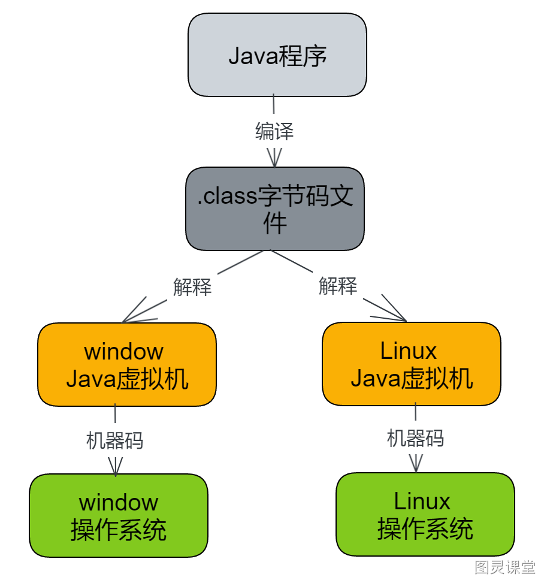
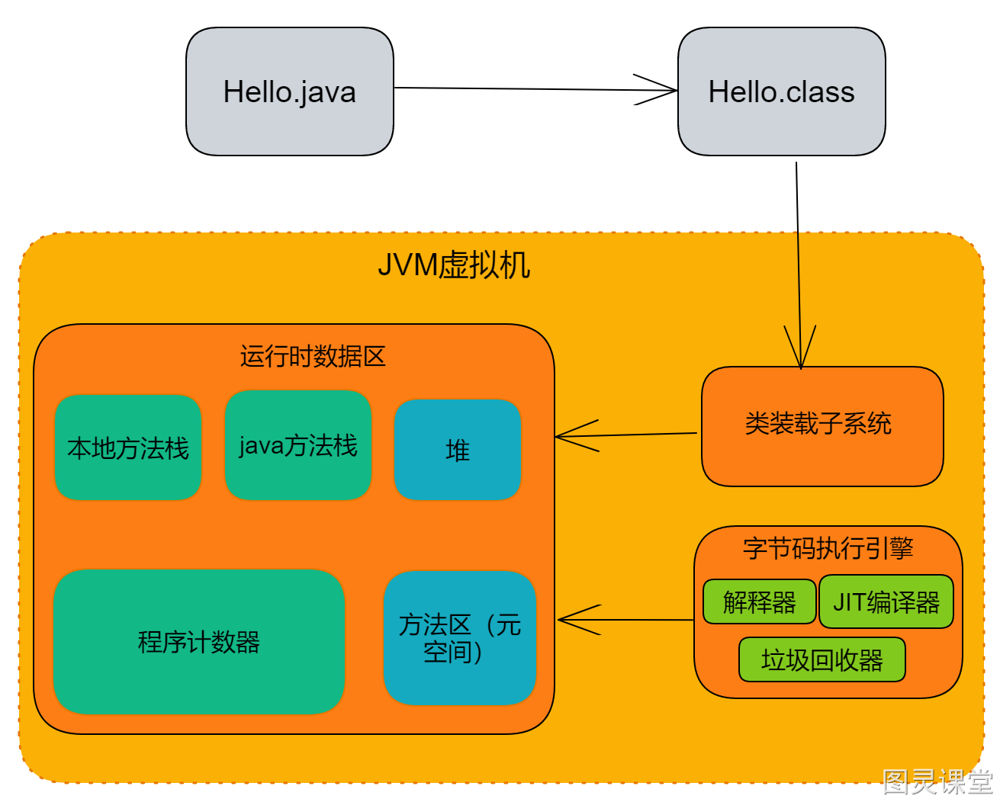
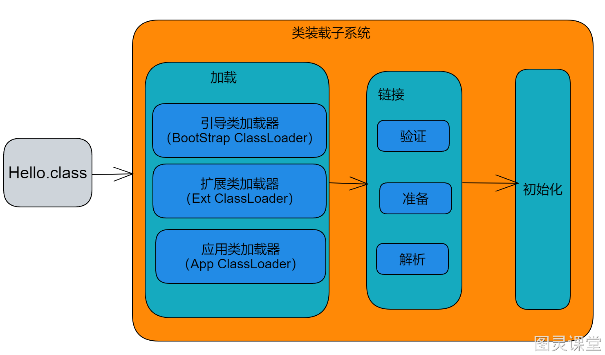
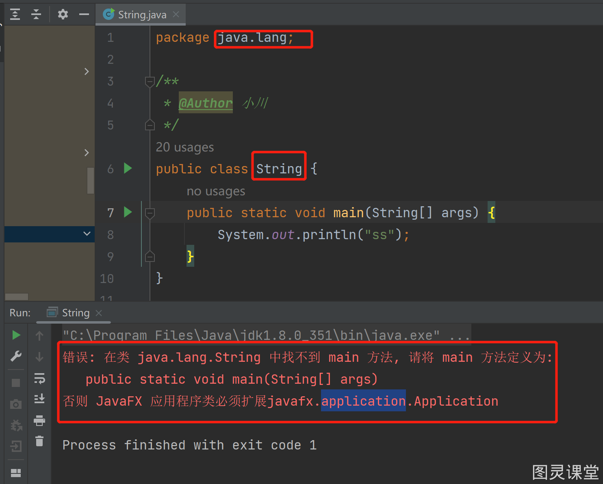
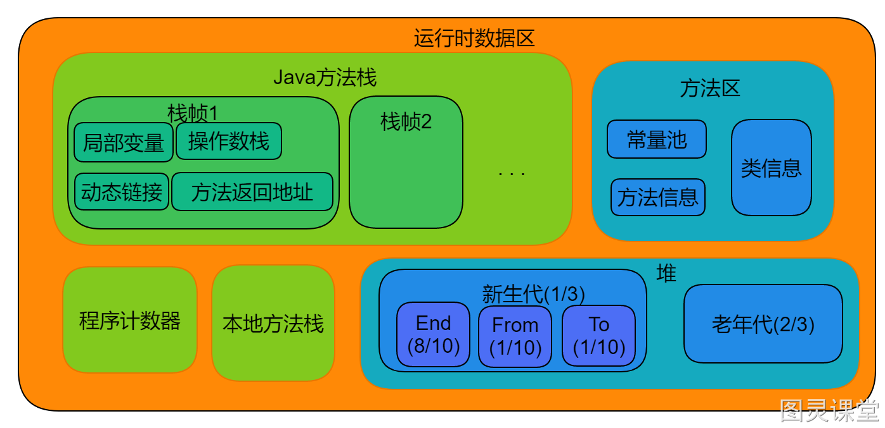
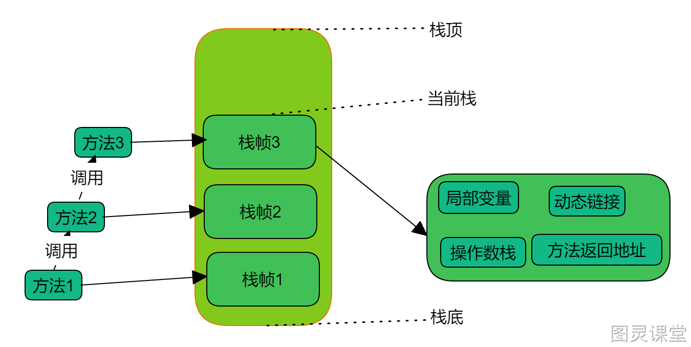
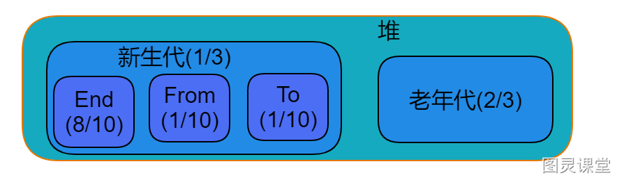
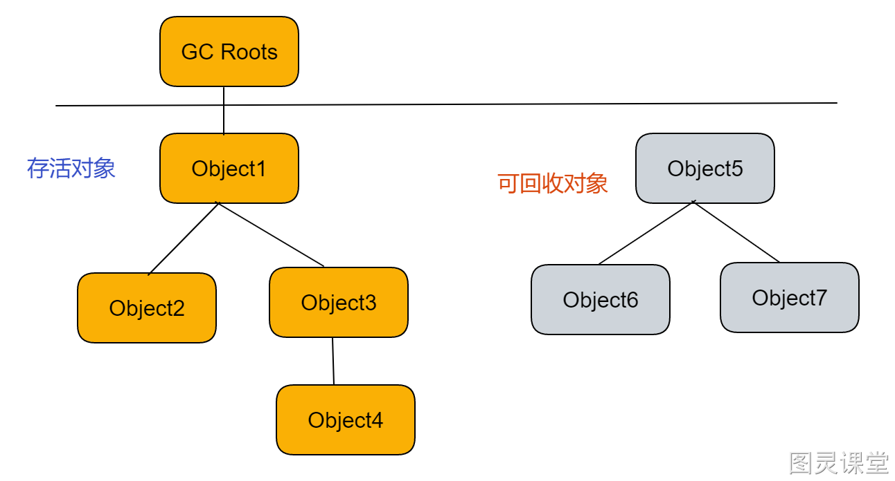
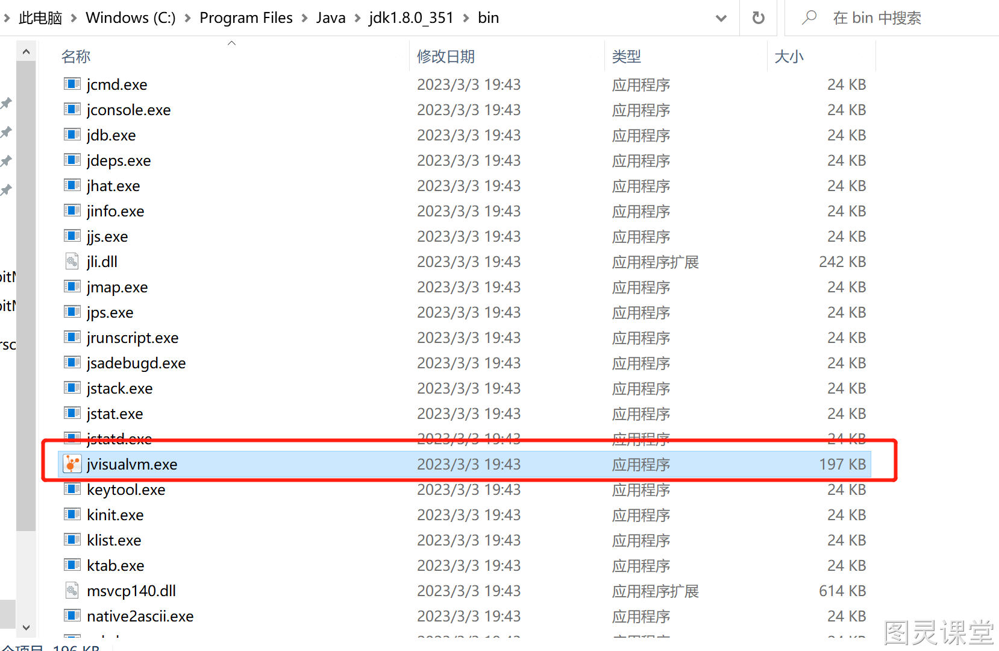

# JVM系列教程


# 什么是JVM
- JVM是Java Virtual Machine（Java虚拟机）的缩写；
- JVM是一种用于计算设备的规范，它是一个虚构出来的计算机，是通过在实际的计算机上仿真模拟各种计算机功能来实现的。
- 引入Java语言虚拟机后，Java语言在不同平台上运行时不需要重新编译。Java语言使用Java虚拟机屏蔽了与具体平台相关的信息，使得Java语言编译程序只需生成在Java虚拟机上运行的目标代码（字节码），就可以在多种平台上不加修改地运行。



# JVM的结构体系


- 类加载子系统：类加载子系统就是把Class文件加载进内存
- 运行时数据区(内存模型)：
   - 本地方法栈：Native方法，就是我们JVM里面由C/C++所写的一些方法
   - java方法栈：java里面写的方法存放区域
   - 程序计数器：用来存储指向下一条指令的地址，也就是即将将要执行的指令代码。由执行引擎读取下一条指令
   - 堆：堆是用来存放对象的内存空间
   - 方法区：类信息、常量池、静态变量、JIT编译后的代码等数据
- 字节码执行引擎：
   - 解释器：用来执行方法区里面的字节码指令
   - JIT编译器：将我们的某些热点字节码指令编译成为我们的机器指令，并且会缓存起来，从而去提高我们的执行效率
   - 垃圾回收器：负责内存的管理，所以提高了程序开发的效率，减少了内存泄漏的概率

# 类加载器

## 类加载器流程


- **作用**
   - 类加载器子系统负责从文件系统或者网络中加载 class 文件，class 文件在文件开头有特定的文件标识。
   - ClassLoader 只负责 class 文件的加载，至于它是否可以运行，则由 Execution Engine 决定。
   - 加载的类信息存放于一块称为方法区的内存空间。除了类的信息外，方法区中还会存放运行时常量池信息，可能还包括字符串字面量和数字常量（这部分常量信息是 class 文件中常量池部分的内存映射）
- **加载**
   - 装载类的第一个阶段，取得类的二进制字节流，并转换为方法区的数据结构，在Java堆中生成对应的java.lang.Class对象。
   - 在JVM规范里面其实是分为了两种加载器，第一种是我们的引导类加载器(BootStrap ClassLoader)，是由C/C++写的，另一种是自定义加载器(比如：Extension ClassLoader，App ClassLoader,以及tomcat的WebAppClassLoader)，由我们Java代码写的，继承实现ClassLoader类
- **链接**
   -  **验证(Verify)**
      -   目的在于确保Class文件中的字节流中包含信息符合当前虚拟机要求，保证被加载类的正确性，不会危害虚拟机自身安全，主要包括四种验证分别是文件格式验证、元数据验证、字节码验证和符号引用验证。
   - **准备(Prepare)**
      -  为类变量分配内存并且设置该类变量的默认初始值
      - 这里不包括final修饰的static，因为final被编译的时候就会分配，准备阶段会显式初始化，
      - 这里不会为实例变量分配初始化，类变量会分配到方法区中，而实例变量是随着对象一起分配到Java堆中
   - **解析(Resolve)**
      - 将常量池的符号引用(当前类的名字)转换为直接引用(类class对象的地址)的过程。
- **初始化**
   - 初始化即执行构造器，为static变量赋值、执行static{}语句
- **类加载的顺序**
   - 如果是一个类的话，加载的顺序是： 
      1. 类的静态属性
      2. 类的静态代码块
      3. 类的非静态属性
      4. 类的非静态代码块
      5. 构造方法
   - 如果一个类有父类，加载的顺序是： 
      1. 父类的静态属性
      2. 父类的静态代码块
      3. 子类的静态属性
      4. 子类的静态代码块
      5. 父类的非静态属性
      6. 父类的非静态代码块
      7. 父类的构造方法
      8. 子类的非静态属性
      9. 子类的非静态代码块
      10. 子类的构造方法。

## 双亲委派
**作用**

- 避免类的重复加载
- 防止核心API被篡改


可以看到，报错在java.lang.String中找不到类方法。因为String类是启动类加载器创建的，不是我们自定义的String类，故没有main方法。

# 运行时数据区


## 程序计数器

### 概念
多线程的Java应用程序：为了让每个线程正常工作就提出了程序计数器（PC Register），每个线程都有自己的程序计数器（线程私有），这样当线程执行切换的时候就可以在上次执行的基础上继续执行，仅仅从一条线程线性执行的角度而言，代码是一条一条的往下执行的，这个时候就是程序计数器；JVM就是通过读取程序计数器的值来决定下一条需要执行的字节码指令，进而进行选择语句、循环、异常处理等；

### 作用

1. 字节码解释器通过改变程序计数器来依次读取指令，从而实现代码的流程控制，如：顺序执行、选择、循环、异常处理、线程恢复等基础功能都需要依赖这个计数器来完成。
2. 在多线程的情况下，程序计数器用于记录当前线程执行的位置，从而当线程被切换回来的时候能够知道该线程上次运行到哪儿了。

**注意**：程序计数器是唯一 一个不会出现OutOfMemoryError的内存区域，他的生命周期随着线程的创建而创建，随着线程的结束而死亡。

## Java方法栈

### Java方法栈结构


1. Java方法栈是线程私有的
2. 一个方法开始执行时栈帧入栈，执行完后栈帧出栈，所以Java方法栈不需要垃圾回收
3. 线程太多，可能会出现OutOfMemoryError；线程创建时没有足够的内存去创建虚拟机栈了
4. 方法调用层数太多，可能会出现StackOverflowError
5. 可以同过-Xss来设置虚拟机栈的大小

## 本地方法栈

### 概念
本地方法栈是 Java 虚拟机的一部分，用于存储和执行本地方法的指令。本地方法是指从 Java 虚拟机中调用的本地函数，这些本地方法通过 JNI(Java Native Interface) 实现与本地系统的通信

### 作用
本地方法栈的作用是存储和执行本地方法指令。在 Java 程序中，当调用本地方法时，Java 虚拟机会首先查找本地方法栈中是否有对应的本地方法指令，如果有，则会按照指令的指示执行本地方法;如果没有，则会通过 JNI 调用本地系统提供的本地方法实现

## 方法区

### **概念**
方法区看做是一块独立于Java堆的内存空间，《Java虚拟机规范》中明确说明：“尽管所有的方法区在逻辑上是属于堆的一部分，但一些简单的实现可能不会选择去进行垃圾收集或者进行压缩。”但对于HotSpotJVM而言，方法区还有一个别名叫做Non-Heap(非堆)，目的就是要和堆分开。

### **作用**
存储类信息、常量池、静态变量、JIT编译后的代码等数据

1. 方法区(Method Area)与Java堆一样，是各个线程共享的内存区域。
2. 方法区在JVM启动的时候被创建，并且它的实际的物理内存空间中与Java堆区一样都是可以是不连续的。
3. 方法区的大小，跟堆空间一样，可以选择固定大小或者可扩展。
4. 方法区的大小决定了系统可以保存多少个类，如果系统定义了太多的类，导致方法区溢出，虚拟机同样会抛出内存溢出错误：java.lang.OutOfMemoryError:PermGen space或者java.lang.OutOfMemoryError:Metaspace，比如加载了大量的第三方的jar包或者tomcat部署的工程过多，都可能导致方法区溢出，出现java.lang.OutOfMemoryError错误。
5. 关闭JVM就会释放这个区域的内存

## 堆
一个JVM实例只有一个堆内存，堆也是Java内存管理的最重要的区域，堆在JVM启动的时候创建，其空间大小也被创建，是JVM中最大的一块内存空间，所有线程共享Java堆，几乎所有的实例都在这里分配内存（**Java规范中规定所有的对象和数组都存放到在堆中，在执行字节码指令时会把创建的对象存入堆中，对象对应的引用地址存入虚拟机栈的栈帧中**），在方法结束后，堆中的对象不会马上删除，仅仅在垃圾收集的时候被删除，堆是GC（垃圾收集器）执行垃圾回收的重点区域


1. JVM运行时堆的大小
   1. **-Xms**堆的最小值 （ms:memory start,指定堆初始化内存大小）
   2. **-Xmx**堆空间的最大值（ms:memory max,指定堆最大内存大小）
- 一旦堆区的内存大小超过-Xmx所指定的最大内存时，将会抛出OutOfMemoryError错误。通常情况下会将-Xms与-Xmx两个选项配置成相同的参数值，这样做能够在JVM进行垃圾回收清理完毕堆区后不需要重新分隔计算堆区的大小从而达到提升性能的目的。
- 在默认情况下：
   - -Xms：物理内存大小 / 64
   - -Xmx：物理内存大小 / 4
2.  新生代堆空间大小调整
   1. **-XX**:NewSize新生代的最小值
   2. **-XX**:MaxNewSize新生代的最大值
   3. **-XX**:NewRatio设置新生代与老年代在堆空间的大小
   4. **-XX**:SurvivorRatio新生代中**Eden**所占区域的大小
3. 永久代大小调整
   1. **-XX**:MaxPermSize
4. 其他
   1. **-XX**:MaxTenuringThreshold,设置将新生代对象转到老年代时需要经过多少次垃圾回收，但是仍然没有被回收

### GC

- "垃圾回收"的缩写，指的是计算机系统中的一种机制；专门用来回收不可用的变量值所占用的内存空间
- 为什么要使用GC：程序运行过程中会申请大量的内存空间，而对于一些无用的内存空间如果不及时清理的话会导致内存使用殆尽（内存溢出），导致程序崩溃，因此管理内存是一件重要且繁杂的事情
- **Young GC / Minor GC**：主要是在年轻代空间内进行垃圾回收，因为通常在程序运行初期，大部分对象都有短暂的生命周期并且很快变得不可达，因此年轻代空间中的对象很快就可以被清除。
- **Old GC / Major GC**：主要是针对在年轻代空间存活的对象，并且存在于老年代空间中的对象。因为老年代空间中的对象通常比年轻代空间中的对象寿命更长，垃圾回收的成本更高。因此，老年代GC的执行频率较低，但需要更长时间。
- **Full GC**：Full GC是一个扫描整个Java堆内存的过程，包括年轻代和老年代空间。它查找不再需要的对象，并释放它们占用的内存。当没有足够的空间分配新对象或JVM检测到堆内存已经满时，通常会调用Full GC。与Young GC和Old GC相比，它通常是一个更昂贵的操作，因为它必须扫描整个Java堆内存。

### 垃圾回收算法之引用计数法和可达性分析法解释

#### 引用计数法

- 在对象中添加一个引用计数器，每当有一个地方 引用它时，计数器值就加1；当引用失效时，计数器值就减1；任何时刻计数器为0的对象就是不可能再被使用的。
- 优点：实现简单，效率高
- 缺点
   - 需要额外的空间和时间来存储和维护技术
   - 无法处理循环引用问题
```java
public class ReferenceCountJvm {
    public Object referenceObj = null;

    public static void main(String[] args) {
       //创建两个实例对象并互相引用
        ReferenceCountJvm a = new ReferenceCountJvm();
        ReferenceCountJvm b = new ReferenceCountJvm();
        a.referenceObj = b;
        b.referenceObj = a;
        //将对象引用置空
        a = null;
        b = null;
    }
}
```

#### 可达性分析法

- 通过一系列被称为「GC Roots」的根对象作为起始节点集，从这些节点开始，通过引用关系向下搜寻，搜寻走过的路径称为「引用链」，如果某个对象到GC Roots没有任何引用链相连，就说明该对象不可达，即可以被回收。



- 可以作为GC Roots的主要有四种对象：
   - 方法区中类静态属性引用的对象
   - 方法区中常量引用的对象
   - 虚拟机栈(栈帧中的本地变量表)中引用的对象
   - 本地方法栈中JNI引用的对象

### 标记清除算法，标记整理算法，标记复制算法的区别

#### 标记-清除算法
**概念**

- 标记-清除算法(Mark-Sweep)是一种非常基础和常见的垃圾收集算法；当可用内存不足时，标记清除垃圾回收算法会暂停用户线程的执行，Stop-The-World，并执行垃圾回收操作。该算法针对不同的模块内存空间 (如新生代和老年代) 采用不同的回收策略。标记清除算法用于清除可以被回收的内存对象，然后进行内存空间的优化，以最大程度地利用可用内存。如果暂停用户线程的执行需要进行垃圾回收，则称为静态内存分配
- 标记清除的执行过程是先标记，再清除
- 标记：标记的过程其实就是，遍历所有的GC Roots，然后将所有GC Roots可达的对象标记为存活的对象。 
-  清除：清除的过程将遍历堆中所有的对象，将没有标记的对象全部清除掉。 


- 特点：实现简单
- 缺点：效率不高、存在内存空间太强片化问题。

#### 标记-复制算法
**概念**：将内存空间分为多个块，每次只使用其中一个块。在进行垃圾回收时，该算法会将可达对象复制到另一个未被使用的内存块中，然后清除当前内存块中的所有对象。随后，算法会交换使用两个内存块，并重复执行垃圾回收操作，直到所有内存都被充分利用。这种算法被称为二分垃圾回收算法 (Binary Space 垃圾回收算法)。


- 优点：空间连续无碎片化、清除高效;
- 缺点：
   - 压缩一半空间，垃圾清除的时候一半空间不可用；
   - 对存活对象较多的老年代下，效率较差；
   - 需要修改栈帧中的引用地址；在移动对象的时候不仅需要移动对象，还要额外的维护对象的引用的地址

#### 标记-整理算法
**概念**：对“标记 - 清除”的改进。“标记 - 整理”算法的标记过程与“标记 - 清除”算法相同，但后续步骤不是直接对可回收对象进行清理，而是让所有存活的对象都向一端移动，然后直接清理掉端边界以外的内存。


- 优点：
   - 没有内存碎片
   - 不需要额外的内存空间来存储标记和整理数据
- 缺点：
   - 需要修改栈帧中的引用地址；在移动对象的时候不仅需要移动对象，还要额外的维护对象的引用的地址，这个过程可能要对内存经过几次的扫描定位才能完成，做的事情越多那么必然消耗的时间也越多

### 三种算法的对比
| 对比名称 | 标记-清除 | 标记-整理 | 标记-复制 |
| --- | --- | --- | --- |
| 速度 | 中等 | 最慢 | 最快 |
| 空间开销 | 少(会产生碎片) | 少(不会产生碎片) | 需要对象2倍大小 |
| 移动对象 | 否 | 是 | 是 |


###  分代收集算法（Generational Collection）
背景：由于每个收集的算法都没办法符合所有的场景，就好比每个对象所在的内存阶段不一样，被回收的概率也不一样，比如在新生代，基本可以说90%以上的都会被回收，而到老年代接近一半以上的对象则是一半存活的，所以针对这两种不同的场景，回收的策略肯定有所不一样，所以引发而出的就是分代收集算法，根据新生代和老年代不同的场景而用不同的算法，比如新生代用复制算法，而老年代则用标记-整理算法。

### 常见垃圾收集器
| Serial  GC | 串行 | 工作线程暂停，一个线程进行垃圾回收 | 新生代 | 复制算法 | 
 |
| --- | --- | --- | --- | --- | --- |
| Serial Old GC | 串行 | 工作线程暂停，一个线程进行垃圾回收 | 老年代 | 标记-整理算法 | 
 |
| ParNew GC | 并行 | 工作线程暂停，多个线程进行垃圾回收 | 新生代 | 复制算法 | Serial GC的多线程版 |
| CMS GC | 并行 | 用户线程和垃圾回收同时执行 | 老年代 | 标记-清除算法 | 低暂停 |
| Parallel GC | 并行 | 工作线程暂停，多个线程进行垃圾回收 | 新生代 | 复制算法 | 和ParNew相比，能动态调整内存分配情况(JDK8默认) |
| Parallel Old GC | 并行 | 工作线程暂停，多个线程进行垃圾回收 | 老年代 | 标记-整理算法 | 替代串行的Serial Old GC |
| G1 | 并行 | 用户线程和垃圾回收线程同时执行 | 整堆 | 分区算法 | 在延迟可控的情况下尽可能提高吞吐量(JDK9默认) |

-XX:+UseSerialGC：在新生代和老年代使用串行收集器
-XX:+UseParNewGC：在新生代使用并行收集器
-XX:+UseParallelGC ：新生代使用并行回收收集器，更加关注吞吐量
-XX:+UseParallelOldGC：老年代使用并行回收收集器
-XX:ParallelGCThreads：设置用于垃圾回收的线程数
-XX:+UseConcMarkSweepGC：新生代使用并行收集器，老年代使用CMS+串行收集器
-XX:ParallelCMSThreads：设定CMS的线程数量
-XX:+UseG1GC：启用G1垃圾回收器

# 有哪些手段可以排查我们的OOM问题

- OOM：OutOfMemory，当JVM中内存不够并且回收的速度跟不上内存分配速度，就会发生OOM。
- JDK1.8推荐生产环境开启一下两个参数：
   - -XX:+HeapDumpOnOutOfMemoryError	当OOM发生时自动dump堆内存信息
   - -XX:HeapDumpOnOutOfMemoryError=/temp/heapdump.hprof		dump堆内存信息存放目录
- 推荐使用visualvm，当然也可以用 Jprofiler，MAT



# 你用过哪些JDK自带的命令工具

## 1.jps

- 列出当前机器上正在运行的虚拟机进程
- 语法格式：
```shell
jps [ options ] [ hostid ]
```

- 实际生产应用中不会去连接远程主机,hostid 这个一般不用
- options 是对应的参数
| 
- options 参数选项
 | 
- 作用
 |
| --- | --- |
| 
- -q
 | 
- 只输出进程 ID,省略主类的名称
 |
| 
- -m
 | 
- 输出虚拟机进程启动时传递给主类 main() 方法的参数
 |
| 
- -l
 | 
- 输出主类的名称,如果进程执行的是 JAR 包,则输出 JAR 文件的路径
 |
| 
- -v
 | 
- 输出虚拟机进程启动时的 JVM 参数
 |


## 2.jstat

- jstat的主要作用就是对Java应用程序的资源和性能进行实时监控的命令行工具，主要包括GC情况和Heap Size资源使用情况。
- 语法格式：
```shell
jstat -<option> [-t] [-h<lines>] <vmid> [<interval> [<count>]]
```

- 参数解释
   - option 常见的都是使用-gcutil查看gc情况
| 
- options 参数选项
 | 
- 作用
 |
| --- | --- |
| 
- -class
 | 
- 监视类装载、卸载数量、总空间及类装载所耗费时间
 |
| 
- -gc
 | 
- 监视Java堆状况，包括Eden区，2个survivor区、老年代、永久代等的容量、已用空间、GC时间合计等信息
 |
| 
- -gccapacity
 | 
- 监视内容与-gc基本相同，但输出主要关注Java堆各个区域使用到的最大和最小空间
 |
| 
- -gcutil
 | 
- 监视内容与-gc基本相同，但输出主要关注已使用空间占总空间的百分比
 |
| 
- gccause
 | 
- 与-gcutil功能一样，但是会额外输出导致上一次GC产生的原因
 |
| 
- gcnew
 | 
- 监视新生代GC的状况
 |
| 
- gcnewcapacity
 | 
- 监视内容与-gcnew基本相同，输出主要关注使用到的最大和最小空间
 |
| 
- gcold
 | 
- 监视老年底GC的状况
 |
| 
- gcoldcapacity
 | 
- 监视内容与-gcold基本相同，输出主要关注使用到的最大和最小空间
 |
| 
- gcpermcapacity
 | 
- 输出永久代使用到的最大和最小空间
 |
| 
- complier
 | 
- 输出JIT编译器编译过的方法、耗时等信息
 |
| 
- printcomplilation
 | 
- 输出以及被JIT编译的方法
 |

   - vmid ： VM的进程号，即当前运行的java进程号
   - interval : 间隔时间，单位为秒或毫秒
   - count：打印次数，如果缺省则打印无数次

- **例**：类加载统计
```shell
jstat -class 3400
```

   - Loaded：加载class的数量
   - Bytes：所占用空间大小
   - Unloaded：未加载数量
   - Bytes：未加载占用空间
   - Time：时间
- **例**：参数interval和count代表查询间隔和次数，如果省略这两个参数，说明只查询一次。假设需要每250毫秒查询一次进程5828垃圾收集状况，一共查询5次，那命令行如下：
```
jstat -gc 5828 250 5
```

### 一些术语的中文解释

- S0C：年轻代中第一个survivor（幸存区）的容量 (字节)
- S1C：年轻代中第二个survivor（幸存区）的容量 (字节)
- S0U：年轻代中第一个survivor（幸存区）目前已使用空间 (字节)
- S1U：年轻代中第二个survivor（幸存区）目前已使用空间 (字节)
- EC：年轻代中Eden（伊甸园）的容量 (字节)
- EU：年轻代中Eden（伊甸园）目前已使用空间 (字节)
- OC：Old代的容量 (字节)
- OU：Old代目前已使用空间 (字节)
- PC：Perm(持久代)的容量 (字节)
- PU：Perm(持久代)目前已使用空间 (字节)
- YGC：从应用程序启动到采样时年轻代中gc次数
- YGCT：从应用程序启动到采样时年轻代中gc所用时间(s)
- FGC：从应用程序启动到采样时old代(全gc)gc次数
- FGCT：从应用程序启动到采样时old代(全gc)gc所用时间(s)
- GCT：从应用程序启动到采样时gc用的总时间(s)
- NGCMN：年轻代(young)中初始化(最小)的大小 (字节)
- NGCMX：年轻代(young)的最大容量 (字节)
- NGC：年轻代(young)中当前的容量 (字节)
- OGCMN：old代中初始化(最小)的大小 (字节)
- OGCMX：old代的最大容量 (字节)
- OGC：old代当前新生成的容量 (字节)
- PGCMN：perm代中初始化(最小)的大小 (字节)
- PGCMX：perm代的最大容量 (字节)
- PGC：perm代当前新生成的容量 (字节)
- S0：年轻代中第一个survivor（幸存区）已使用的占当前容量百分比
- S1：年轻代中第二个survivor（幸存区）已使用的占当前容量百分比
- E：年轻代中Eden已使用的占当前容量百分比
- O：old代已使用的占当前容量百分比
- P：perm代已使用的占当前容量百分比
- S0CMX：年轻代中第一个survivor（幸存区）的最大容量 (字节)
- S1CMX ：年轻代中第二个survivor（幸存区）的最大容量 (字节)
- ECMX：年轻代中Eden（伊甸园）的最大容量 (字节)
- DSS：当前需要survivor（幸存区）的容量 (字节)（Eden区已满）
- TT： 持有次数限制
- MTT ： 最大持有次数限制

## 3.jstack

- 命令用于打印当前线程的堆栈跟踪信息，它可以显示当前线程的栈跟踪，以及可能引发的内存泄漏和其他问题
- 语法格式
```shell
jstack [ option ] pid 
jstack [ option ] executable core 
jstack [ option ] [server-id@]remote-hostname-or-IP 

executable Java executable from which the core dump was produced.(可能是产生core dump的java可执行程序)
core 将被打印信息的core dump文件
remote-hostname-or-IP 远程debug服务的主机名或ip
server-id 唯一id,假如一台主机上多个远程debug服务
```

- options 是对应的参数
| 选项 | 作用 |
| --- | --- |
| -F | 当正常输出的请求不被响应时，强制输出线程堆栈 |
| -m | 如果调用到本地方法的话，可以显示C/C++的堆栈 |
| -l | 除堆栈外，显示关于锁的附加信息，在发生死锁时可以用jstack -l pid来观察锁持有情况 |

- 最常用命令
```shell
jstack [option] <pid>  // 打印某个进程的堆栈信息
```


> 原文: <https://www.yuque.com/tulingzhouyu/sfx8p0/qv5znk0wiloz547s>