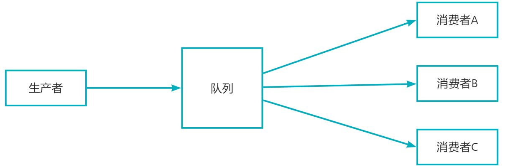
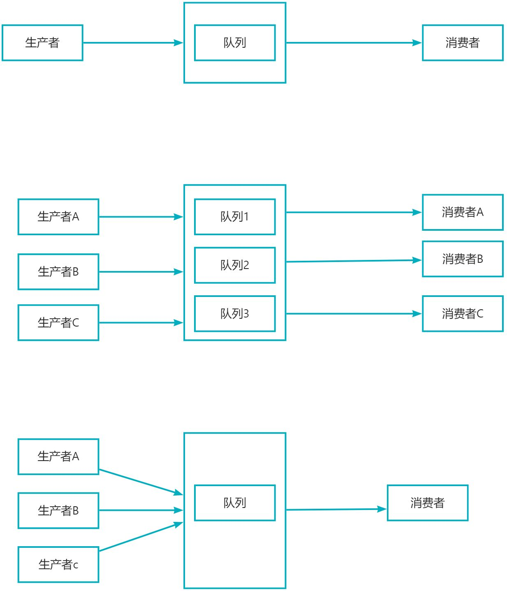

# 如何保证消息队列的顺序性


# 1.为什么会出现消息错乱

如果生产者消息message1，message2和message3，需要按照1，2，3的顺序来执行；但是有三个消费者，这时候消费者A获取了message1执行时间为2s，消费者B获取到了message2执行时间为10s，消费者C获取了message3执行时间为3s；因为消费者B获取到message2执行时间比较长，可能就会导致message2最后被执行完；无法保证顺序性。

# 2. 解决方案

## 2.1 生产者有序的情况下，单线程消费来保证消息的顺序性


## 2.2 生产者无序的情况下，对消息进行编号，消费者处理时根据编号判断顺序。 

### 2.2.1 重新入队列
获取我们已经执行了的消息存放在持久层中，如果上一个消息已经执行了，那么我们可以继续消费当前消息，如果上一个消息没有被执行，那么我们应该将该消息重新入队列，等待下一次被执行
缺点：消息队列压力会比较大

1. maven依赖：
```xml
		  <!--rabbit-->
        <dependency>
            <groupId>com.rabbitmq</groupId>
            <artifactId>amqp-client</artifactId>
            <version>5.16.0</version>
        </dependency>

        <!--redis-->
        <dependency>
            <groupId>redis.clients</groupId>
            <artifactId>jedis</artifactId>
            <version>4.4.0-m2</version>
        </dependency>

        <!--json-->
        <dependency>
            <groupId>com.alibaba.fastjson2</groupId>
            <artifactId>fastjson2</artifactId>
            <version>2.0.25</version>
        </dependency>

        <dependency>
            <groupId>org.apache.commons</groupId>
            <artifactId>commons-lang3</artifactId>
            <version>3.12.0</version>
        </dependency>
```

2. 生产者代码
```java
import com.alibaba.fastjson2.JSONObject;
import com.rabbitmq.client.BuiltinExchangeType;
import com.rabbitmq.client.Channel;
import java.io.IOException;
import java.util.concurrent.CountDownLatch;

/**
 * @Author 小川
 */
public class Producer {

    public static void main(String[] args) throws Exception {

        //获取rabbitmq channel
        Channel channel = RabbitmqCommon.getChannel();
        /**
         * 声明和创建交换机
         * 1.交换机的名称
         * 2.交换机的类型：direct、topic或者fanout和headers， headers类型的交换器的性能很差，不建议使用。
         * 3.指定交换机是否要持久化，如果设置为true，那么交换机的元数据要持久化到内存中
         * 4.指定交换机在没有队列与其绑定时，是否删除，设置为false表示不删除；
         * 5.Map<String, Object>类型，用来指定交换机其它一些结构化的参数，我在这里直接设置为null。
         */
        channel.exchangeDeclare(RabbitmqCommon.EXCHANGE_NAME, BuiltinExchangeType.DIRECT, false, true, null);

        /**
         * 生成一个队列
         * 1.队列的名称
         * 2.队列是否要持久化，但是需要注意，这里的持久化只是队列名称等这些队列元数据的持久化，不是队列中消息的持久化
         * 3.表示队列是不是私有的，如果是私有的，只有创建它的应用程序才能从队列消费消息；
         * 4.队列在没有消费者订阅时是否自动删除
         * 5.队列的一些结构化信息，比如声明死信队列、磁盘队列会用到。
         */
        channel.queueDeclare(RabbitmqCommon.QUEUE_NAME, false, false, false, null);

        /**
         * 将交换机和队列进行绑定
         * 1.队列名称
         * 2.交换机名称
         * 3.路由键，在直连模式下为队列名称。
         */
        channel.queueBind(RabbitmqCommon.QUEUE_NAME, RabbitmqCommon.EXCHANGE_NAME, RabbitmqCommon.QUEUE_NAME);

        int num = 10;
        CountDownLatch latch = new CountDownLatch(num);
        //开启多线程发送消息
        for (int i=1;i<=num;i++) {
            int finalI = i;
            new Thread(new Runnable() {
                @Override
                public void run() {
                    //组装消息
                    JSONObject json = new JSONObject();
                    json.put("id",finalI);
                    json.put("message", "hello world"+ finalI);
                    String jsonStr = json.toString();
                    try {
                        /**
                         * 发送消息
                         * 1.发送到哪个交换机
                         * 2.队列名称
                         * 3.其他参数信息
                         * 4.发送消息的消息体
                         */
                        channel.basicPublish(
                                RabbitmqCommon.EXCHANGE_NAME,
                                RabbitmqCommon.QUEUE_NAME,
                                null,
                                jsonStr.getBytes());

                        System.out.println("发送消息:"+ jsonStr);
                    } catch (IOException e) {
                        throw new RuntimeException(e);
                    }
                    latch.countDown();
                }
            }).start();
        }

        System.out.println("等待子线程运行结束");
        latch.await();
        System.out.println("子线程运行结束");

    }
}

```

3. 消费者代码
```java
import com.alibaba.fastjson2.JSONObject;
import com.rabbitmq.client.CancelCallback;
import com.rabbitmq.client.Channel;
import com.rabbitmq.client.DeliverCallback;
import org.apache.commons.lang3.StringUtils;
import redis.clients.jedis.Jedis;

import java.io.IOException;
import java.util.concurrent.TimeoutException;

/**
 * @Author 小川
 */
public class Consumer {

    static Jedis jedis = RedisCommon.getJedis();

    public static void main(String[] args) throws IOException, TimeoutException {
        //获取rabbitmq channel
        Channel channel = RabbitmqCommon.getChannel();

        //接收消息回调
        DeliverCallback deliverCallback = (consumerTag, message)-> {
            JSONObject json = JSONObject.parseObject(new String(message.getBody()));
            int id = json.getIntValue("id");
            String messageStr = json.getString("message");
            if (id==1) {
                //第一条消息直接处理
                System.out.println("处理消息:"+id);
                jedis.set(String.valueOf(id), messageStr);
                /**
                 * 肯定确认应答
                 * 1.消息的标记Tag
                 * 2.是否批量应答 false表示不批量应答信道中的消息
                 */
                channel.basicAck(message.getEnvelope().getDeliveryTag(),false);
            } else {
                String redisKey = String.valueOf(id-1);
                //判断上一个消息是否已经执行
                if (StringUtils.isNotBlank(jedis.get(redisKey))) {
                    System.out.println("处理消息:"+id);
                    jedis.set(String.valueOf(id), messageStr);
                    //肯定确认应答
                    channel.basicAck(message.getEnvelope().getDeliveryTag(),false);
                } else {
                    /**
                     * 否定确认应答
                     * 1.拒绝 deliveryTag 对应的消息
                     * 2.是否 requeue：true 则重新入队列，false 则丢弃或者进入死信队列。
                     * 该方法 reject 后，该消费者还是会消费到该条被 reject 的消息。
                     */
                    channel.basicReject(message.getEnvelope().getDeliveryTag(),true);

                }
            }
        };

        //取消消息回调
        CancelCallback cancelCallback = consumerTag ->{
            System.out.println("消费消息被中断");
        };

        /**
         * 消费消息
         * 1.消费哪个队列
         * 2.消费成功之后是否要自动应答，true:自动应答
         * 3.消费者未成功消费的回调
         * 4.消费者取消消费的回调
         */
        channel.basicConsume(RabbitmqCommon.QUEUE_NAME, false, deliverCallback, cancelCallback);

    }
}

```

4. 其他类
```java
import com.rabbitmq.client.Channel;
import com.rabbitmq.client.Connection;
import com.rabbitmq.client.ConnectionFactory;
import java.io.IOException;
import java.util.concurrent.TimeoutException;

/**
 * @Author 小川
 */
public class RabbitmqCommon {

    //队列名
    public static final String QUEUE_NAME = "hello-queue";
    //交换机
    public static final String EXCHANGE_NAME = "hello-exchange";

    public static Channel getChannel() throws IOException, TimeoutException {
        //创建一个连接工厂
        ConnectionFactory factory = new ConnectionFactory();
        //服务地址
        factory.setHost("192.168.16.129");
        //账号
        factory.setUsername("admin");
        //密码
        factory.setPassword("123456");
        //端口号
        factory.setPort(5672);
        //创建连接
        Connection connection = factory.newConnection();
        //创建信道
        return connection.createChannel();

    }
}

```
```java
import redis.clients.jedis.Jedis;

/**
 * @Author 小川
 */
public class RedisCommon {
    public static void main(String[] args) {
        getJedis();
    }
    public static Jedis getJedis (){
        //创建Jedis客户端连接Redis
        Jedis jedis = new Jedis("127.0.0.1",6379);

        System.out.println(jedis.ping());
        return jedis;
    }

}

```

### 2.2.2 将待执行消息存放在内存中
获取我们已经执行了的消息存放在持久层中，如果上一个消息已经执行了，那么我们可以继续消费当前消息，如果上一个消息没有被执行，那么我们应该将该消息存放在我们内存中，等待下一次被执行
缺点：存放在内存中，一旦服务重启或者服务宕机，数据容易丢失

1. 消费者代码
```java
import com.alibaba.fastjson2.JSONObject;
import com.rabbitmq.client.CancelCallback;
import com.rabbitmq.client.Channel;
import com.rabbitmq.client.DeliverCallback;
import org.apache.commons.lang3.StringUtils;
import redis.clients.jedis.Jedis;

import java.io.IOException;
import java.util.Map;
import java.util.TreeMap;
import java.util.concurrent.TimeoutException;

/**
 * @Author 小川
 */
public class Consumer1 {

    static Jedis jedis = RedisCommon.getJedis();

    static Map<Integer, String> map = new TreeMap<>();

    public static void handlerWaitMessage(int id){
        boolean flag = true;
        while (flag) {
            id++;
            if (map.containsKey(id)) {
                //处理消息
                System.out.println("处理消息:"+id);
                jedis.set(String.valueOf(id), map.get(id));
                //删除内存中待执行的该条消息
                map.remove(id);
            } else {
                flag = false;
            }

        }
    }

    public static void main(String[] args) throws IOException, TimeoutException {
        //获取rabbitmq channel
        Channel channel = RabbitmqCommon.getChannel();

        //接收消息回调
        DeliverCallback deliverCallback = (consumerTag, message)-> {
            JSONObject json = JSONObject.parseObject(new String(message.getBody()));
            int id = json.getIntValue("id");
            String messageStr = json.getString("message");
            if (id==1) {
                //第一条消息直接处理
                System.out.println("处理消息:"+id);
                jedis.set(String.valueOf(id), messageStr);
                //获取内存中待执行的消息并消费
                handlerWaitMessage(id);
                /**
                 * 肯定确认应答
                 * 1.消息的标记Tag
                 * 2.是否批量应答 false表示不批量应答信道中的消息
                 */
                channel.basicAck(message.getEnvelope().getDeliveryTag(),false);
            } else {
                String redisKey = String.valueOf(id-1);
                //判断上一个消息是否已经执行
                if (StringUtils.isNotBlank(jedis.get(redisKey))) {
                    System.out.println("处理消息:"+id);
                    jedis.set(String.valueOf(id), messageStr);
                    //获取内存中待执行的消息并消费
                    handlerWaitMessage(id);
                    //肯定确认应答
                    channel.basicAck(message.getEnvelope().getDeliveryTag(),false);
                } else {
                    //让待执行的消息进入内存
                    map.put(id, messageStr);
                    //肯定确认应答
                    channel.basicAck(message.getEnvelope().getDeliveryTag(),false);

                }
            }
        };

        //取消消息回调
        CancelCallback cancelCallback = consumerTag ->{
            System.out.println("消费消息被中断");
        };

        /**
         * 消费消息
         * 1.消费哪个队列
         * 2.消费成功之后是否要自动应答，true:自动应答
         * 3.消费者未成功消费的回调
         * 4.消费者取消消费的回调
         */
        channel.basicConsume(RabbitmqCommon.QUEUE_NAME, false, deliverCallback, cancelCallback);

    }
}

```

### 2.2.3 将待执行消息存放在内存中
获取我们已经执行了的消息存放在持久层中，如果上一个消息已经执行了，那么我们可以继续消费当前消息，如果上一个消息没有被执行，那么我们应该将该消息存放在我们redis中，等待下一次被执行

1. 消费者代码
```java
import java.io.IOException;
import java.util.concurrent.TimeoutException;

/**
 * @Author 小川
 */
public class Consumer2 {

    static Jedis jedis = RedisCommon.getJedis();
    static String PREFIX = "wait_";


    public static void handlerWaitMessage(int id){
        boolean flag = true;
        while (flag) {
            id++;
            String redisKey = PREFIX + id;
            String message = jedis.get(redisKey);
            if (StringUtils.isNotBlank(message)) {
                //处理消息
                System.out.println("处理消息:"+id);
                jedis.set(String.valueOf(id), message);
                //删除redis中待执行的该条消息
                jedis.del(redisKey);
            } else {
                flag = false;
            }

        }
    }

    public static void main(String[] args) throws IOException, TimeoutException {
        //获取rabbitmq channel
        Channel channel = RabbitmqCommon.getChannel();

        //接收消息回调
        DeliverCallback deliverCallback = (consumerTag, message)-> {
            JSONObject json = JSONObject.parseObject(new String(message.getBody()));
            int id = json.getIntValue("id");
            String messageStr = json.getString("message");
            if (id==1) {
                //第一条消息直接处理
                System.out.println("处理消息:"+id);
                jedis.set(String.valueOf(id), messageStr);
                //获取redis中待执行的消息并消费
                handlerWaitMessage(id);
                /**
                 * 肯定确认应答
                 * 1.消息的标记Tag
                 * 2.是否批量应答 false表示不批量应答信道中的消息
                 */
                channel.basicAck(message.getEnvelope().getDeliveryTag(),false);
            } else {
                String redisKey = String.valueOf(id-1);
                //判断上一个消息是否已经执行
                if (StringUtils.isNotBlank(jedis.get(redisKey))) {
                    System.out.println("处理消息:"+id);
                    jedis.set(String.valueOf(id), messageStr);
                    //获取redis中待执行的消息并消费
                    handlerWaitMessage(id);
                    //肯定确认应答
                    channel.basicAck(message.getEnvelope().getDeliveryTag(),false);
                } else {
                    //让待执行的消息进入redis
                    jedis.set(PREFIX+id, messageStr);
                    //肯定确认应答
                    channel.basicAck(message.getEnvelope().getDeliveryTag(),false);

                }
            }
        };

        //取消消息回调
        CancelCallback cancelCallback = consumerTag ->{
            System.out.println("消费消息被中断");
        };

        /**
         * 消费消息
         * 1.消费哪个队列
         * 2.消费成功之后是否要自动应答，true:自动应答
         * 3.消费者未成功消费的回调
         * 4.消费者取消消费的回调
         */
        channel.basicConsume(RabbitmqCommon.QUEUE_NAME, false, deliverCallback, cancelCallback);

    }
}

```


> 原文: <https://www.yuque.com/tulingzhouyu/sfx8p0/mfyo6g7ardl424rw>