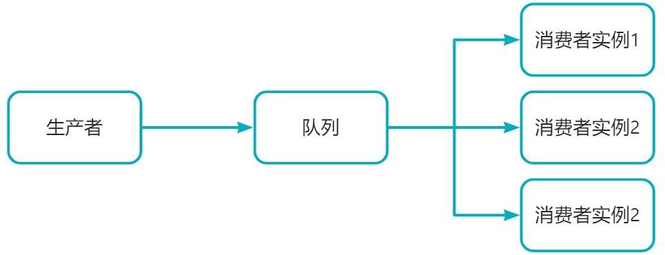
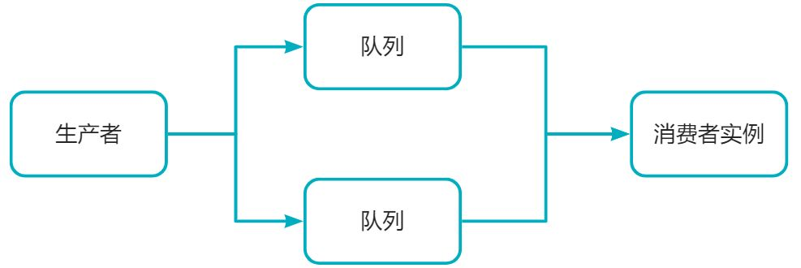
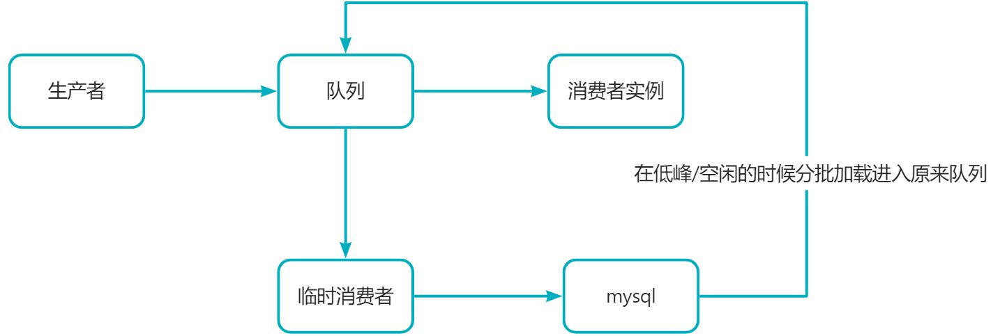

# 如何解决消息堆积问题

# 消息堆积产生的原因
1. 新上线的消费者功能有BUG，消息无法被消费
2. 消费者实例宕机或因网络问题暂时无法同Broker建立连接
3. 生产者短时间内推送大量消息至Broker，消费者消费能力不足

# 解决消息堆积的方案

## 事前处理
在我们系统上线之前应该我们对大致的流量应该有一个预估，并提前进行压测

## 事中处理

1. 临时扩容
   1. 增加消费者实例数量

   2. 增加消息队列数量

   3. 同时增加消费者实例数量和消息队列数量
2. 增加临时消费者
   1. 如果我们消息队列内存不允许的情况下，我们可以增加一个临时消费者实例(只做插入操作，将消息保存到数据库中，保证消息不丢失)

3. 业务降级，最低限度让系统还能正常运转，服务重要业务和核心业务
   1. 减少发送方发送的数据量
   2. 减轻消费者业务逻辑，提高消费速度。

## 事后处理

1. 优化我们消费者代码，提高消费者消费速度
2. 并行处理，将消息分配到多个处理线程中同时处理，从而提供系统的处理速度和性能

# 总结
为了防止我们消息堆积问题的产生

1. 我们要做好上线前的对流量的预估和提前的压测
2. 对于新增活动或者其他会导致我们短时间流量飙升的，需要提前增加我们的消费者实例数量和消息队列数量
3. 通过服务降级来保证重要业务和核心业务。
4. 提高我们的消费者能力（策略：丢弃(消费者有API获取的)，加强消费速度或者增加并行）；

> 原文: <https://www.yuque.com/tulingzhouyu/sfx8p0/uvm1f9brypezg70z>