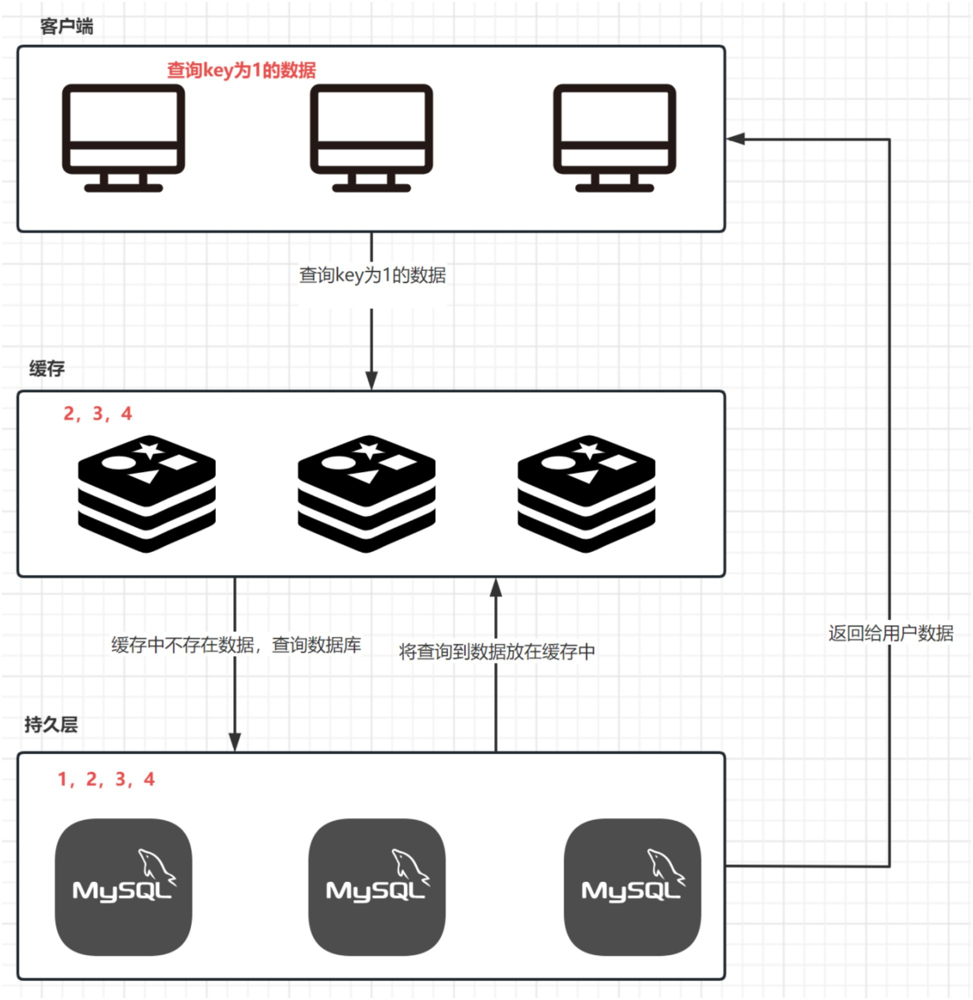
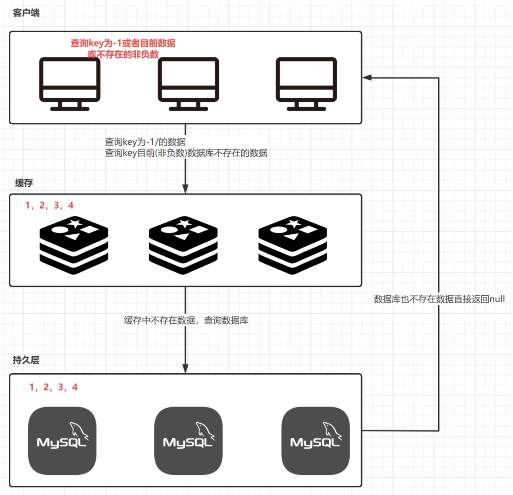

# 如何解决缓存击穿，缓存穿透，缓存雪崩

# 缓存击穿

## 什么是缓存击穿
指当缓存中某个热点数据过期了，在该热点数据重新载入缓存之前，有大量的查询请求穿过缓存，直接查询数据库。这种情况会导致数据库压力瞬间骤增，造成大量请求阻塞，甚至直接挂掉
一句话概括：某一个热点key在缓存过期，但是在数据库中存在数据

## 缓存击穿解决方案

1. 永不过期
2. 根据场景设置过期时间
   1. 或者可以将热点数据设置成永不过期，冷门数据设置成定时过期
   2. 对于一些冷门数据，突然成为热点数据，那可以考虑增加到一定的访问数量将它设置成永不过期；或者随着他每增加一定的访问量，适当的去延长过期时间
3. 加锁排队

# 缓存穿透

## 什么是缓存穿透
用户访问的数据既不在缓存当中，也不在数据库中。出于容错的考虑，如果从底层数据库查询不到数据，则不写入缓存。这就导致每次请求都会到底层数据库进行查询，缓存也失去了意义。当高并发或有人利用不存在的Key频繁攻击时，数据库的压力骤增，甚至崩溃
一句话概括：某一个key在缓存和数据库中都没有数据

## 缓存穿透解决方案

1. 缓存空对象
2. IP拉黑
3. 参数校验
4. 布隆过滤器

# 缓存雪崩

## 什么是缓存雪崩
当缓存中有大量的key在同一时刻过期，或者Redis直接宕机了，导致大量的查询请求全部到达数据库，造成数据库查询压力骤增，甚至直接挂掉
一句话概括：缓存大批量集中过期

## 缓存雪崩解决方案

1. 永不过期
2. 随机过期时间
3. 通过定时任务，在缓存失效前，将他的缓存重新跑进去，并重新设置过期时间
4. 加锁排队
5. 对于Redis宕机的情况 ，我们可以考虑使用Redis的高可用方案部署，比如采用Redis的哨兵机制，一旦主服务器挂掉，会立马重新选择一个新的主服务器出来

> 原文: <https://www.yuque.com/tulingzhouyu/sfx8p0/tar5gy5sy8adk5kb>