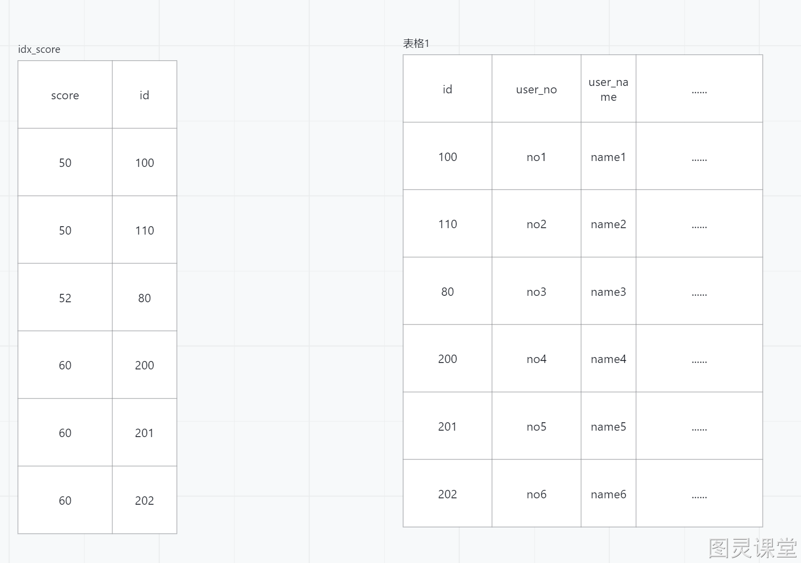

# 带排序的分页查询优化


# 1. 脚本

## 1.1 创建表的脚本
```sql
CREATE TABLE `student` (
	`id` int(11) NOT NULL AUTO_INCREMENT COMMENT '主键',
	`user_no` varchar(50) DEFAULT '' COMMENT '学号',
	`user_name` varchar(50) DEFAULT '' COMMENT '姓名',
	`score` decimal(10,2) DEFAULT NULL COMMENT '分数',
	`create_time` date DEFAULT NULL COMMENT '创建时间',
	`update_time` date DEFAULT NULL COMMENT '更新时间',
	`remark` varchar(200) DEFAULT '' COMMENT '备注',
	PRIMARY KEY (`id`),
	KEY `idx_score` (`score`)
) ENGINE=InnoDB AUTO_INCREMENT=1 DEFAULT CHARSET=utf8mb4 COMMENT='学生表';
```

## 1.2 需求
按照成绩降序排列，并查询字段 学号(user_no),姓名(user_name)，分数(score)，做一个带排序的分页查询

## 1.3 存储过程-自动执行数据

```sql
use test;
DROP PROCEDURE if EXISTS BatchInsert;
delimiter $$
CREATE PROCEDURE BatchInsert(IN initId INT, IN loop_counts INT)
BEGIN
    DECLARE Var INT;
    DECLARE ID INT;
    SET Var = 0;
    SET ID = initId;
    set autocommit=0; -- 关闭自动提交事务，提高插入效率
    WHILE Var < loop_counts DO
        INSERT INTO `student` (`user_no`,`user_name`,`score`,`create_time`,`update_time`,`remark`) 
        VALUES (CONCAT('学号',ID),CONCAT('姓名',ID), floor(1 + rand()*100) , 
				DATE_ADD('2020-1-01 11:29:00', INTERVAL ROUND(RAND() * 1000 + 1) DAY),
				DATE_ADD('2020-1-01 11:29:00', INTERVAL ROUND(RAND() * 1000 + 1) DAY),
				CONCAT('备注',ID));
        SET ID = ID + 1;
        SET Var = Var + 1;
    END WHILE;
    COMMIT;
END$$;

delimiter ;  
CALL BatchInsert(1, 2000000);  
```

# 2.待优化sql
```sql
	#浅分页
	EXPLAIN
	select user_no, user_name, score from student order by score desc limit 5, 20;
	#深分页
	EXPLAIN
	select user_no, user_name, score from student order by score desc limit 80000, 20;
```
缺点：无论深分页或者浅分页。整体性能都比较差
解析：同样都是查询20条数据，深分页查询因为偏移量大，所以扫描的记录行数比浅分页多，所以性能比较差

# 3.优化方案1
增加order by 排序字段索引脚本
```sql
#增加order by 排序字段索引脚本
ALTER TABLE student ADD index idx_score (score);
```
优点：浅分页查询速度得到很好的提升
缺点：深分页查询速度没有明显变化
回表需要成本，排序也需要成本，mysql帮我们做了优化，两者取最优
深分页查询慢的原因：偏移量小的回表成本小，偏移量大的回表成本大
score字段索引数据结构



# 4.优化方案2
给order by 和 select字段加上联合索引
```sql
#给我们order by 和 select字段加上联合索引
ALTER TABLE student ADD index idx_score_name_no (score,user_name, user_no);
```
优点：深分页查询速度都得到了明显的提升
缺点：如果因为需求变更，增加了查询字段，会影响sql的性能，我们不能总是去改我们的查询字段的联合索引

# 5.优化方案3
给排序字段增加索引，并手动回表(需要将方案2的索引删除，减少其他索引的影响)
删除脚本
```sql
#给排序字段增加索引，并手动回表
drop index idx_score_name_no on student;
```
执行sql
```sql
EXPLAIN
select user_no, user_name, score from student t1 join
(select id from student order by score desc limit 80000,20) t2 on t1.id= t2.id;  
```
优点：深分页查询速度得到了提升
缺点：当子查询结果集过多时不建议采用

# 6.优化方案4
根据我们的score索引结构进行优化；score字段索引是先按照score升序进行排序，再在score相同情况下再按照id的升序进行排列
分页查询前端传递上一页最后一行数据的id和分数
```sql
EXPLAIN
 SELECT
	id, user_no, user_name, score 
FROM
	student 
WHERE id < 30000000  AND score <= 100.00 
	ORDER BY score DESC  LIMIT 20

```

# 7.总结
带排序的分页查询优化

1. 浅分页可以给order by字段添加索引
2. 深分页可以给order by 和select字段添加联合索引
3. 可以通过手动回表，强制去走索引
4. 从业务方着手，去限制他的分页查询或者修改前后端交互(将每页最后一条数据的id和分数传递过来) 


> 原文: <https://www.yuque.com/tulingzhouyu/sfx8p0/bg6van3gzw0l87rz>