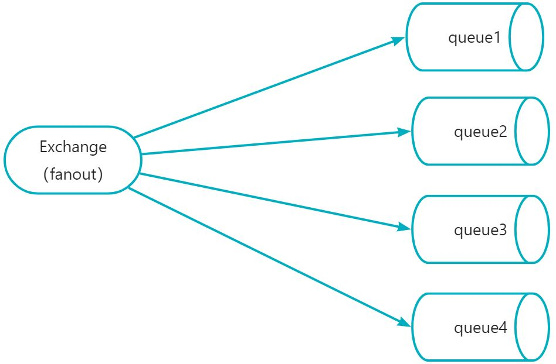
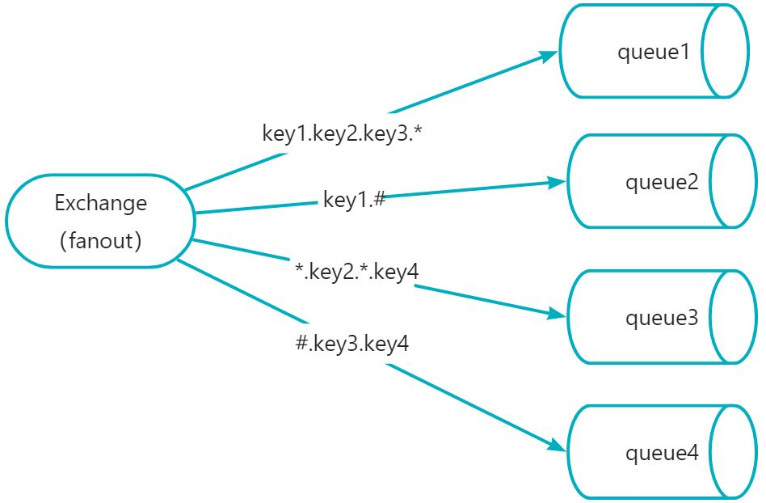

# 快速掌握RabbitMQ到实战


# 1.什么是消息队列
- **消息队列（Message Queue）**是一种用于在应用程序之间传递消息的通信方式，消息队列允许应用程序异步地发送和接收消息，并且不需要直接连接到对方。
- **消息（Message）**是指在应用间传送的数据。消息可以非常简单，比如只包含文本字符串，也可以更复杂，可能包含嵌入对象
- **队列（Queue）**可以说是一个数据结构，可以存储数据。先进先出

# 2.消息队列有哪些作用和应用场景

## 2.1应用解耦


1. 传统模式下，如果库存系统异常无法访问，会导致下单失败；或者随着公司业务拓展，物流系统也需要接入下单信息，此时订单系统还需要增加调用物流系统的接口
2. 引入消息队列，用户下单后，将消息写入消息队列，返回下单成功；库存和物流系统通过订阅下单消息，获取下单信息，库存系统根据下单信息进行库存扣减操作，物流系统根据下单信息生成物流单；即使此时库存系统无法访问，但是不会影响下单流程。当库存系统恢复后可以正常消费消息

## 2.2异步提速


1. 传统模式下，用户从注册到响应成功，需要先保存注册信息，再发送邮件通知，邮件发送成功后再发送短息通知，短息发送成功后才响应给用户，用户体验不好
2. 引入MQ后，保存用户信息后，短信通知和邮件通知消息写入MQ(此过程耗时比较短)。极大的缩短了响应时间。增强用户体验

## 2.3流量削峰


# 3.认识一下RabbitMQ
一款基于AMQP(高级消息队列协议)用于软件之间通信的中间件，由Rabbit科技有限公司开发，服务器端用Erlang语言编写，支持多种客户端，如：Python、Ruby、.NET、Java、JMS、C、PHP、ActionScript、XMPP、STOMP等。用于在分布式系统中存储转发消息，在易用性、扩展性、高可用性等方面表现不俗。
RabbitMQ四大核心：

- 生产者
- 消费者
- 队列
- 交换机

 AMQP协议是一种二进制协议，它定义了一组规则和标准，以确保消息可以在不同的应用程序和平台之间传递和解释，AMQP协议包含四个核心组件：

- 消息
- 交换机
- 队列
- 绑定

# 4.RabbitMQ的安装

## 4.1文件下载
RabbitMQ：[https://packagecloud.io/rabbitmq/erlang/packages/el/7/erlang-23.3.4.11-1.el7.x86_64.rpm/](https://packagecloud.io/rabbitmq/erlang/packages/el/7/erlang-23.3.4.11-1.el7.x86_64.rpm/)
erlang：[https://packagecloud.io/rabbitmq/erlang/packages/el/7/erlang-23.3.4.11-1.el7.x86_64.rpm/download.rpm?distro_version_id=140](https://packagecloud.io/rabbitmq/erlang/packages/el/7/erlang-23.3.4.11-1.el7.x86_64.rpm/download.rpm?distro_version_id=140)

## 4.2安装文件：

### 4.2.1 安装命令
rpm -ivh erlang-23.3.4.11-1.el7.x86_64.rpm
yum install socat -y
rpm -ivh rabbitmq-server-3.8.16-1.el7.noarch.rpm
开机启动：chkconfig rabbitmq-server on
启动服务：/sbin/service rabbitmq-server start
查看服务状态：/sbin/service rabbitmq-server status
停止服务(选择执行)：/sbin/service rabbitmq-server stop
开启web管理插件（先将服务关闭掉）：rabbitmq-plugins enable rabbitmq_management
访问地址：[http://192.168.16.128:15672/](http://192.168.16.128:15672/)（默认端口号：15672），如果遇到访问不了，看看是否防火墙开着

关闭防火墙：systemctl stop firewalld
开机关闭防火墙：systemctl disable firewalld
查看防火墙状态：systemctl status firewalld

### 4.2.2添加一个新的用户：

1. 创建账号

rabbitmqctl add_user admin 123456

2. 设置用户角色

rabbitmqctl set_user_tags admin administrator

3. 设置用户权限

rabbitmqctl set_permissions [-p <vhostpath>] <user> <conf> <write> <read>
rabbitmqctl set_permissions -p "/" admin ".*" ".*" ".*"
用户admin具有/vhost1这个virtual host中所有的配置，写、读权限

4. 查询当前用户和角色

rabbitmqctl list_users

# 5.RabbitMQ的工作原理

**Broker**：接收和分发消息的应用，RabbitMQ Server 就是 Message Broker
**Virtual host**：Virtual host是一个虚拟主机的概念，一个Broker中可以有多个Virtual host，每个Virtual host都有一套自己的Exchange和Queue，同一个Virtual host中的Exchange和Queue不能重名，不同的Virtual host中的Exchange和Queue名字可以一样。这样，不同的用户在访问同一个RabbitMQ Broker时，可以创建自己单独的Virtual host，然后在自己的Virtual host中创建Exchange和Queue，很好地做到了不同用户之间相互隔离的效果。
**Connection**：publisher/consumer和borker之间的TCP连接
**Channel**：发送消息的通道，如果每一次访问 RabbitMQ 都建立一个 Connection，在消息量大的时候建立 TCP Connection 的开销将是巨大的，效率也较低。Channel 是在 connection 内部建立的逻辑连接，如果应用程 序支持多线程，通常每个 thread 创建单独的 channel 进行通讯，AMQP method 包含了 channel id 帮助客 户端和 message broker 识别 channel，所以 channel 之间是完全隔离的。Channel 作为轻量级的 Connection 极大减少了操作系统建立 TCP connection 的开销
**Exchange**：message 到达 broker 的第一站，根据分发规则，匹配查询表中的 routing key，分发 消息到 queue 中去。常用的类型有：direct (point-to-point), topic (publish-subscribe) and fanout (multicast)
**Queue**：Queue是一个用来存放消息的队列，生产者发送的消息会被放到Queue中，消费者消费消息时也是从Queue中取走消息。
**Binding**：exchange 和 queue 之间的虚拟连接，binding 中可以包含 routing key，Binding 信息被保 存到 exchange 中的查询表中，用于 message 的分发依据

# 6.如何实现生产者和消费者

## 6.1引入包依赖
```xml
<dependency>
    <groupId>com.rabbitmq</groupId>
    <artifactId>amqp-client</artifactId>
    <version>5.16.0</version>
</dependency>
```

## 6.2生产者代码
```java
import com.rabbitmq.client.BuiltinExchangeType;
import com.rabbitmq.client.Channel;
import com.rabbitmq.client.Connection;
import com.rabbitmq.client.ConnectionFactory;

/**
 * @Author 小川
 */
public class Producer {

    //队列名
    private static final String QUEUE_NAME = "hello-queue";
    //交换机
    private static final String EXCHANGE_NAME = "hello-exchange";

    public static void main(String[] args) throws Exception {
        //创建一个连接工厂
        ConnectionFactory factory = new ConnectionFactory();
        //服务地址
        factory.setHost("192.168.16.128");
        //账号
        factory.setUsername("admin");
        //密码
        factory.setPassword("123456");
        //端口号
        factory.setPort(5672);
        //创建连接
        Connection connection = factory.newConnection();
        //创建信道
        Channel channel = connection.createChannel();

        /**
         * 声明和创建交换机
         * 1.交换机的名称
         * 2.交换机的类型：direct、topic或者fanout和headers， headers类型的交换器的性能很差，不建议使用。
         * 3.指定交换机是否要持久化，如果设置为true，那么交换机的元数据要持久化到内存中
         * 4.指定交换机在没有队列与其绑定时，是否删除，设置为false表示不删除；
         * 5.Map<String, Object>类型，用来指定交换机其它一些结构化的参数，我在这里直接设置为null。
         */
        channel.exchangeDeclare(EXCHANGE_NAME, BuiltinExchangeType.DIRECT, false, true, null);

        /**
         * 生成一个队列
         * 1.队列的名称
         * 2.队列是否要持久化，但是需要注意，这里的持久化只是队列名称等这些队列元数据的持久化，不是队列中消息的持久化
         * 3.表示队列是不是私有的，如果是私有的，只有创建它的应用程序才能从队列消费消息；
         * 4.队列在没有消费者订阅时是否自动删除
         * 5.队列的一些结构化信息，比如声明死信队列、磁盘队列会用到。
         */
        channel.queueDeclare(QUEUE_NAME, false, false, false, null);

        /**
         * 将交换机和队列进行绑定
         * 1.队列名称
         * 2.交换机名称
         * 3.路由键，在直连模式下为队列名称。
         */
        channel.queueBind(QUEUE_NAME, EXCHANGE_NAME, QUEUE_NAME);

        /**
         * 发送消息
         * 1.发送到哪个交换机
         * 2.队列名称
         * 3.其他参数信息
         * 4.发送消息的消息体
         */
        String message = "hello world";
        channel.basicPublish(EXCHANGE_NAME, QUEUE_NAME, null, message.getBytes());
        System.out.println("消息发送成功");
    }
}

```

## 6.3消费者代码
```java
import com.rabbitmq.client.CancelCallback;
import com.rabbitmq.client.Channel;
import com.rabbitmq.client.Connection;
import com.rabbitmq.client.ConnectionFactory;
import com.rabbitmq.client.DeliverCallback;

/**
 * @Author 小川
 */
public class Consumer {

    //队列名
    private static final String QUEUE_NAME = "hello-queue";

    public static void main(String[] args) throws Exception {

        //创建一个连接工厂
        ConnectionFactory factory = new ConnectionFactory();
        //服务地址
        factory.setHost("192.168.16.128");
        //账号
        factory.setUsername("admin");
        //密码
        factory.setPassword("123456");
        //端口号
        factory.setPort(5672);
        //创建连接
        Connection connection = factory.newConnection();
        //创建信道
        Channel channel = connection.createChannel();

        //接受消息回调
        DeliverCallback deliverCallback = (consumerTag, message)-> {
            System.out.println(new String(message.getBody()));
        };

        //取消消息回调
        CancelCallback cancelCallback = consumerTag ->{
            System.out.println("消费消息被中断");
        };

        /**
         * 消费消息
         * 1.消费哪个队列
         * 2.消费成功之后是否要自动应答，ture:自动应答
         * 3.消费者未成功消费的回调
         * 4.消费者取消消费的回调
         */
        channel.basicConsume(QUEUE_NAME, true, deliverCallback, cancelCallback);

    }
}

```

# 7.RabbitMQ交换机类型

## 7.1 direct
路由键与队列名完全匹配交换机，此种类型交换机，通过RoutingKey路由键将交换机和队列进行绑定， 消息被发送到exchange时，需要根据消息的RoutingKey，来进行匹配，只将消息发送到完全匹配到此RoutingKey的队列。
比如：如果一个队列绑定到交换机要求路由键为“key”，则只转发RoutingKey标记为“key”的消息，不会转发"key1"，也不会转发“key.1”等等。它是完全匹配、单播的模式

	同一个key可以绑定多个queue队列；当匹配到key1时，queue1和queue2都可以收到消息

## 7.2 fanout
Fanout，扇出类型交换机，此种交换机，会将消息分发给所有绑定了此交换机的队列，此时RoutingKey参数无效。

fanout类型交换机下发送消息一条，无论RoutingKey是什么，queue1,queue2,queue3,queue4都可以收到消息

## 7.3 topic
Topic，主题类型交换机，此种交换机与Direct类似，也是需要通过routingkey路由键进行匹配分发，区别在于Topic可以进行模糊匹配，Direct是完全匹配。

1. Topic中，将routingkey通过"."来分为多个部分
2. "*"：代表一个部分
3. "#"：代表0个或多个部分(如果绑定的路由键为 "#" 时，则接受所有消息，因为路由键所有都匹配)


然后发送一条信息，routingkey为"key1.key2.key3.key4"，那么根据"."将这个路由键分为了4个部分，此条路由键，将会匹配：

1. key1.key2.key3.*：成功匹配，因为 * 可以代表一个部分
2. key1.# ：成功匹配，因为#可以代表0或多个部分
3. *.key2.*.key4： 成功匹配，因为第一和第三部分分别为key1和key3，且为4个部分，刚好匹配
4. #.key3.key4：成功匹配，#可以代表多个部分，正好匹配中了我们的key1和key2

如果发送消息routingkey为"key1"，那么将只能匹配中key1.#，#可以代表0个部分

## 7.4 headers
headers 匹配 AMQP 消息的 header 而不是路由键，此外 headers 交换器和 direct 交换器完全一致，但性能差很多，目前几乎用不到了
消费方指定的headers中必须包含一个"x-match"的键。
键"x-match"的值有2个

1. x-match = all ：表示所有的键值对都匹配才能接受到消息
2. x-match = any ：表示只要有键值对匹配就能接受到消息


发送消息时间，如果其他参数信息是{ "name":"xiaochuanXX", "sex":"男" }，因为queue2的x-match是any，只需要有一个键值对匹配所以就能接收到消息，所以queue2可以接收到消息；queue1的x-match是all，需要所有的键值对都匹配才能接收到消息，所以此时queue1接收不到消息
	

# 8.RabbitMQ集群搭建


1. 首先通过克隆的方式，从第一台安装好RabbitMQ的服务器环境克隆出两台机器
2. 修改克隆出的2台RabbitMq服务器的Ip地址，修改IP(可不修改，通过ifconfig或者ip addr查看ip地址)
只需修改/etc/sysconfig/network-scripts/ifcfg-ens33文件中的IPADDR即可。
3. 修改3台RabbitMq服务器的hostname
3台服务器的hostname分别设置为node1、node2、node3；

vi /etc/hostname
设置后一定要对服务进行重启，重启命令：reboot

4. 分别修改3台Rabbitmq服务器的节点的hosts文件

vi /etc/hosts
在hosts文件后面追加
192.168.16.137 node1
192.168.16.134 node2
192.168.16.135 node3

5.  把第1个节点上的cookie文件复制到另外2台克隆的节点上，确保各节点用的同一个cookie

在node1上执行下面2条命令，把node1节点上的cookie文件复制到node2和node3上。
scp /var/lib/rabbitmq/.erlang.cookie root@node2:/var/lib/rabbitmq/.erlang.cookie
scp /var/lib/rabbitmq/.erlang.cookie root@node3:/var/lib/rabbitmq/.erlang.cookie

6. 启动 RabbitMQ 服务,顺带启动 Erlang 虚拟机和 RbbitMQ 应用服务

分别在3个节点上执行以下命令
rabbitmq-server -detached

7. 在节点2执行

rabbitmqctl stop_app (rabbitmqctl stop_会将Erlang虚拟机关闭，rabbitmqctl stop_app只会关闭rabbitmq服务)
rabbitmqctl reset
 rabbitmqctl join_cluster rabbit@node1
 rabbitmqctl start_app（只启动应用服务）

8. 在节点3执行

rabbitmqctl stop_app 
rabbitmqctl reset
rabbitmqctl join_cluster rabbit@node2
rabbitmqctl start_app

9. 集群状态

rabbitmqctl cluster_status

10. 需要重新设置用户(只需要在一台机器上运行)
   1. 创建账号

rabbitmqctl add_user admin 123456

   2. 设置用户角色

rabbitmqctl set_user_tags admin administrator

   3. 设置用户权限

rabbitmqctl set_permissions -p "/" admin ".*" ".*" ".*"

11. 解除集群节点(node2和node3机器分别执行)

rabbitmqctl stop_app 
rabbitmqctl reset
rabbitmqctl start_app
rabbitmqctl cluster_status
rabbitmqctl forget_cluster_node rabbit@node2(node1节点上执行)

# 9. 镜像队列

## 9.1使用镜像队列的原因

- 虽然集群共享队列，但在默认情况下，消息只会被路由到某一个节点的符合条件的队列上，并不会同步到其他节点的相同队列上。
- 假设消息路由到 node1 的 my-queue 队列上，但是 node1 突然宕机了，那么消息就会丢失
- 想要解决这个问题，需要开启队列镜像，将集群中的队列彼此之间进行镜像，此时消息就会被拷贝到处于同一个镜像分组中的所有队列上。

## 9.2 管理界面配置参数

**参数解释**：

- **Name**: policy的名称，用户自定义。
- **Pattern**: queue的匹配模式（正则表达式）。^表示所有队列都是镜像队列。
- **Definition**: 镜像定义，包括三个部分ha-sync-mode、ha-mode、ha-params。
   - **ha-mode**: 指明镜像队列的模式，有效取值范围为all/exactly/nodes。
      - **all**：表示在集群所有的代理上进行镜像。
      - **exactly**：表示在指定个数的代理上进行镜像，代理的个数由ha-params指定。
      - **nodes**：表示在指定的代理上进行镜像，代理名称通过ha-params指定。
   - **ha-params**: ha-mode模式需要用到的参数。
   - **ha-sync-mode**: 表示镜像队列中消息的同步方式，有效取值范围为：automatic，manually。
      - **automatic**：表示自动向master同步数据。
      - **manually**：表示手动向master同步数据。
- **Priority**: 可选参数， policy的优先级。

# 10. 负载均衡-HAProxy

## 10.1HAProxy概述

- 一种高效、可靠、免费的高可用及**负载均衡**软件，非常适合于高负载站点的七层数据请求。客户端通过Haproxy代理服务器获得站点页面，而代理服务器收到客户请求后根据负载均衡的规则将请求数据转发给后端真实服务器
- 实现了一种事件驱动、单一进程模型，能支持非常大的并发连接数


## 10.2安装HAProxy

1. 下载依赖包

yum install gcc vim wget

2. 下载haproxy源码包

wget [https://src.fedoraproject.org/repo/pkgs/haproxy/haproxy-2.7.3.tar.gz/sha512/f9eeee2d232fd2f4da1959e9265dd6abe6c6182109a0455d4f868a516e78cc6ea67e8456d5bc26e439385d17f52e4b179d7c615bacf15aeae901ab8e172dc758/haproxy-2.7.3.tar.gz](https://src.fedoraproject.org/repo/pkgs/haproxy/haproxy-2.7.3.tar.gz/sha512/f9eeee2d232fd2f4da1959e9265dd6abe6c6182109a0455d4f868a516e78cc6ea67e8456d5bc26e439385d17f52e4b179d7c615bacf15aeae901ab8e172dc758/haproxy-2.7.3.tar.gz)
(源码包下载地址：[https://src.fedoraproject.org/repo/pkgs/haproxy/](https://src.fedoraproject.org/repo/pkgs/haproxy/))

3. 解压

tar -zxvf haproxy-2.7.3.tar.gz -C /usr/local

4. 进入目录，进行编辑、安装

cd /usr/local/haproxy-2.7.3
make TARGET=linux30 PREFIX=/usr/local/haproxy
make install PREFIX=/usr/local/haproxy
创建文件夹：mkdir /etc/haproxy

5. 赋权

--创建组
groupadd -r -g 149 haproxy
--创建用户
useradd -g haproxy -r -s /sbin/nologin -u 149  haproxy

6. 创建配置文件

vim /etc/haproxy/haproxy.cfg
```
#全局配置
global
    #设置日志
    log 127.0.0.1 local0 info
    #当前工作目录
    chroot /usr/local/haproxy
    #用户与用户组
    user haproxy
    group haproxy
    #运行进程ID
    uid 99
    gid 99
    #守护进程启动
    daemon
    #最大连接数
    maxconn 4096

#默认配置
defaults
    #应用全局的日志配置
    log global
    #默认的模式mode {tcp|http|health}
    #TCP是4层，HTTP是7层，health只返回OK
    mode tcp
    #日志类别tcplog
    option tcplog
    #不记录健康检查日志信息
    option dontlognull
    #3次失败则认为服务不可用
    retries 3
    #每个进程可用的最大连接数
    maxconn 2000
    #连接超时
    timeout connect 5s
    #客户端超时
    timeout client 120s
    #服务端超时
    timeout server 120s

#绑定配置
listen rabbitmq_cluster 
        bind 192.168.16.138:5671
        #配置TCP模式
        mode tcp
        #简单的轮询
        balance roundrobin
        #RabbitMQ集群节点配置
        server node1 192.168.16.137:5672 check inter 5000 rise 2 fall 2
        server node2 192.168.16.138:5672 check inter 5000 rise 2 fall 2
        server node3 192.168.16.139:5672 check inter 5000 rise 2 fall 2

#haproxy监控页面地址
listen monitor 
        bind 192.168.16.138:8100
        mode http
        option httplog
        stats enable
				#项目名为rabbitmq_stats，ip+端口+项目名即可访问
        stats uri /rabbitmq_stats
				#自动刷新时间
        stats refresh 5s
```

7. 配置启动文件复制 haproxy 文件到 /usr/sbin 下 ，复制 haproxy 脚本，到 /etc/init.d 下

cp /usr/local/haproxy/sbin/haproxy /usr/sbin/
 cp /usr/local/haproxy-2.7.3/examples/haproxy.init /etc/init.d/haproxy
 chmod 755 /etc/init.d/haproxy 

8. 启动

service haproxy start|stop|restart|reload|condrestart|status|check 
 

# 11. 消息队列面试题

## **11.1消息队列的作用**

- 应用解耦
   - 如果有订单系统，下单成功之后，需要调用库存系统扣减库存；随着公司业务的发展又需要增加物流系统接收下单信息；此时有需要订单系统增加调用物流系统的代码；但是增加队列后，订单系统只需要将下单信息发送到队列，其他系统需要这个消息自己来订阅就可以了；并且也不会因为库存系统异常导致下单失败。
- 异步提速
   - 用户注册成功后，需要先将数据保存，并且发送邮件通知，邮件通知成功后再发送短息通知，短信通知成功后才响应客户成功消息。用户体验很差。增加消息队列后，只需要保存数据，将发送邮件通知和短信通知消息发送到消息队列，可以极大提升响应速度
- 流量削峰
   - 如果订单系统每秒只能处理1k的请求量，但是在某一瞬间，比如抢单，每秒可以达到1W甚至更多的请求，这种情况下可能会直接导致订单系统崩溃；增加消息队列后，订单系统没拉取1K请求，可以很平稳的去消费消息。

## **11.2使用消息队列有什么缺点**

- 降低系统的可用性：系统引入的外部依赖越多，越容易挂掉；
- 系统复杂度提高：使用 MQ 后可能需要保证消息没有被重复消费、处理消息丢失的情况、保证消息传递的顺序性等等问题；
- 一致性问题：A 系统处理完了直接返回成功了，但问题是：要是 B、C、D 三个系统那里，B 和 D 两个系统写库成功了，结果 C 系统写库失败了，就造成数据不一致了。

## 11.3如何保证消息队列的顺序性

- 生产者有序的情况下，单线程消费来保证消息的顺序性
- 生产者无序的情况下，对消息进行编号，消费者处理时根据编号判断顺序。多个消费者，可以考虑增加分布式锁

案例：[https://www.yuque.com/tulingzhouyu/sfx8p0/mfyo6g7ardl424rw?singleDoc#](https://www.yuque.com/tulingzhouyu/sfx8p0/mfyo6g7ardl424rw?singleDoc#) 《如何保证消息队列的顺序性》

## 11.4如何保证消息不被重复消费/如何保证消息的幂等性

- 生产者发送每条数据的时候，里面添加一个全局唯一的id， 消费者消费到消息后， 先根据消息id去redis中查询，如果redis不存在，就处理消息，然后将消息id写入redis。如果redis中存在，说明消息已经消费过，就不用处理。
- 基于数据库的唯一键，保证重复数据不会重复插入。因为有唯一键约束，所以重复数据只会插入报错，不会导致数据库中出现脏数据。

## 11.5如何保证消息不丢失
 	保证消息不丢失我们应该从以下方面来分析，以RabbitMQ为例：

- 生产者丢失消息
   - **丢失原因：**发送消息过程中出现网络问题：producer以为发送成功，但RabbitMQ server没有收到
   - **解决方案**：发送方确认机制，在生产者端开启comfirm 确认模式，你每次写的消息都会分配一个唯一的 id，然后如果写入了 RabbitMQ 中，RabbitMQ 会给你回传一个 ack 消息，告诉你说这个消息 ok 了
- 队列丢失消息
   - **丢失原因：**暂存内存中，还没消费，自己挂掉，数据会都丢失
   - **解决方案**：
      - MQ设置为持久化。将内存数据持久化到磁盘中；
      - 开启镜像队列
      - 持久化到磁盘中也并不能保证100%不丢失数据，可能在写入磁盘过程中宕机；这时候可以开启生产者开启comfirm 确认模式
- 消费者丢失消息
   - **丢失原因**：消费者丢数据一般是因为采用了自动确认消息模式。这种模式下，消费者会自动确认收到信息。这时RabbitMQ会立即将消息删除，这种情况下，如果消费者出现异常而未能处理消息，就会丢失该消息。
   - **解决方案**：
采用手动确认消息即可，RabbitMQ 提供的 ack 机制，就是你必须关闭 RabbitMQ 的自动 ack，可以通过一个 api 来调用就行，然后每次你自己代码里确保处理完的时候，再在程序里 ack 一下。这样的话，如果你还没处理完，不就没有 ack 了嘛；那 RabbitMQ 就认为你还没处理完，这个时候 RabbitMQ 会把这个消费分配给别的 consumer 去处理，消息是不会丢的。


> 原文: <https://www.yuque.com/tulingzhouyu/sfx8p0/wgnfgb6yqet547mt>