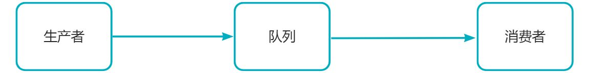

# 消息队列如何保证消息不丢失



# 1.生产者消息丢失
| 丢失原因 | 解决方案 |
| --- | --- |
| 发送消息过程中出现网络问题：producer以为发送成功，但RabbitMQ server没有收到 | 
- 开启生产者确认机制；
   - 在生产者端开启comfirm 确认模式，你每次写的消息都会分配一个唯一的 id，然后如果写入了 RabbitMQ 中，RabbitMQ 会给你回传一个 ack 消息，告诉你说这个消息 ok 了；如果写入失败，会有一个失败函数回调，可以在失败回调函数里处理业务；比如：将失败消息插入数据库并标记为插入失败
 |

- rabbitmq开启生产者确认模式
```java
        //开启生产者确认模式
        channel.confirmSelect();
       
        channel.addConfirmListener(new ConfirmListener() {
             /**
        	 * 返回成功回调函数
         	*/
            @Override
            public void handleAck(long l, boolean b) throws IOException {
                System.out.println("发送消息成功");
            }

            /**
             * 返回失败回调函数
             * @param l
             * @param b
             * @throws IOException
             */
            @Override
            public void handleNack(long l, boolean b) throws IOException {
                System.out.println("发送消息失败");
                //TODO 添加发送消息失败日志或者进行重试
            }
        });
```

# 2.消息队列丢列消息丢失
| 丢失原因 | 解决方案 |
| --- | --- |
| 队列和消息没有持久化；
此时队列和消息是保存在内存中，一旦服务重启或者宕机就会出现消息丢失问题 | 
- 将队列和消息持久化，保存在磁盘中
 |
| 队列和消息已经持久化；
但是在将消息将要写入磁盘时发生宕机 | 
- 在生产者端开启comfirm 确认模式；只有当磁盘写入成功后才会返回ack
- 配置rabbitmq集群
 |

- 队列持久化
```java
/**
* 生成一个队列
* 1.队列的名称
* 2.队列是否要持久化，但是需要注意，这里的持久化只是队列名称等这些队列元数据的持久化，不是队列中消息的持久化
* 3.表示队列是不是私有的，如果是私有的，只有创建它的应用程序才能从队列消费消息；
* 4.队列在没有消费者订阅时是否自动删除
* 5.队列的一些结构化信息，比如声明死信队列、磁盘队列会用到。
*/
channel.queueDeclare(QUEUE_NAME, true, false, false, null);
```

- 消息持久化
```java
 /**
* 发送消息
* 1.发送到哪个交换机
* 2.队列名称
* 3.其他参数信息，MessageProperties.PERSISTENT_TEXT_PLAIN:可以让消息持久化
* 4.发送消息的消息体
*/
channel.basicPublish( EXCHANGE_NAME, QUEUE_NAME, MessageProperties.PERSISTENT_TEXT_PLAIN, message.getBytes());
```

# 3.消费者消息丢失
| 丢失原因 | 解决方案 |
| --- | --- |
| 消费者开启自动消息确认模式；
这种模式下消费者会自动确认收到消息；
这时rabbitmq会立即将消息删除，此时如果消费这出现异常未能成功处理消息，消息就会丢失 | 开启消费者消息确认模式；
消费者确认模式需要有消息接受和消息确认两个步骤；当消费者从队列中接收到一条消息时，RabbitMQ 会将这条消息标记为“未确认”状态。接着，消费者必须明确地向 RabbitMQ 确认该消息，才能将其标记为“已确认”状态并从队列中移除。如果你没处理完，就不要确认。这时rabbitmq会将这个消息分配给其他的消费者去处理，消息是不会丢的 |

- 开启消费者消息确认模式
```java
/**
* 消费消息
* 1.消费哪个队列
* 2.消费成功之后是否要自动应答，true:自动应答
* 3.消费者未成功消费的回调
* 4.消费者取消消费的回调
*/
channel.basicConsume("xc_queue_name", false, deliverCallback, cancelCallback);

```

- 肯定应答
```java
/**
* 肯定确认应答
* 1.消息的标记Tag
* 2.是否批量应答 false表示不批量应答信道中的消息
*/
channel.basicAck(message.getEnvelope().getDeliveryTag(),false);

```

- 否定确认应答
```java
/**
* 否定确认应答
* 1.拒绝 deliveryTag 对应的消息
* 2.是否 requeue：true 则重新入队列，false 则丢弃或者进入死信队列。
* 该方法 reject 后，该消费者还是会消费到该条被 reject 的消息。
*/
channel.basicReject(message.getEnvelope().getDeliveryTag(),true);
```

# 4.总结
虽然rabbitmq开启了生产者/消费者确认模式和消息持久化功能，但是不能完全保证100%的消息不丢失。在实际应用中，建议使用多种措施来保障消息的可靠性
为了极大的保证消息的可靠性，我们使用rabbitmq集群


# 生产者代码
```java
import com.rabbitmq.client.BuiltinExchangeType;
import com.rabbitmq.client.Channel;
import com.rabbitmq.client.ConfirmListener;
import com.rabbitmq.client.Connection;
import com.rabbitmq.client.ConnectionFactory;
import com.rabbitmq.client.MessageProperties;

/**
* @Author 小川
*/
public class Producer {

    /**
    * 交换机名称
    */
    static String EXCHANGE_NAME = "xc_exchange_name";

    /**
    * 队列名称
    */
    static String QUEUE_NAME = "xc_queue_name";

    public static void main(String[] args) throws Exception {

        //创建一个连接工厂
        ConnectionFactory factory = new ConnectionFactory();
        //服务地址
        factory.setHost("192.168.16.130");
        //账号
        factory.setUsername("admin");
        //密码
        factory.setPassword("123456");
        //端口号
        factory.setPort(5672);
        //创建连接
        Connection connection = factory.newConnection();
        //创建信道
        Channel channel = connection.createChannel();

        /**
        * 声明和创建交换机
        * 1.交换机的名称
        * 2.交换机的类型：direct、topic或者fanout和headers， headers类型的交换器的性能很差，不建议使用。
        * 3.指定交换机是否要持久化，如果设置为true，那么交换机的元数据要持久化到内存中
        * 4.指定交换机在没有队列与其绑定时，是否删除，设置为false表示不删除；
        * 5.Map<String, Object>类型，用来指定交换机其它一些结构化的参数，我在这里直接设置为null。
        */
        channel.exchangeDeclare(EXCHANGE_NAME, BuiltinExchangeType.DIRECT, true, true, null);

        /**
        * 生成一个队列
        * 1.队列的名称
        * 2.队列是否要持久化，但是需要注意，这里的持久化只是队列名称等这些队列元数据的持久化，不是队列中消息的持久化
        * 3.表示队列是不是私有的，如果是私有的，只有创建它的应用程序才能从队列消费消息；
        * 4.队列在没有消费者订阅时是否自动删除
        * 5.队列的一些结构化信息，比如声明死信队列、磁盘队列会用到。
        */
        channel.queueDeclare(QUEUE_NAME, true, false, false, null);

        /**
        * 将交换机和队列进行绑定
        * 1.队列名称
        * 2.交换机名称
        * 3.路由键，在直连模式下为队列名称。
        */
        channel.queueBind(QUEUE_NAME, EXCHANGE_NAME, QUEUE_NAME);

        String message = "hello world";

        //开启生产者确认模式
        channel.confirmSelect();
        channel.addConfirmListener(new ConfirmListener() {
            /**
            * 返回成功回调函数
            */
            @Override
            public void handleAck(long l, boolean b) throws IOException {
                System.out.println("发送消息成功");
            }

            /**
            * 返回失败回调函数
            * @param l
            * @param b
            * @throws IOException
            */
            @Override
            public void handleNack(long l, boolean b) throws IOException {
                System.out.println("发送消息失败");
                //TODO 添加发送消息失败日志或者进行重试
            }
        });
        /**
        * 发送消息
        * 1.发送到哪个交换机
        * 2.队列名称
        * 3.其他参数信息，MessageProperties.PERSISTENT_TEXT_PLAIN:可以让消息持久化
        * 4.发送消息的消息体
        */
        channel.basicPublish( EXCHANGE_NAME, QUEUE_NAME, MessageProperties.PERSISTENT_TEXT_PLAIN,  message.getBytes());

        channel.close();
        connection.close();
        System.out.println("发送消息");

    }
}
```

# 消费者代码
```java
import com.rabbitmq.client.CancelCallback;
import com.rabbitmq.client.Channel;
import com.rabbitmq.client.Connection;
import com.rabbitmq.client.ConnectionFactory;
import com.rabbitmq.client.DeliverCallback;

/**
 * @Author 小川
 */
public class Consumer {

    public static void main(String[] args) throws Exception {

        //创建一个连接工厂
        ConnectionFactory factory = new ConnectionFactory();
        //服务地址
        factory.setHost("192.168.16.130");
        //账号
        factory.setUsername("admin");
        //密码
        factory.setPassword("123456");
        //端口号
        factory.setPort(5671);
        //创建连接
        Connection connection = factory.newConnection();
        //创建信道
        Channel channel = connection.createChannel();

        //接收消息回调
        DeliverCallback deliverCallback = (consumerTag, message)-> {
            try{
                System.out.println("接收到消息："+ new String(message.getBody()));
                int numA = 1;
                int numB = 0;
                int temp = numA / numB;
                /**
                 * 肯定确认应答
                 * 1.消息的标记Tag
                 * 2.是否批量应答 false表示不批量应答信道中的消息
                 */
                channel.basicAck(message.getEnvelope().getDeliveryTag(),false);
            } catch (Exception e) {
                e.printStackTrace();
            }

        };

        //取消消息回调
        CancelCallback cancelCallback = consumerTag ->{
            System.out.println("消费消息被中断");
        };

        /**
         * 消费消息
         * 1.消费哪个队列
         * 2.消费成功之后是否要自动应答，true:自动应答
         * 3.消费者未成功消费的回调
         * 4.消费者取消消费的回调
         */
        channel.basicConsume("xc_queue_name", false, deliverCallback, cancelCallback);
    }
}

```


> 原文: <https://www.yuque.com/tulingzhouyu/sfx8p0/uuubqilraxc6c1q1>