# 线上JVM内存溢出排查


## 模拟内存溢出

### 设置启动参数

- -Xms100m -Xmx100m -XX:+HeapDumpOnOutOfMemoryError
   - -Xms：堆的最小值
   - -Xmx：堆空间的最大值
   - -XX:+HeapDumpOnOutOfMemoryError	当OOM发生时自动dump堆内存信息
   - -XX:HeapDumpOnOutOfMemoryError=/temp/heapdump.hprof		dump堆内存信息存放目录

### 模拟内存飙升
访问：[http://127.0.0.1:8080/prometheus/test/testUp1](http://127.0.0.1:8080/prometheus/test/testUp1)
   [http://127.0.0.1:8080/prometheus/test/testUp2](http://127.0.0.1:8080/prometheus/test/testUp2)
jps 查看引用进程
jmap -dump:format=b,file=/home/dump.out pid
http://ip:port/actuator/heapdump

### 模拟内存溢出
访问：[http://127.0.0.1:8080/prometheus/test/testOutOfMemory](http://127.0.0.1:8080/prometheus/test/testOutOfMemory)

# 内存溢出问题分析

## 打开mat
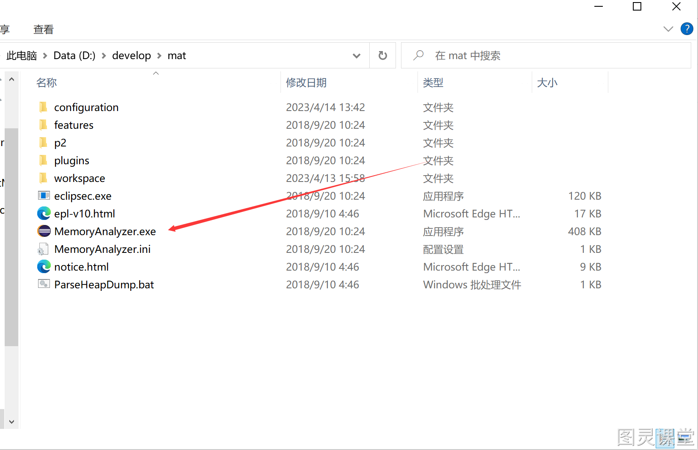

## 载入dump文件
File - > Open Heap Dump - >选择我们的dump文件(注意文件类型选择All Files或者*.hprof)

## 分析界面

- 在Overview界面点击我们的Dominator Tree 查看内存占用情况（按内存占比从大到小顺序排列）

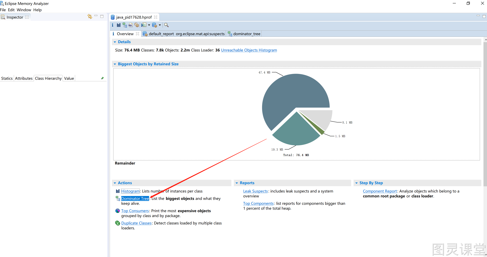
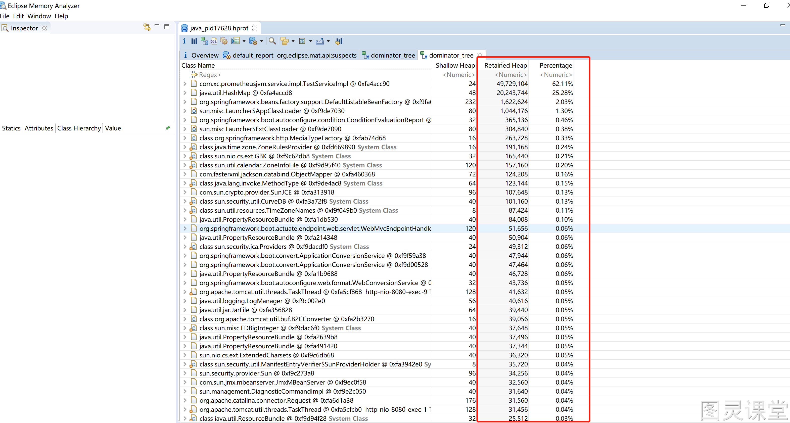

-  点击Leak Suspects 可以看到工具帮我们分析出来的问题项 ，点击Details可以查看详情

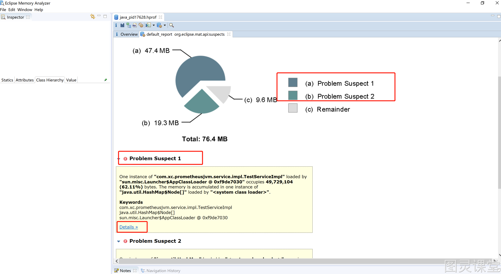
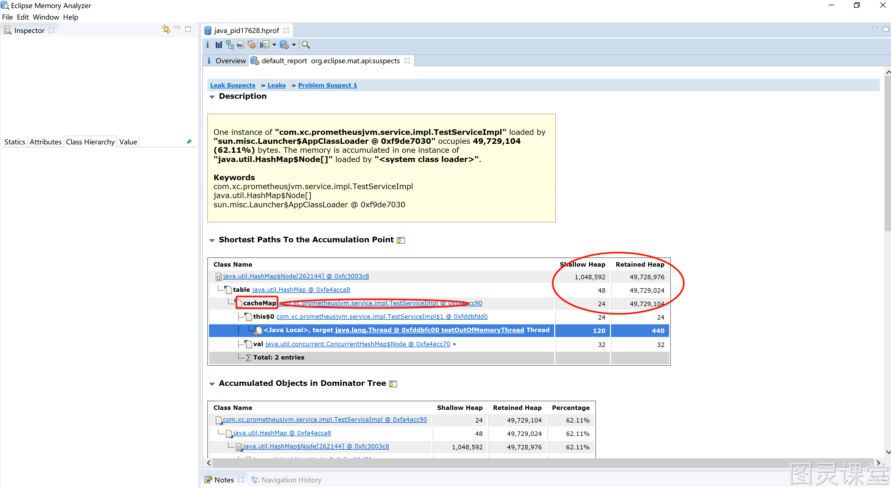

## SpingBoot项目搭建

## 添加maven依赖
```xml
<dependency>
  <groupId>org.springframework.boot</groupId>
  <artifactId>spring-boot-starter-actuator</artifactId>
</dependency>
<dependency>
  <groupId>io.micrometer</groupId>
  <artifactId>micrometer-registry-prometheus</artifactId>
</dependency>
```

## 配置application.properties
```properties
server.port=8080
spring.application.name=prometheus-jvm
management.endpoints.web.exposure.include=*
management.metrics.tags.application=${spring.application.name}
```

## 添加监控JVM的配置类
```java
@Bean
public MeterRegistryCustomizer<MeterRegistry> configurer(@Value("${spring.application.name}") String applicationName){
    return registry -> registry.config().commonTags("application", applicationName);
}
```

## 启动SpringBoot项目
启动成功后，访问[http://127.0.0.1:8080/actuator/prometheus](http://127.0.0.1:8080/actuator/prometheus)查看指标是否正常

# Prometheus搭建

## 下载地址
[https://prometheus.io/download/](https://prometheus.io/download/)

## prometheus.yml添加配置
```shell
#名称随便取
 - job_name: "prometheus-jvm"
    # 多久采集一次数据
    scrape_interval: 5s
    # 采集时的超时时间
    scrape_timeout: 5s
    # 采集的路径
    metrics_path: '/actuator/prometheus'
    # 采集SpringBoot的服务地址
    static_configs:
       - targets: ['127.0.0.1:8080']
```
最终是这个样子
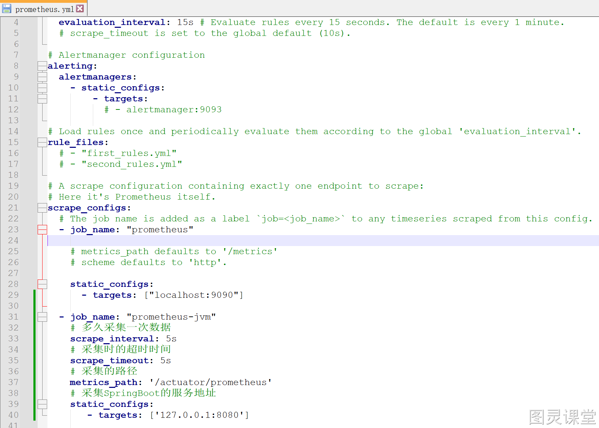

## windows下启动 prometheus
在prometheus文件目录下执行，**prometheus.exe --config.file=prometheus.yml**
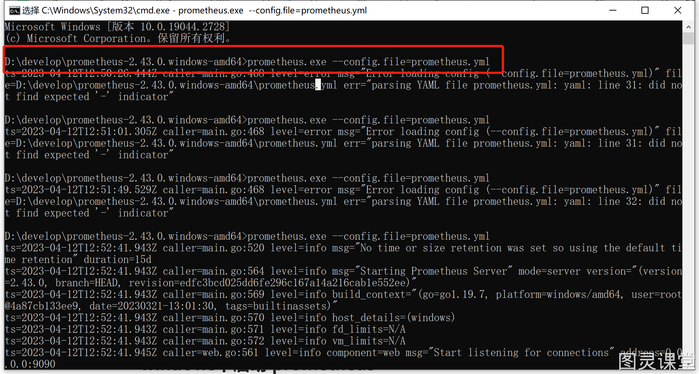
访问：[http://127.0.0.1:9090/targets](http://127.0.0.1:9090/targets)

# Grafana搭建

## 下载地址
[https://grafana.com/grafana/download?pg=get&platform=windows&plcmt=selfmanaged-box1-cta1](https://grafana.com/grafana/download?pg=get&platform=windows&plcmt=selfmanaged-box1-cta1)

## 启动

- 解压完直接进入bind目录，双击grafana-server.exe启动服务
- 访问：[http://127.0.0.1:3000/](http://127.0.0.1:3000/)
- 用户名密码随便输入，自己记住

## 配置模板

- 模板库地址：[https://grafana.com/grafana/dashboards](https://grafana.com/grafana/dashboards)
- 视频模板采用地址：[https://grafana.com/grafana/dashboards/4701-jvm-micrometer/](https://grafana.com/grafana/dashboards/4701-jvm-micrometer/)

### 配置prometheus数据源
点击Prometheus 
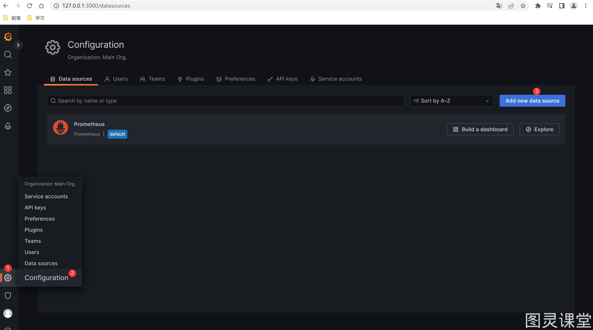
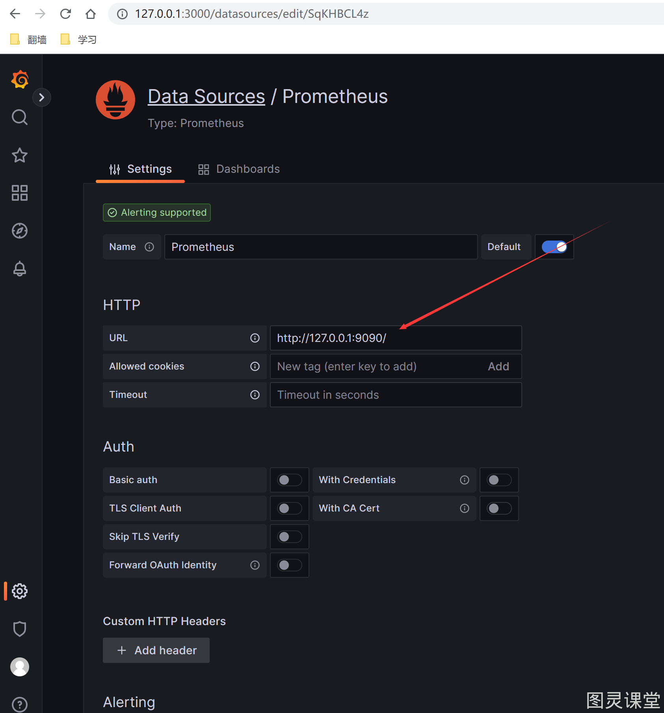

### 导入模板
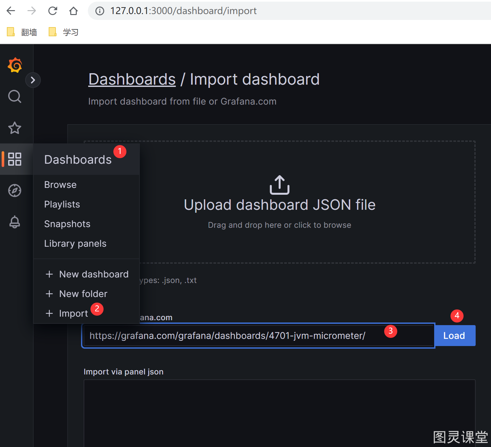
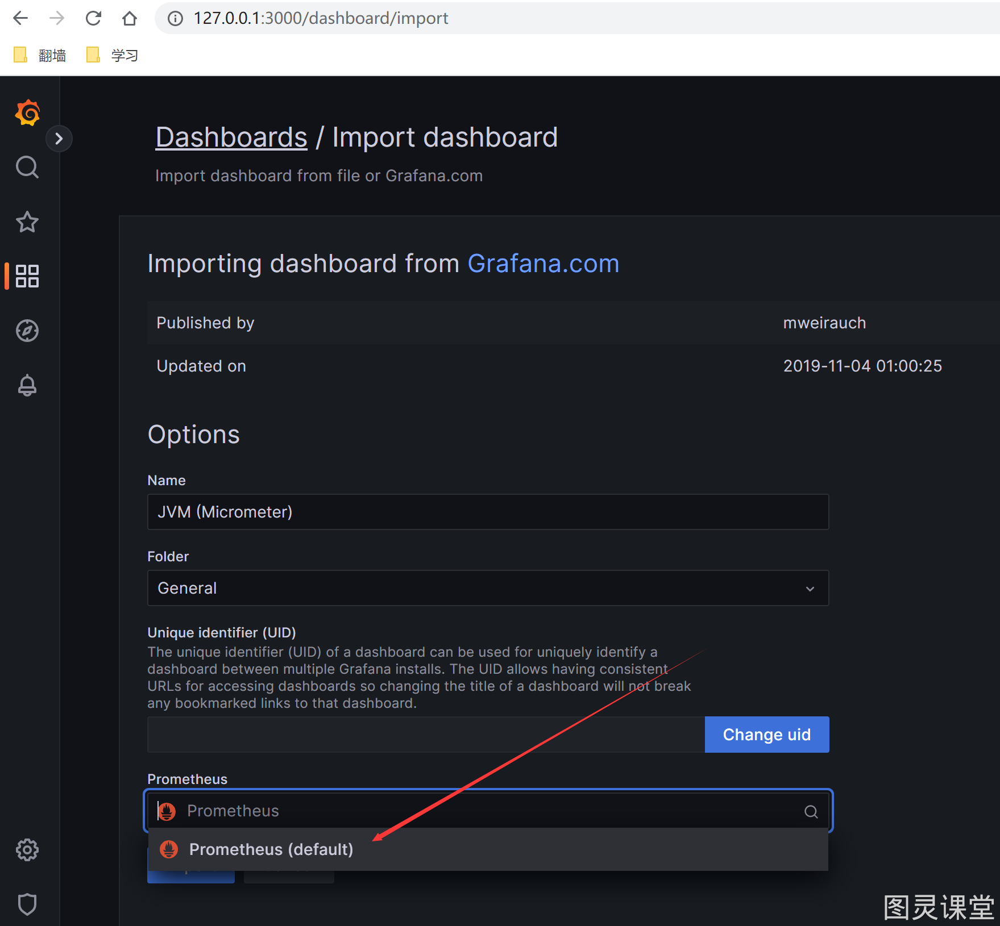

### 


> 原文: <https://www.yuque.com/tulingzhouyu/sfx8p0/qdh0ck3zzgqew1b3>