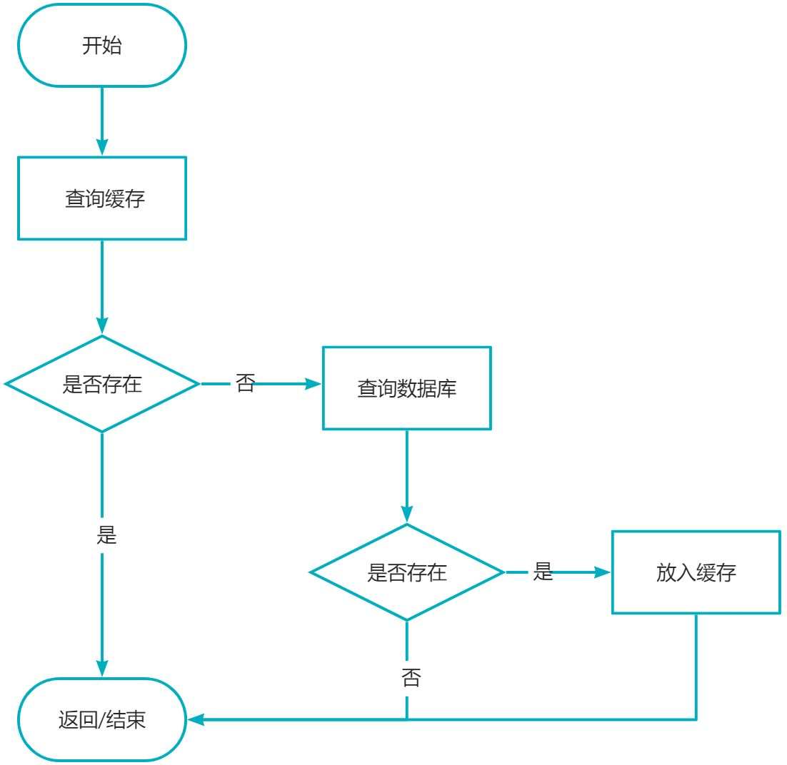
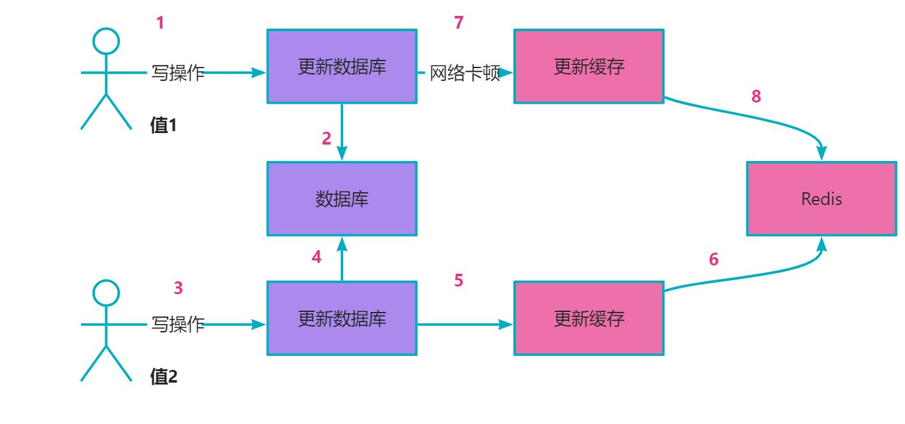
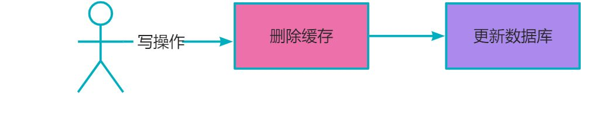
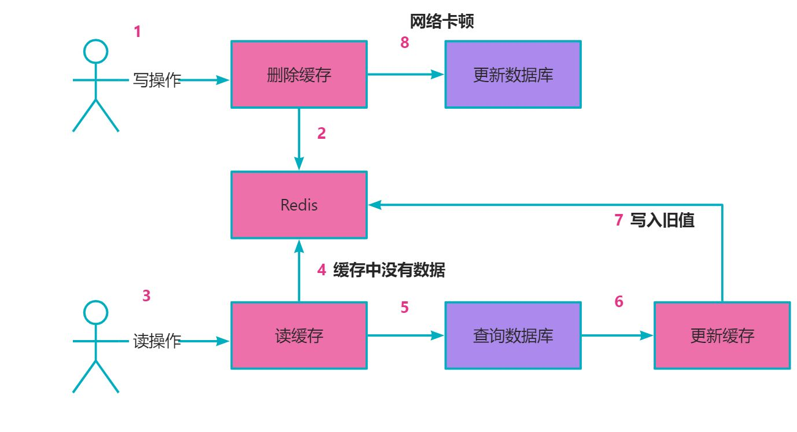
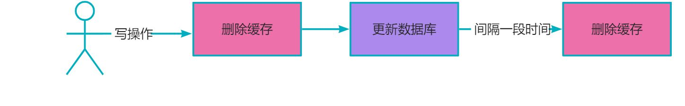
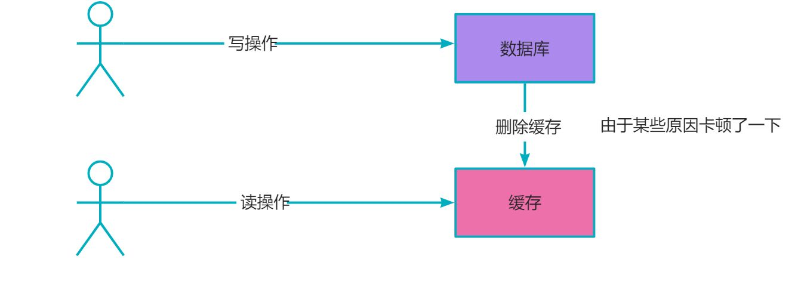
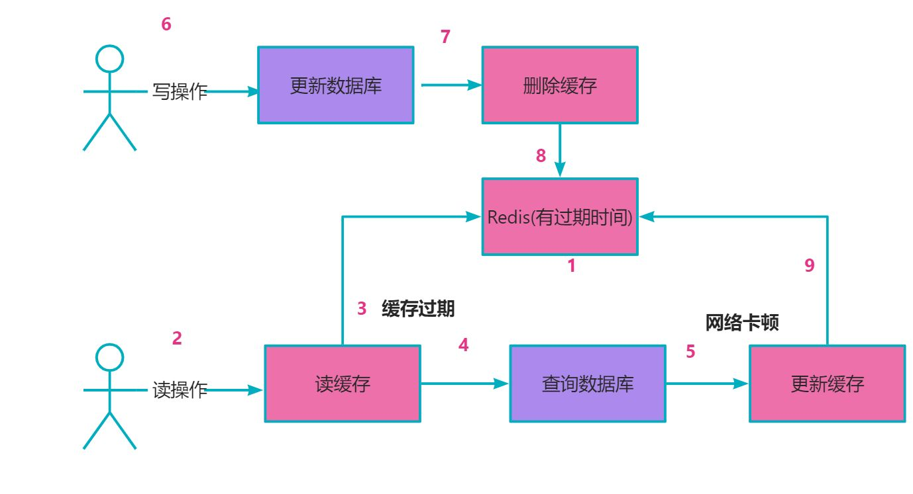
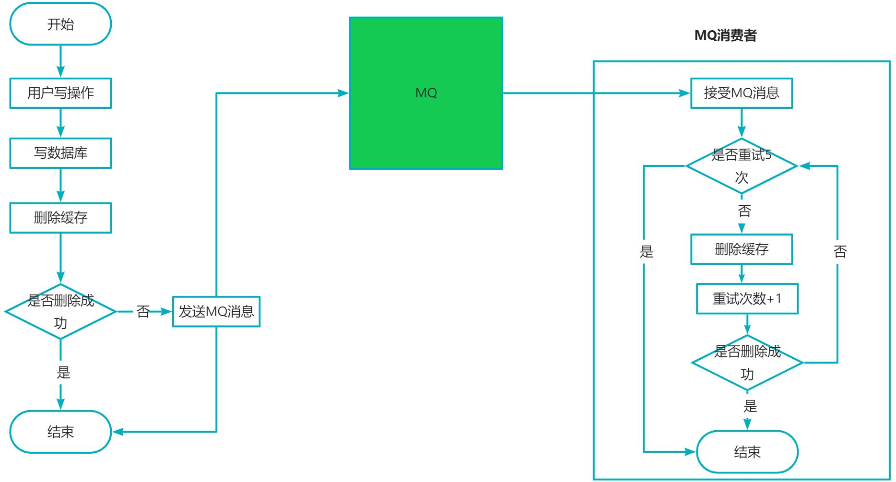
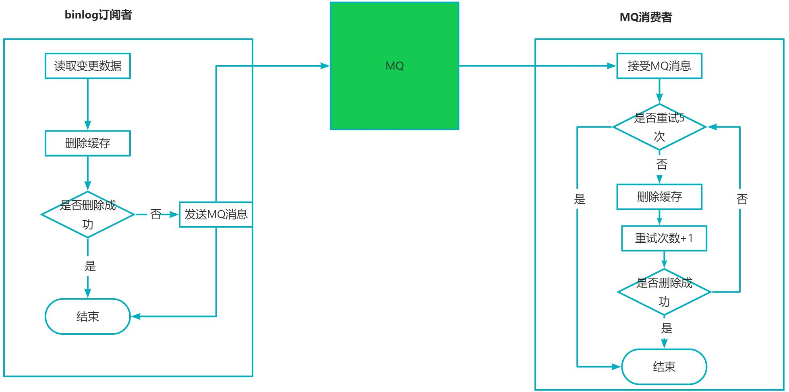

# 高频Redis面试题:如何保证Redis和数据库数据一致性

# 缓存用法

问题：如果数据库中的某条数据放入缓存后，又马上被更新了，那我们应该如何更新缓存

# 如何更新缓存

## 先更新缓存，再更新数据库

缺点：如果先更新缓存成功，在更新数据库的时候失败，这时候会导致数据不一致；缓存的作用是不是临时将我们数据保存在内存，便于提高查询速度；但是如果某条数据在数据库中都不存在，缓存这种数据没有一点意义

## 先更新数据库，再更新缓存

优点：可以解决先更新缓存，再更新数据库带来的假数据问题
缺点：高并发场景下，如果多个线程同时执行更新数据库再写缓存操作可能会出现数据库是新值，而缓存中是旧值

## 先删除缓存，再更新数据库

缺点：高并发场景下，如果多个线程同时执行更新数据库再写缓存操作可能会出现数据库是新值，而缓存中是旧值

## 延时双删（删除缓存，更新数据库，再延时删除缓存）

关键的：间隔一段时间再删除是为了保证并发读请求写入的旧值最终能够被第二次删除删除掉
缺点：延时双删可能对我们性能要求方面不能有太高的要求
如果第二次删除缓存失败怎么办?

## 先更新数据库，再删除缓存
在高可用的系统系统里面，我们追求数据最终一致性的话，我们可以考虑先更新数据库，再去删除缓存

## 为了防止删除缓存失败，可以进行重试机制

-  同步重试，如果并发量高的时候可能会影响接口性能
-  异步重试：
   - 创建单独的一个线程，进行重试；但是在高并发的场景下，可能会因为创建线程太多，导致OOM
   - 交给线程池处理；但是如果服务重启，会导致数据丢失
   - 重试数据写入表，通过定时任务重试（可以保证数据不丢失，但是对于实时性要求较高的该场景不太适用）
   - 利用MQ消息中间件进行重试，在消费者中处理

   - 订阅mysql的binlong，在订阅者中，如果发现更新数据请求，则删除响应的缓存，比如使用canal中间件；为了保证删除缓存成功，可以增加MQ

> 原文: <https://www.yuque.com/tulingzhouyu/sfx8p0/bncsuqfk2vas82x7>