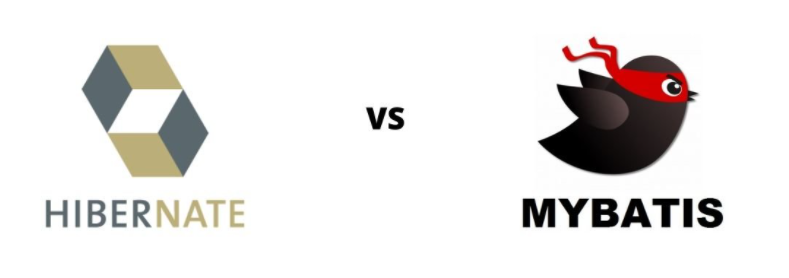
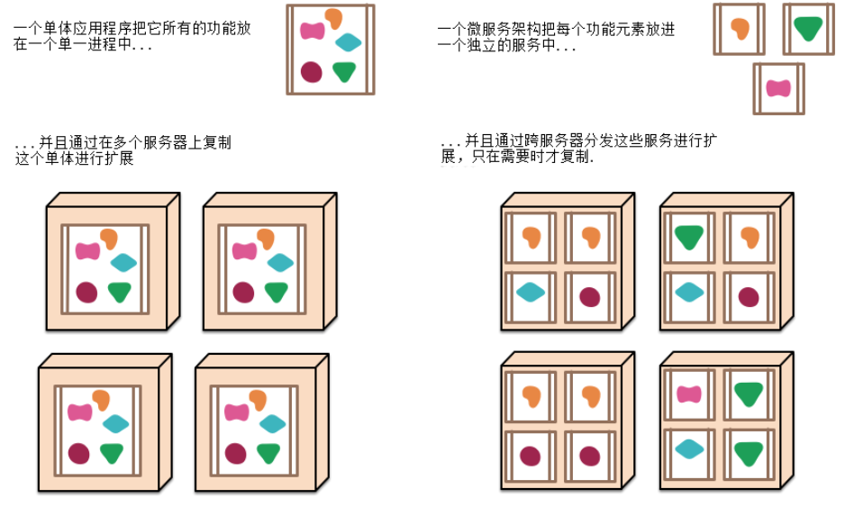
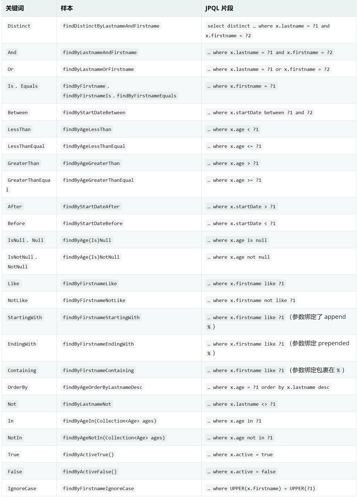

# Hibernate淘汰了？只是你不会用而已！

不知道大家在整合SpringBoot+MyBatis有没有想过， 为什么SpringBoot不提供MyBatis的官方Starter呢？你以为是为了和SpringDataJPA竞争？：

首先Hibernate才是正统的JPA血脉！JPA（Java Persistence API ）是JDK钦点的ORM规范！
那SpringBoot要做ORM框架肯定跟着JDK玩，毕竟JDK才是整个java的标准，所以SpringBoot会选择Hibernate作为SpringDataJPA的ORM实现框架也理所当然。
MyBatis？根本算不上ORM框架，不过是一个封装了JDBC的持久化框架！SpringBoot我都不愿意跟你玩，你对标的应该是我的JDBCTemplate，我都有一个封装了JDBC的组件干嘛还跟你玩，你要跟我玩自己写Starter来适配我! 这才是真正的原因！

我知道你看完还是无法打动你，我们来比较一下Hibernate VS  MyBatis：


## Hibernate VS  MyBatis

Hibernate 是一个对象关系映射框架 (ORM)，它将 Java 类映射到数据库表。
MyBatis 是一个持久化框架——不是 ORM。它将 SQL 语句映射到 Java 方法。



### 为什么国人更偏爱MyBatis

总结原因：
1.你连JPA、Hibernate、ORM 都搞不清楚，还咋用Hibernate？**Hibernate学习和使用门槛比MyBatis高**
2.MyBatis简单易学上手快—符合培训机构的教学标准。**培训机构都教MyBatis能不流行嘛！**
3.中国特色的业务需求更复杂，使用MyBatis实现简单快捷。**Hibernate要实复杂需求现难度更大！**
4.为了无条件实现领导的需求，催生更加复杂的业务。**需要面向领导编程，不得不选择更灵活的MyBatis。**
5. 随着SS**H**的落幕，SS**M**的带动下。**时代变迁\技术变更\大众选择**

> ps:那说来说去感觉还是应该MyBatis更好用啊..Hibernate还是被时代被社会环境抛弃了啊..虽然它确实有用又能怎么样呢？**但是**hibernate在实现一些需求单一的应用还是有它的优势的：**相较传统的Mybatis来说，持久层代码码少了60%，当然大部分都是体现在xml文件上，你无需花精力去维护你SQL语句，大大简化了持久层的开发、提升了开发效率。**所以他们可以用于不同场景：


### 不同使用场景

Hibernate用于

- 常规 CRUD功能、偏简单的业务需求 。
- 编程方式由对象模型驱动—CodeFisrt。
- 有更换数据库的需求。

MyBatis 用于

- 编程方式由数据库驱动—DBFisrt。
- 对SQL语句有极致的优化需求。
- 对复杂的搜索查询，动态条件查询支持更舒服。

哦~~看样子他们各有各的好处，难不成我Hibernate和MyBatis混用？确实有很多应用这么干，但是我不建议在一个应用中混用，增加了应用架构的复杂度，但是如果一个应用可以拆成互不相干的小应用呢？各自小应用可以根据自己的业务复杂度选择自己所需的技术呢？


## 所以迎来Hibernate的又一春来了—— 微服务下结合SpringDataJpa

微服务架构下的关键就是：“拆！”,代码和数据库都会随之拆分，单个服务的业务复杂度也就降低了，随之SQL复杂度也就降低了，并且我每个服务可以自由选择自己的技术互不干涉，SpringDataJpa的用武之地毋庸置疑啊！




## 使用SpringDataJPA

SpringBoot下使用SpringDataJPA不要太方便：

1. **只需加入对应springdatajpa依赖**

```xml
<dependency>
    <groupId>org.springframework.boot</groupId>
    <artifactId>spring-boot-starter-data-jpa</artifactId>
</dependency>
```

**2.添加Repository接口**
结合dao层的Repository内置接口即可快速的CRUD，多种持久化方式供你自由选择，以下示例中7种：

```java
public interface CustomerRepository extends 
PagingAndSortingRepository<Customer,Long>   //1.实现分页排序和CRUD
  // 需要实现动态条件也有很多内置接口可选择
, QueryByExampleExecutor<Customer>				  // 2.实现动态条件：快速精确匹配（查）
, JpaSpecificationExecutor<Customer>				// 3.实现动态条件：Specification（查）
, QuerydslPredicateExecutor<Customer>			  // 4.实现动态条件：Querydsl（查）
{

  // 5.还可以根据规定方法名进行快速定制持久化操作（查删）
  List<Customer> findByCustName(String custName);   // 即可生成SELECT * FROM Customer WHERE custName=?
  
  
  // 如果你想自定义语句查询，依然提供：
  // 6.通过JPQL进行持久化操作（增删改查）
  @Query("FROM Customer where custName=:custName ")
  List<Customer> findCustomerByCustName(@Param("custName") String custName);
  // 7.通过原生SQL进行持久化操作（增删改查）
  @Query(value="select * FROM tb_customer where cust_name=:custName ",nativeQuery = true)
  List<Customer> findCustomerByCustNameBySql(@Param("custName") String custName);

}
```

第5种更多规定方法名对照表：

**使用：**
直接调用持久化方法即可、无需依赖任何代码生成器

```java
@Autowired
CustomerRepository repository;


// 1.PagingAndSortingRepository
repository.findById(20L);
// 5.规定方法名
repository.findByCustName("图灵");

// 4.通过QueryDSL可以进行复杂查询： 是不是跟SQL很像：
JPAQuery<Tuple> tupleJPAQuery = factory
  .select(customer.custId, customer.custName)
  .from(customer)
  .where(customer.custId.eq(1L))
  .orderBy(customer.custId.desc());
  
  
// ...更多方式可以学习springdatajpa课程
```


## 总结和展望

SpringDataJPA使用起来的感受就是一个字 “**快**” ，它能快速的搭建起一个持久层，也不用像Mybatis一样太多的关心SQL。 
其实在互联网项目中涉及到实时直接操作数据的场景会越来越少， 大多数都会通过缓存或其他NoSql存储（ES、MongoDB）、定时任务、MQ等技术 来为数据库减压。所以我觉得以后数据库的运用就应该是简单直接的。
所以推荐简单业务的应用和微服务架构下都可以采用SpringDataJpa，而MyBatis的则为实现那些复杂的ERP\OA等各种系统、为了应付领导各种复杂的需求才有它的用武之地。


> 原文: <https://www.yuque.com/tulingzhouyu/sfx8p0/yu1lay9i2wbzegiv>